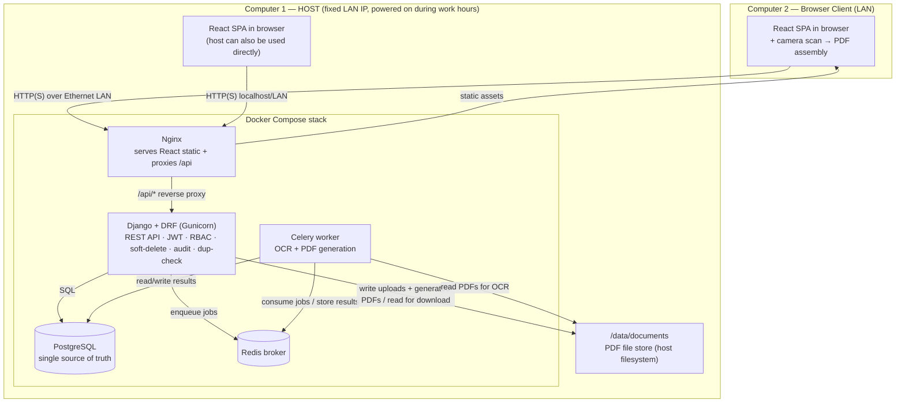
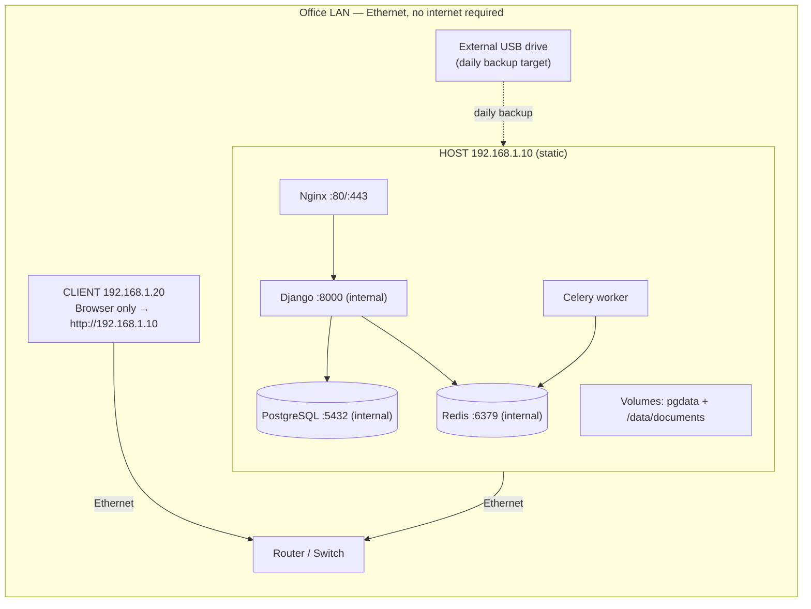
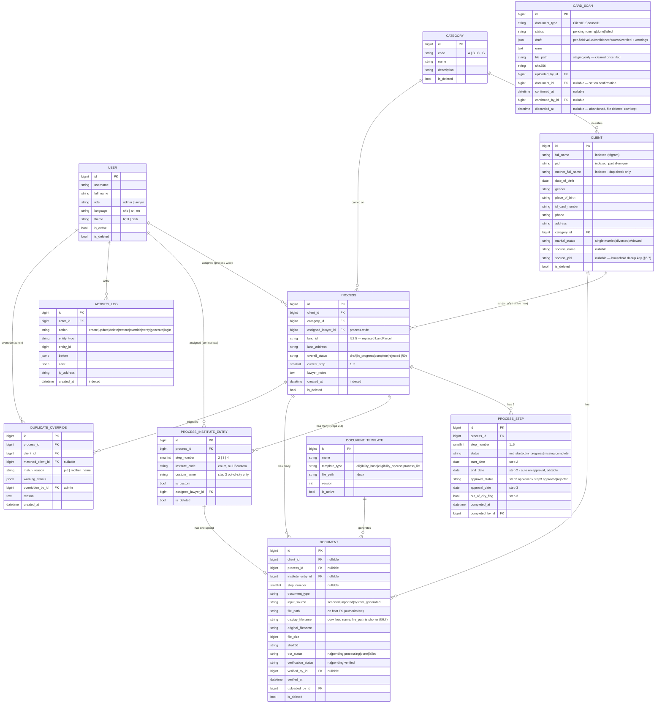
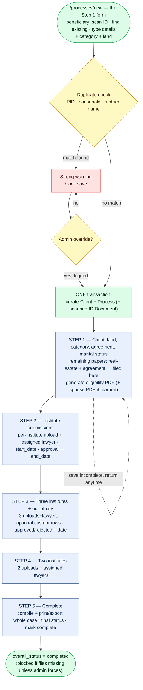
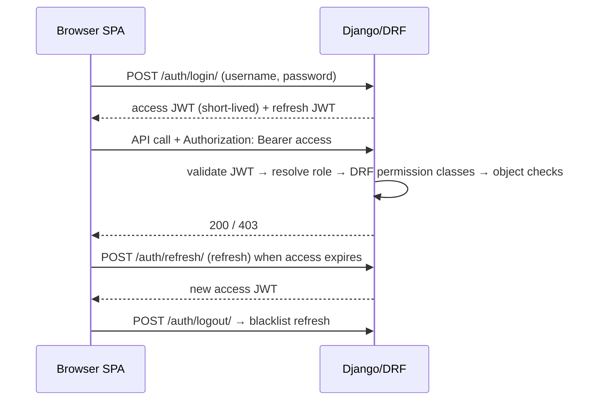
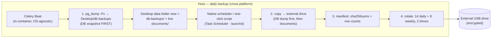

# Offline Government Land-Allocation Case Management System — System Architecture

**Document status:** Production-ready architecture specification
**Audience:** Implementing engineers, the government office's IT owner, reviewers
**Constraints honored:** 100% offline · two computers · single shared host · PostgreSQL · Django REST + Celery · React + RTK Query · local Sorani/Arabic/English OCR · soft-delete everywhere · full audit trail · data-safety first

---

## 0. Implementation deviations from this spec (living — updated through Iteration 2.5)

This section records where the **built system intentionally differs** from the design below. It is the authoritative changelog; where a section further down conflicts, this table wins. All core invariants (soft-delete, append-only audit, DB-level dedup, server-side RBAC, optimistic locking, full i18n/RTL) are upheld.

### Permanent deviations & additions

| Area | Spec says | Built instead | Reason |
|------|-----------|---------------|--------|
| **User theme/language** | `theme`/`language` fields on `User`; `PATCH /users/me/` edits them (§7, §4.2) | Both fields **removed**; preferences live in the browser (localStorage) only; `GET /users/me/` is read-only | Product decision — client-only UI prefs |
| **`Client.created_by`** | not present | Added FK `created_by` on `Client` | Lets the lawyer who created a client edit it before a process links them |
| **Land / `LandParcel`** | a `LandParcel` entity + `Process.parcel` FK + `/parcels/` CRUD | **Removed entirely.** The land is just two strings on the process — `land_id` + `land_address` — entered/edited in Step 1 (It.2.5) | Product decision — the office only records a land identifier and address, no parcel registry |
| **`GET /api/v1/lawyers/`** | not present (only admin `GET /users/`) | Added: read-only `id`+`username` of active users, any authenticated caller | Non-admin assignees need it for the per-institute lawyer dropdowns; the full Users API stays admin-only |
| **User soft-delete** | "every domain model extends `SoftDeleteModel`" | `User` **mirrors** the soft-delete fields (`is_deleted/deleted_at/deleted_by/version`) rather than extending it | `AbstractUser` cannot cleanly multi-inherit `SoftDeleteModel`; behavior is identical (a deleted user is also `is_active=False`) |
| **`version` field** | not shown in the `SoftDeleteModel` snippet (§3.1) | Present on every soft-deletable model incl. `User` | Required by the optimistic-locking invariant (§4.1, §12) |
| **UI component library** | shadcn/ui (§8) | Hand-built shadcn-*style* primitives (Dialog/Select/Accordion have **zero** Radix deps) | Offline footprint + avoid dependency churn; same look and behavior |
| **Step sequencing** | no forced sequence; `current_step` is informational and "not a gate" (§5.2) | `current_step` is the **highest step a lawyer has unlocked**. Steps above it render locked; an explicit **Proceed** (confirm dialog → `POST /processes/{id}/advance-step/`) unlocks the next one. Forward-only. Admins bypass it entirely and see all five | Product decision (It.2.5) — lawyers asked to walk one step at a time instead of facing all five at once. Unlocked steps stay editable, so non-linear work within them is unaffected |
| **Where a case begins** (2026-08-02, It.7 — UC-024, amended UC-028) | §5's START node requires an **existing** Client, set before Step 1 | **Creating a process *is* Step 1.** `/processes/new` opens the Step-1 form itself: the beneficiary is **created there** — by scanning their ID (§6.5) or by typing the details — alongside category and land. **Amended the same day (UC-028): there is no third "find someone already on file" mode.** One person holds one live allocation (§3.7), so anyone already on file already has a case and cannot be the beneficiary of a new one; offering the choice only invited the lawyer to look for a record that must not be reusable. Nothing is written until one **Create** submit, which creates client + case (+ the scanned ID document) in **one transaction** | The spec contradicted itself: §5.1 already lists "all gov-ID client fields" as **Step-1 inputs**, and §6 states reading is **scan-first** — the card creates the person. Only the START node said otherwise, and the build followed it. Real-data testing (It.7) found the result unusable: opening a case meant leaving Processes, creating the client on another screen, and searching them back out of a dropdown. **User decisions:** the case row is written *only* on submit, so an abandoned form leaves no draft case in a register where nothing can be hard-deleted (§11.1); and the standalone `/scan-card` entry point is **removed**, so exactly one path creates a case |
| **The Clients screen** (2026-08-02, It.7 — UC-026, UC-027, UC-029, UC-030) | §8.3 gives Clients full CRUD, and the duplicate dialog lives on its create form | **Clients is search-only** — it finds a beneficiary and opens their case; it neither creates, edits nor deletes. Creation belongs to the Step-1 intake form, and a beneficiary is edited from inside their own case. The **duplicate check + admin override moved with it**, and now guards **both** branches of the intake submit (typed *and* scan-confirm); the scan branch shows the client fields beside the staged card, so every field is reachable and checkable before the record exists | Follows UC-024: if exactly one path creates a person, every guard that path needs must live on it. Two create screens meant two dedup implementations, and the one the office actually used (scan) was the one that had none |
| **Build identity** (2026-08-09, pre-It.9) | not present — nothing anywhere records which build is installed | A repo-root **`VERSION`** file (`APP_VERSION`/`APP_BUILD`) read by both halves and loaded as a Compose `env_file`; shown on the login footer, the sidebar footer and Settings → About; returned by `GET /health/`; stamped onto every `activity_log` row; and compared by a mismatch banner. See **§2.6** | The office is updated by hand from an external drive, one computer at a time, so "which build is this?" has to be answerable from the screen, offline, by a non-technical user — and a half-applied update (new frontend, old backend) otherwise presents as an app bug. **The build number is a committed integer, not a git commit count**, which is not monotonic across branches (`dev` 204 vs `main` 28 when measured) |
| **Blank forms on the Templates screen** (2026-08-10, It.9 — UC-039) | §6.6 knows one kind of template: a `.docx` letter the system fills in per case | `DocumentTemplate` holds **two** kinds. A **blank form** (`request_form`, the office's `داواکاری`) is a **PDF stored and served byte for byte**: `preview` returns the file itself instead of a sample-data render, `render_to_pdf` refuses it, and its dialog — and only its dialog — carries **Print** and **Download**. Split by `BLANK_FORM_TYPES`, carried to the UI as **`is_blank_form` on each template row**. See **§6.6** | The office's Request paper is printed blank, signed by hand and scanned back in as the optional `Request` document (§6.7) — it has no placeholders to fill. The sheet a citizen signs must be the office's own file, so nothing may re-render or re-encode it |
| **Appearance settings** (2026-08-02, It.7 — UC-015, UC-031, UC-032, UC-033) | §9 assumes one bundled face and a light/dark theme | Settings offers **mode** (light / dark / **system**), **9 palettes** and **9 typefaces**, all client-only (localStorage, per machine). A palette is **four numbers** every token derives from, so switching one moves the whole screen; a typeface sets Latin **and** Arabic, so the setting is visible in every language. See §9.1 | The office asked for a real palette change rather than an accent tint (UC-032), a font setting that does something in English (UC-031), and more than four of each (UC-033). Deriving tokens from a hue/chroma pair keeps nine palettes at a few hundred bytes and safe in light, dark and RTL |

### Temporary simplifications (revisit when the named iteration lands)

| Area | Spec target | Current build | Revisit at |
|------|-------------|---------------|-----------|
| **`overall_status` values** | `draft \| in_progress \| submitted \| completed \| rejected` (§5.2) | `draft \| in_progress \| complete \| rejected` (no `submitted`; `complete`, not `completed`) | It.4 (compiled export adds the `submitted` stage) |
| **Step-1 completion** | also requires the generated eligibility PDF (§3.6) | **permanent deviation** — the letter is *generated by* completing Step 1, never required *for* it. Requiring it would deadlock: the step waits on the letter while the letter waits on the step. Completion needs the client papers + header fields + a spouse ID when married | — (settled It.3) |
| **`GenerationJob` and `CardScan` are not soft-deletable** | every domain model extends `SoftDeleteModel` (§3.1) | both extend `TimeStampedModel` only. They record a *run*, not case data — the artefacts they produce (`Document`, and the audit row) are the durable, soft-deletable things, and nothing references either as evidence. `CardScan` instead carries `discarded_at`, which the sweep sets when it deletes an abandoned scan's file while keeping the row (§6.3) | — (settled It.3 / It.5) |
| **Document naming** | friendly name composed **at verification**; temp `__<id>.pdf` during OCR draft (§6.7) | **as specified, for scanned cards** — a card is staged as `_staging/scan__<id>.pdf` and only composed + filed on confirmation (§6.5). Other uploads still compose at upload, which is correct: they attach to a person who already exists | — (settled It.5). Still open: re-filing after a *later* name edit |
| **Store layout** | `<CATEGORY>/<client_id>_<pid>/<category>_<institute>_<person>_<type>__<id>.pdf` (§6.7) | **`<CATEGORY>/<CODE>_<PID>/<Sorani label>__<id>.pdf`** — the folder is keyed by the **case** (code + PID), so a person's two cases no longer share one folder, and the label is the Sorani name of the issuing body or the paper itself so the archive can be browsed by hand. `display_filename` = `<CODE>_<PERSON>_<label>.pdf`, with no short id | — (It.5, revised It.7/UC-060) |
| **MRZ expiry date** | read and check-digit verified (§6.2) | **not read** — the office identifies the holder, and a national ID does not stop identifying its holder when the card expires. Its offsets still matter, because nationality sits after it | — (settled It.5, user decision) |
| **Duplicate rules at the DB layer** | "no land twice" held entirely by two partial-unique indexes (§3.7) | the **household rule** (a married couple may hold one allocation) is enforced in the **application layer**: "no row's `pid` may equal any other row's `spouse_pid`" is a cross-row condition no unique index can express. The two indexes are unchanged and still hold their own guarantees | — (settled It.5) |
| **OCR engine** | Tesseract 5 `-l ckb+ara+eng`, one pass (§6.2) | **permanent deviation** — `ckb` **does not exist** (upstream ships only `kmr`, Kurmanji/Latin). Each side is read **twice**: the `Arabic` *script* model for names, `eng` for digits and the MRZ. Measured: `Arabic` 88%, `ara` 68%, `Arabic+ara` 77% | — (settled It.5) |
| **OCR pre-processing** | deskew · denoise · CLAHE · binarize — "where most accuracy is won" (§6.2) | **permanent deviation — measured twice, and it made things worse both times.** Thresholding a glossy card shredded the thin Arabic strokes (10 good lines → 70 of noise); re-tested on *photocopied* input it rescued nothing and at two copier passes destroyed a card number the raw read had recovered. No cleanup path exists in the code | — (settled It.5) |
| **OCR output storage** | `Document.ocr_text` (raw) + `parsed_fields` (§3, §6.2, D2) | **permanent deviation** — neither column exists and raw text is never stored. The reading lives on `CardScan.draft` as per-field `{value, confidence, source, verified}` + warnings. The (predicted → corrected) pairs §6.5 wants are kept in the **append-only audit log**, which no re-read can erase | — (settled It.5) |
| **What gets OCR'd, and when** | every scanned/imported upload auto-enqueues OCR (§6) | **permanent deviation** — only the two identity cards are read, and a lawyer starts the read deliberately. There is nothing to parse in a title deed, and auto-OCR would burn worker time on every upload | — (settled It.5) |
| **Per-step `missing` status** | four states incl. auto-derived `missing` (§5.4) | `not_started / in_progress / complete` computed; `missing` not auto-set | It.4/It.5 (when file-expectation rules firm up) |
| **`document_type` vocabulary** | e.g. `ClientID, SignedAgreement, ApprovalLetter, EligibilityBase` (§6.7) | `ClientID, SpouseID, RealEstate, SignedAgreement, EligibilityLetter` + generic `InstituteDoc` for Steps 2–4; enforced server-side on upload | as document types are finalized |
| **`ProcessStep.approval_status`** | step carries approval | **done** — column dropped in `processes/0012` (It.8). Approval lives on `ProcessInstituteEntry`, which is the only one any screen reads | — (closed It.8) |

---

## Table of Contents

> **New to the project?** Start with **[Orientation for Engineers](#orientation-for-engineers-start-here)** (plain-language summary + end-to-end walkthrough), and keep the **[Glossary](#glossary)** handy for any unfamiliar term.

1. [High-Level Architecture Overview](#1-high-level-architecture-overview)
2. [Network & Deployment Topology](#2-network--deployment-topology)
3. [Data Model / ER Design](#3-data-model--er-design)
4. [REST API Design](#4-rest-api-design)
5. [Process Workflow Design (5 Steps)](#5-process-workflow-design-5-steps)
6. [Document + OCR Pipeline](#6-document--ocr-pipeline)
7. [Authentication & Authorization](#7-authentication--authorization)
8. [Frontend Architecture](#8-frontend-architecture)
9. [Internationalization & RTL](#9-internationalization--rtl)
10. [Reporting & Printing](#10-reporting--printing)
11. [Soft-Delete, Audit & Activity Logging](#11-soft-delete-audit--activity-logging)
12. [Security & Data Safety](#12-security--data-safety)
13. [Scalability, Backup & Recovery](#13-scalability-backup--recovery)
14. [Clean Project / Repo Structure](#14-clean-project--repo-structure)
15. [Recommended Build Order](#15-recommended-build-order)
16. [Consolidated Risk Register](#16-consolidated-risk-register)

---

## Orientation for Engineers (Start Here)

*New to this document? Read this section first — it explains the whole system in plain language before the detailed specs. Hit an unfamiliar term anywhere? It's defined in the [Glossary](#glossary).*

### What this system is (one paragraph)

It's an internal **web app for a government land-allocation office**. The office grants plots of land to eligible citizens; lawyers take each allocation through a legal/administrative workflow and file the supporting paperwork. Today that paperwork is physical — this app replaces the paper archive with a digital one. For each citizen, a lawyer opens a **case** (called a **Process**), scans or uploads the documents, and the app reads them with **OCR**, stores them, and tracks the case through **5 steps**. It runs on **two office computers over a local network, with no internet at all**.

### The shape of it (mental model)

If you've built a normal CRUD web app, you already know ~80% of this:

- a **React** single-page app in the browser (the UI),
- a **Django REST** backend (the business rules + the API),
- **PostgreSQL** for structured records, and **PDF files on disk** (the files are *not* stored in the database — just their paths and metadata are),
- plus one extra piece most CRUD apps don't have: a **background worker (Celery)** that runs slow jobs — reading scanned documents (OCR) and generating PDFs — so the web app never freezes while it waits.

Everything runs in **Docker** on one computer (the "**host**"); the second computer just opens a browser pointed at the host's fixed local IP address.

### What's unusual (where to focus)

Three requirements drive nearly every non-obvious decision in this document:

1. **Fully offline** — no cloud, no CDN, no internet APIs. Every library, font, and OCR model is bundled and runs locally.
2. **Local OCR for Kurdish Sorani + Arabic (right-to-left text)** — the hardest technical part. Accuracy is imperfect, so **a human always confirms** what the OCR read before it's saved.
3. **Government-grade data safety** — nothing is ever truly deleted (**soft delete**), every change is **logged** (audit trail), and the same citizen can't be granted land twice (**duplicate prevention**).

### One request, end to end (a concrete walkthrough)

Here's what actually happens when a lawyer scans a client's ID card — it touches almost every component, so if you follow this, the rest of the document is just detail:

1. In the browser, the lawyer captures the ID with the computer's camera; the browser stitches the photos into a **PDF** and uploads it to the backend.
2. **Django** saves the PDF to the file store on disk, records its metadata in **PostgreSQL**, and puts an OCR job on the **queue** (Redis).
3. The **Celery worker** picks up the job, cleans the image (deskew/denoise), runs **OCR**, extracts fields (name, ID number…), and marks the job done.
4. The browser has been **polling** "is it done yet?"; when it is, it shows the extracted text **beside the scan** and asks the lawyer to confirm it matches.
5. The lawyer corrects any mistakes and confirms; the record is marked **verified** and saved — and every one of these actions is written to the **audit log**.

### Where to start, by role

| You are… | Read next (after this section) |
|----------|-------------------------------|
| **Anyone** | §1 Architecture overview → §5 the 5-step workflow (the heart of the app) |
| **Backend dev** | §3 Data model → §4 API → §6 OCR pipeline → §7 Auth → §11–13 Audit/Security/Backup |
| **Frontend dev** | §8 Frontend architecture → §5 Workflow UI → §9 Internationalization / RTL |
| **Deploying / DevOps** | §2 Deployment & network → §2.5 Host OS & data folder → §13 Backup/restore → §14 Repo layout |
| **Reviewing the design** | Guiding Decisions (below) → §16 Risk register → §12 Security |

Everything below assumes the plain-language picture above; any term you don't recognize is in the **[Glossary](#glossary)**.

---

## Guiding Priorities & Key Decisions (read first)

Every judgment call below follows the mandated priority order: **(1) data safety & integrity → (2) simplicity & maintainability → (3) reliability.** The decisions that shape the whole design:

| # | Decision | Rationale (one line) |
|---|----------|----------------------|
| D1 | **Single shared PostgreSQL on the host; no offline-first sync** | One source of truth eliminates merge/conflict risk — the #1 data-integrity hazard — exactly as the constraints require. |
| D2 | **PDFs live on the host filesystem; DB stores path + metadata** *(no OCR text — see §6.2)* | Keeps the DB small and fast, makes filesystem-level backup trivial, and matches the hard constraint. |
| D3 | **Scan-to-PDF is assembled client-side in the browser** (camera capture + bundled WASM), with an optional **local scanner helper** on the host | Works fully offline from either computer's own camera; the helper covers sheet-fed USB scanners physically attached to one machine. |
| D4 | **OCR runs async in Celery; output is always a human-verified draft** | Uploads never block; Sorani accuracy is unreliable, so a human-in-the-loop gate is designed in, not bolted on. |
| D5 | **Step-1 eligibility PDFs are generated server-side** (`docxtpl` → headless LibreOffice) | Server-side template fill is far more reliable offline than browser rendering and produces correct RTL layout. |
| D6 | **Institute list is a single Python enum**, exposed read-only to the frontend | One source of truth for backend + frontend; no drift between the two sides. |
| D7 | **Soft-delete + audit implemented in a shared base model + explicit service layer** | Uniform enforcement everywhere; explicit actor attribution that DB signals cannot reliably provide. |
| D8 | **Structured indexed search only** (date, PID, name) — no document/OCR full-text search | Matches the requirement and keeps lookups index-fast at tens of thousands of rows. |
| D9 | **At-rest protection via host full-disk encryption (BitLocker on Windows prod / FileVault on macOS dev)** | The only at-rest option that protects both PostgreSQL data and the PDF store without breaking OCR/preview, and needs no internet. |
| D10 | **Nginx container serves the static React build and reverse-proxies the API** | Single origin for the LAN client, clean static serving, and a natural place to enforce upload size limits. |
| D11 | **Single-folder monorepo — frontend + backend + deploy in one project folder** | One clone, one `docker compose up`; no cross-repo drift; the shared institute enum generates backend→frontend in one build step (§14.1). |
| D12 | **One Desktop data folder for documents + DB dumps; live Postgres in a Docker named volume; entire stack in Linux containers** | Consolidates durable data in one easy-to-protect place, avoids slow/unsafe live-Postgres on a Windows bind mount, and makes Windows-production and macOS-development behave identically (§2.5). |

---

## 1. High-Level Architecture Overview

The system is a classic three-tier application collapsed onto **one physical host** for full-offline operation, with a **second computer acting purely as a browser client** over the LAN. All moving parts run as Docker containers on the host so the entire stack starts with one command and has no external dependencies.

**Components and responsibilities:**

- **React SPA (static build)** — the entire UI (login, processes, dashboard, reports, settings, admin pages). Runs in the browser on *either* computer. Talks to the backend only through the REST API. Performs the client-side camera scan and PDF assembly.
- **Nginx (host container)** — serves the compiled React static files and reverse-proxies `/api/*` to Django. Single origin the LAN client points its browser at. Enforces the max upload body size.
- **Django + Django REST Framework (host container, Gunicorn)** — the REST API, business rules, JWT auth, RBAC, soft-delete, audit writes, duplicate checks, permission-guarded document download, and enqueuing of Celery jobs. The single authority over all data.
- **PostgreSQL (host container)** — the one shared database; handles concurrent writes from both computers. Stores everything except the PDF bytes.
- **Celery worker (host container)** — runs OCR jobs and server-side PDF generation off the request path.
- **Broker — Redis (host container)** — the local, offline Celery broker/result backend.
- **File store (host filesystem, bind-mounted volume)** — the organized directory tree of PDF files. Written by Django (uploads, generated PDFs) and read by both Django (download endpoint) and the Celery worker (OCR input).

**Communication rules:** the browser only ever speaks HTTP(S) to Nginx; Django is the only writer to PostgreSQL and the file store; Celery communicates with Django only through Redis and the shared database/file volume. Nothing reaches the internet — there is no egress path in the design.



**Why this shape:** collapsing the tiers onto one host removes every network hop that could fail or need syncing, while Docker Compose keeps the pieces cleanly separated and reproducible. The second computer needs nothing installed but a browser — the lowest-maintenance client possible for a small office.

---

## 2. Network & Deployment Topology

### 2.1 Physical & network layout

Two computers connect to a simple office **router/switch over Ethernet**. The host holds a **fixed/static local IP** (either a DHCP reservation on the router or a statically configured address, e.g. `192.168.1.10`). The client computer reaches the app at `http://192.168.1.10` (port 80/443 via Nginx). No internet uplink is required for the app to function; the router can be a plain unmanaged switch with no WAN at all.



**Port exposure (deliberately minimal):** only Nginx (`80`, and `443` if TLS is enabled) is published to the LAN. PostgreSQL (`5432`), Redis (`6379`), and Django (`8000`) are **not** published to the host's LAN interface — they are only reachable inside the Docker network. This means the "two computers share one database" requirement is satisfied *through the API*, not by exposing Postgres on the wire (which would be a data-safety hole). Concurrency is handled by PostgreSQL because both browsers hit the same Django/PG instance.

### 2.2 What runs where

| Layer | Where it runs | Notes |
|-------|---------------|-------|
| React SPA | In the browser on **both** computers | Static files delivered by Nginx; no per-client install |
| Nginx | Host container, published `:80`/`:443` | Only LAN-exposed service |
| Django/DRF (Gunicorn) | Host container, internal `:8000` | All business logic + auth |
| PostgreSQL | Host container, internal `:5432`, `pgdata` volume | The shared DB |
| Celery worker + Redis | Host containers, internal only | OCR & PDF generation |
| PDF file store | Host filesystem bind mount `/data/documents` | Backed up to external drive |

### 2.3 Docker Compose layout

A single `docker-compose.yml` on the host defines five services (six with the optional scanner-helper). Images are **built once and saved** (`docker save`) so the host can be provisioned with zero internet (`docker load`).

```yaml
# docker-compose.yml (host) — illustrative
services:
  db:
    image: postgres:16
    volumes: ["pgdata:/var/lib/postgresql/data"]
    env_file: [./.env.db]           # POSTGRES_USER/PASSWORD/DB
    restart: unless-stopped
    # no ports published to LAN — internal only

  redis:
    image: redis:7
    restart: unless-stopped
    # internal only

  backend:
    build: ./backend
    command: gunicorn config.wsgi:application --bind 0.0.0.0:8000 --workers 3
    volumes: ["docdata:/data/documents"]
    env_file: [./.env.backend]
    depends_on: [db, redis]
    restart: unless-stopped

  worker:
    build: ./backend
    command: celery -A config worker -l info --concurrency=2
    volumes: ["docdata:/data/documents"]   # same file store as backend
    env_file: [./.env.backend]
    depends_on: [db, redis]
    restart: unless-stopped

  nginx:
    image: nginx:1.27
    volumes:
      - ./frontend/dist:/usr/share/nginx/html:ro   # compiled React build
      - ./nginx/default.conf:/etc/nginx/conf.d/default.conf:ro
    ports: ["80:80"]                # (and 443:443 if TLS enabled)
    depends_on: [backend]
    restart: unless-stopped

  # Optional 6th service on the host only: scanner-helper (see §6.3)

volumes:
  pgdata:        # NAMED volume (stays in the Docker/WSL2 VM) — do NOT bind-mount live Postgres to the Desktop on Windows
  docdata:       # bind-mount to the Desktop data folder's documents/ (see §2.5):
                 #   Windows: C:\Users\<user>\Desktop\LandAllocationData\documents
                 #   macOS:   /Users/<user>/Desktop/LandAllocationData/documents
```

`restart: unless-stopped` means the whole stack comes back automatically after a power cycle — important because the host is switched on each working morning.

### 2.4 Startup / shutdown expectations

- **Morning start:** power on the host; Docker + `restart: unless-stopped` bring the stack up with no operator action. The client computer just opens the browser.
- **During the day:** the host must stay on; it is the single source of truth. The client is stateless.
- **Evening shutdown:** run the **daily backup** (§13) — ideally an automated scheduled task (Windows Task Scheduler in production / macOS launchd in development, §2.5) so it does not depend on someone remembering — then the host can be powered off. The schedule must fall within working hours (the host is off overnight), and the host should stay on until it completes.
- **Health:** a tiny `/api/health/` endpoint (DB + Redis + file-store writability check) lets the office confirm "the system is up" without technical knowledge.

**Risk flag:** the host is a single point of failure. Mitigations are the daily external-drive backups (§13) and keeping a *tested* restore procedure plus a spare machine image so the stack can be brought up on replacement hardware quickly.

### 2.5 Host OS & the data root (Windows in production, macOS in development)

The **production host runs Windows**; **development is on macOS**. This is safe because **every service runs inside a Linux container** (Docker Desktop uses the WSL 2 Linux backend on Windows and a Linux VM on macOS). So Django, PostgreSQL, Celery, Redis, Nginx, **and the OCR/LibreOffice engines are identical on both machines** — the host OS never touches application behavior. Only four things are host-OS-specific, and all are pinned below: the data-root path, the disk-encryption tool, the backup scheduler, and the optional scanner helper.

**One data folder on the Desktop.** All persistent data — the document PDFs and the database's daily dumps — lives together in **one folder on the Desktop**, kept entirely **outside the code repo** so the data is easy to find, protect, and copy to the external drive as a single unit:

```
Desktop/LandAllocationData/          # the ONE data folder (never inside land-allocation/)
├── documents/                       # live PDF file store → bind-mounted into backend+worker as /data/documents
│   └── <CATEGORY>/<client>/<document_id>.pdf     # layout in §6.7
├── db-backups/                      # daily pg_dump output (.dump files)
└── manifests/                       # per-backup checksums + row counts
```

| Path | Production (Windows) | Development (macOS) |
|------|----------------------|---------------------|
| Data root | `C:\Users\<user>\Desktop\LandAllocationData\` | `/Users/<user>/Desktop/LandAllocationData/` |

**Important nuance — the *live* database is NOT a Desktop file.** PostgreSQL's live data directory stays in a **Docker named volume (`pgdata`)**, not in the Desktop folder. Running a live Postgres data directory on a Windows Desktop bind mount (DrvFS across the WSL 2 boundary) is slow and can cause file-locking/corruption problems. So the split is: **live DB → fast/safe Docker volume**; **Desktop folder → the consolidated *durable* copy** (live documents + the DB's daily dumps), which is exactly what gets mirrored to the external drive. The `documents/` store *is* bind-mounted to the Desktop folder because PDFs are write-once and immune to those performance concerns. (On macOS dev a Postgres bind mount would also work, but keeping the named volume makes dev and prod identical.)

**Host-OS equivalents (the only differences between the two machines):**

| Concern | Production — Windows | Development — macOS |
|---------|----------------------|---------------------|
| Container runtime | Docker Desktop (WSL 2, Linux containers) | Docker Desktop (Linux VM) |
| Auto-start on boot | Docker Desktop "Start on login" + `restart: unless-stopped` | same |
| Disk encryption (at rest) | **BitLocker** on the system/data drive | **FileVault** |
| Internal consistent backup | **Celery Beat** task (in-container, OS-agnostic) writes the `pg_dump` into `Desktop/…/db-backups/` | same |
| External-drive copy scheduler | **Windows Task Scheduler** runs `backup.bat` | **launchd**/`cron` runs `backup.sh` |
| Optional scanner helper (§6.3) | NAPS2 / WIA | Image Capture / SANE |

Because the consistent DB dump is produced by an in-container **Celery Beat** job, the only genuinely host-specific automation is the final "copy the Desktop data folder to the external USB drive" step — a tiny native scheduled task (or the provided one-click `backup.bat`/`backup.sh`).

### 2.6 Build identity — which version is installed (added 2026-08-09, pre-It.9)

The office is updated by hand, one computer at a time, from an external drive. So "which build is this machine running?" is a question that has to be answerable **from the screen, offline, by a non-technical user** — otherwise every support call starts by guessing.

**Declared once**, in the repo-root **`VERSION`** file:

```
APP_VERSION=0.9.0
APP_BUILD=1
```

`APP_BUILD` is a **committed integer, bumped by hand when an image is handed to the office**. It is deliberately *not* derived from git: `git rev-list --count` is not monotonic across branches (measured 2026-08-09 — `dev` 204, `main` 28), so a build cut from `main` would number *lower* than a dev build and the number would run backwards after a merge. A committed integer is branch-independent and works in a build with no `.git` at all. The keys are named `APP_*` so the file is **itself a valid Compose `env_file`** — no second parser, and no way for the two halves to drift.

**Resolution is environment first, file second**, on both sides (`backend/common/version.py`, `frontend/vite.config.ts`). The backend image is built from `backend/` alone and the frontend is a static bundle with no runtime to ask, so in production both get the values baked in as environment at image-build time; the file is the dev-time source. **Neither side may raise**: an unresolvable build degrades to `0.0.0 (build 0)`, because a version stamp must never be why an office computer fails to start.

| Surface | What it carries |
|---|---|
| Settings → **About** | the stamp, with the hint that this is what to read out when reporting a problem |
| **Login page** footer | readable *before* sign-in — which is exactly when the office phones about not getting in |
| **Sidebar** footer | always visible while working (hidden when the sidebar is collapsed) |
| `GET /api/v1/health/` | `app_version` + `build`, so the frontend and a diagnostic script read the same source |
| Every `activity_log` row | `app_build` — a bad record can be traced to the build that wrote it |
| Version-mismatch banner | shown when the bundle and the server disagree; half an update is a real outcome, and every symptom of it otherwise looks like an app bug |

**Naming:** the app's version is `app_version` / `build` **everywhere it is exposed, never `version`** — that name is already the optimistic-lock counter on every model, serializer and mutation (§7.2), and sharing it would make two unrelated things indistinguishable across the whole API.

**Two deliberate exceptions, both easy to "fix" by mistake:**
- The stamp is **Latin digits**, never routed through `useNum`/`formatNumber` — it has to match what is in git and what someone types into a bug report, so §9's Sorani-digit rule does not apply to it. A test pins the format so a digit sweep fails loudly instead of silently converting it to `٠.٩.٠`.
- Only the **string** is `dir="ltr"`, not its paragraph — the paragraph follows the page direction so it aligns with what it sits under, while bidi isolation keeps `(build 1)` from swinging to the wrong end on an RTL page.

**`app_build` is nullable and never back-filled.** Null means "written before build stamping existed" (766 rows at the time it shipped), not "unknown" — the trail stays append-only.

---

## 3. Data Model / ER Design

> **In plain terms:** this is the list of database tables and how they link together. Everything centers on the **Process** (one land-allocation case); the other tables hang off it. If you read only one diagram in this document, make it the ER diagram just below.

The model is normalized around one central entity — **Process** — with **Client** and **Category** as its inputs (the land is captured as `land_id`/`land_address` fields on the process, not a separate entity — see §0), and **Documents**, **ProcessSteps**, and **ProcessInstituteEntries** hanging off it. Two cross-cutting concerns — **soft-delete** and **audit** — are implemented once in abstract base models and inherited everywhere.

### 3.1 Base models (inherited by all domain tables)

```python
class TimeStampedModel(models.Model):
    created_at = models.DateTimeField(auto_now_add=True, db_index=True)
    updated_at = models.DateTimeField(auto_now=True)
    class Meta: abstract = True

class SoftDeleteModel(TimeStampedModel):
    is_deleted  = models.BooleanField(default=False, db_index=True)
    deleted_at  = models.DateTimeField(null=True, blank=True)
    deleted_by  = models.ForeignKey("accounts.User", null=True, blank=True,
                                    on_delete=models.PROTECT, related_name="+")
    objects     = ActiveManager()   # filters is_deleted=False by default
    all_objects = models.Manager()  # includes soft-deleted (admin/restore/audit)
    class Meta: abstract = True
```

Every domain table below extends `SoftDeleteModel`, so **soft-delete, timestamps, and "who deleted" are uniform system-wide** (satisfies the soft-delete-only and audit constraints at the schema level). `on_delete=models.PROTECT` on foreign keys guarantees nothing is ever hard-deleted by cascade.

### 3.2 Entity–Relationship diagram



### 3.3 Entity/field reference

| Entity | Purpose | Key fields | Notable relationships |
|--------|---------|-----------|----------------------|
| **User** | Login account, assignment, audit attribution | `role` (admin/lawyer) — *`language`/`theme` removed, see §0* | 1→N Process (process-wide), 1→N ProcessInstituteEntry (per-institute), 1→N ActivityLog |
| **Category** | A/B/C/G institute grouping, admin-managed | `code`, `name` | 1→N Client, 1→N Process |
| **Client** | Land beneficiary; all gov-ID fields | `full_name`, `pid`, `mother_full_name`, `marital_status`, `spouse_name`, `spouse_pid` *(§5.7 household dedup)*, `created_by` *(§0)* | N→1 Category; 1→N Document; 1→N Process |
| **Process** | Central allocation case | `overall_status`, `current_step`, `assigned_lawyer`, `lawyer_notes`, `land_id`, `land_address` *(§0 — replaced LandParcel)* | N→1 Client/Category/Lawyer; 1→N Step/InstituteEntry/Document |
| **ProcessStep** | Per-step status + step-level dates/approval | `step_number`, `status`, `start_date`, `end_date`, `approval_status`, `out_of_city_flag` | N→1 Process |
| **ProcessInstituteEntry** | One institute's upload + assigned lawyer in steps 2–4 | `institute_code` OR `custom_name`, `is_custom`, `assigned_lawyer` | N→1 Process; 1→1 Document (single owning FK: `Document.institute_entry_id`) |
| **Document** | A PDF (scanned/imported/generated) | `file_path`, `input_source`, `ocr_status`, `verification_status`, `sha256` | N→1 Client/Process/InstituteEntry |
| **CardScan** | A photographed ID **staged before its client exists** — the reading that creates the person (§6.5) | `document_type`, `status`, `draft`, `file_path` (staging), `confirmed_at`, `discarded_at` | 1→1 Document (once confirmed); N→1 User |
| **DocumentTemplate** | `.docx` templates for generated PDFs — Step-1 eligibility + Processes-page list docs (§6.8) | `template_type`, `file_path`, `version`, `is_active` | 1→N generated Documents |
| **ActivityLog** | Immutable audit trail | `actor`, `action`, `entity_type/id`, `before`, `after`, `ip_address`, `app_build` (§2.6) | N→1 User (actor) |
| **DuplicateOverride** | Records a fired duplicate warning + admin override | `match_reason`, `overridden_by`, `reason` | N→1 Process/Client/Admin |

### 3.4 The shared institute enum (single source of truth)

The Step 2–4 institutes are **defined once in Python** and consumed by both sides — the backend validates `institute_code` against it, and the frontend fetches it read-only (see §4).

```python
# catalog/institutes.py — the ONE definition
INSTITUTES = [
    # code,           display_key (i18n),   step
    ("INST_S2_A",     "institute.s2_a",     2),   # Step 2 = ONE institute
    ("INST_S3_A",     "institute.s3_a",     3),
    ("INST_S3_B",     "institute.s3_b",     3),
    ("INST_S3_C",     "institute.s3_c",     3),   # Step 3 = three fixed institutes
    ("INST_S4_A",     "institute.s4_a",     4),
    ("INST_S4_B",     "institute.s4_b",     4),   # Step 4 = two fixed institutes
]
```

**The real bodies these codes stand for** (supplied and confirmed by the business, 2026-08-03 — UC-046).
The codes themselves are deliberately opaque and permanent: they are stored on every
`ProcessInstituteEntry` row, so a body being renamed must never be a data migration.

| Code | Kurdish (ckb) | English |
|---|---|---|
| `INST_S2_A` | سەرۆکایەتیی شارەوانیی سلێمانی | Slemani Municipality Presidency |
| `INST_S3_A` | بەڕێوەبەرایەتیی تۆماری خانووبەرە ١ | Real Estate Registration Directorate 1 |
| `INST_S3_B` | بەڕێوەبەرایەتیی تۆماری خانووبەرە ٢ | Real Estate Registration Directorate 2 |
| `INST_S3_C` | بەڕێوەبەرایەتیی گشتیی شارەوانییەکان | General Directorate of Municipalities |
| `INST_S4_A` | لایەنی پەیوەندیدار | The relevant authority |
| `INST_S4_B` | *(still a placeholder — see below)* | Institute S4-B |

> **Deviation (2026-08-03, the business's review — UC-040, UC-046).** **Step 2 has exactly one
> institute, not two.** `INST_S2_B` never existed as a real body, and because
> `_missing_fixed_institutes` required *every* code for the step, **Step 2 could never complete** —
> the same class of defect as Step 1's in §3.6. The code is removed from the enum and the
> `ProcessInstituteEntry` rows that referenced it are **soft-deleted** by `processes/0008`, not
> hard-deleted (§11.1), then step 2 is re-derived for every case.
>
> **`INST_S4_B` is deliberately left untouched.** The business named every other institute and did
> not mention it, and "unmentioned" is not "delete" — removing a Step-4 body on an inference would
> silently drop real rows. It keeps its placeholder label until they say what it is.

`GET /api/v1/institutes/` also carries **`name_ckb` and `name_en`** for each code. The case screens
print the two together — `<Kurdish> — <English>` (UC-054) — because the office deals with bodies
known by their Kurdish name on paper and their English one in the ministry's own correspondence.
That pair is identical in every interface language, so it is served with the institute rather than
duplicated into all three translation files; `display_key` remains for anything wanting a single
localised name. **The compiled cover sheet stays Kurdish-only** — its institute table has four
columns and no room for both (§10.3).

The frontend never hard-codes this list — it reads `GET /api/institutes/`. Institute **display names** are i18n keys, not literals, so Sorani/Arabic/English labels come from the translation files while the stable machine `code` lives in the DB. `ProcessInstituteEntry.institute_code` stores the enum code for fixed institutes; `is_custom=True` + `custom_name` covers Step 3's out-of-city rows (which have no enum code).

**Document types work the same way.** `catalog/document_types.py` is the one definition of the controlled `Document.document_type` vocabulary — `(code, i18n key, step, required)` — exposed read-only at `GET /api/v1/document-types/`. `processes/status.py` derives Step 1's required papers from it and `Step1Panel` lays out its upload slots from it, so a step can never require a document the UI offers no slot for. The vocabulary is deliberately partial (Steps 2–4 use a generic `InstituteDoc`; generated types arrive with It.3 — see §0).

### 3.5 Marital status & generated documents at the schema level

`Client.marital_status` + nullable `Client.spouse_name` capture the Step-1 marital input. Generated eligibility PDFs are ordinary `Document` rows with `input_source="system_generated"`, `ocr_status="na"`, `verification_status="na"`, linked to the process — so they preview/print/download through the same document machinery as everything else. A married client simply yields **two** generated Documents (base + spouse); a single client yields one.

### 3.6 Per-step required-vs-missing status

`ProcessStep.status` is derived from a **declarative per-step requirement spec** (which documents / institute uploads must be present) and recomputed on every save. Storing it (rather than computing on read) lets list/badge queries stay index-fast and gives the audit log a concrete before/after value.

| Step | Required for "complete" |
|------|-------------------------|
| 1 | Client + category + marital status set; client-ID and signed-agreement docs present, **plus a spouse ID when the client is married**; duplicate check cleared/overridden. The generated letter is **output of** completing this step, not a requirement of it (§0, §6.6) |
| 2 | Every Step-2 institute entry has a document + assigned lawyer; start_date set; approval recorded (sets end_date) |
| 3 | All three Step-3 institute entries complete; each out-of-city row (if flag on) has name + doc + lawyer; approved/rejected + date recorded |
| 4 | Every Step-4 institute entry has a document + assigned lawyer; **`land_id` recorded; the real-estate document present** |
| 5 | All prior steps complete (no missing files) unless admin-forced; final status recorded |

> **Deviation (2026-08-03, the business's own review — UC-037, UC-041, UC-038).** Step 1 used to
> demand two things the office does not possess when a case is opened: the **`land_id`** and the
> **real-estate document**. Both are produced by the Step-4 registration institutes, so Step 1 could
> never be completed honestly and every case sat blocked at the first step.
>
> Both moved to **Step 4**. `land_id` is **one field with one stored value** (`Process.land_id`) —
> it is still *offered* in Step 1, because a lawyer who happens to know it should be able to record
> it early, but it is only *required* in Step 4. The real-estate document likewise moved
> (`catalog/document_types.py`, `step=4`), which made Step 4 the first institute-shaped step that
> also carries a named-document requirement — `missing_requirements` handles both there now.
>
> **Consequence that made this urgent:** the eligibility letter's button was unlocked by
> `stepComplete`, so a Step 1 that could never complete meant the letter could never be generated.
> Per the business, generation now unlocks on **the names being present** (the beneficiary's, plus
> the spouse's when married) — which is all the letter actually renders (§6.6, `row_for_process`).
> The backend never gated generation at all; this was a frontend lock only.

Status values: `not_started` (no data), `in_progress` (some data, some required items missing), `missing` (explicitly flagged outstanding files), `complete`. These drive the accordion badge colors (§5, §8).

**One source of truth.** `processes/status.py` implements the table above as `missing_requirements(process, n, step_row)`, which returns stable codes for everything the step still needs — `land_id`, `start_date`, `duplicate_flag`, `custom_entries`, `doc:<type>`, `institute:<code>`, `step:<n>`. A step is `complete` exactly when that list is empty, so the badge and the Proceed dialog's "still missing" list (§5.2) can never disagree. The list is served per step as `missing` on `ProcessStepSerializer`; the frontend localizes each code (institute codes resolve through the shared enum §3.4, document codes through the shared vocabulary §6.7).

Two things keep this honest:

- **The stored status is re-derived wherever its inputs change** — document upload/delete, institute-entry writes, per-step save, the process header `PATCH` (Step 1 reads `land_id`/`category` from it) and the admin duplicate override. Otherwise a green badge could contradict the step's own `missing` list.
- **`processes/test_missing_codes.py` proves every code the API can emit has a label.** It builds a maximally-incomplete case, collects the real output of all five steps, and checks each code against the shipped `en.json` (the i18n parity test then covers ar/ckb). Compose mounts the locale files read-only at `/frontend_locales` so this runs inside the container too.

> **The code list (added 2026-08-04, UC-057).** The office prints its own form of the selected
> cases — number, full name, **unique code**, land number, and a `تێبینی` column left blank to write
> on. `POST /processes/generate-codes/` binds to the `process_codes` template and its own context
> (`documents.letters.process_codes_context`), kept separate from the eligibility/list contract so
> the two documents are free to diverge. **It carries a step gate the list letter does not:** only
> cases at **step 3 or later** may be printed, because an earlier one has no land number and no
> institute decisions to report. The gate is enforced server-side — the toolbar button disabling
> itself is a courtesy, never the boundary (§7.2).

### 3.8 The unique code — the office's own case number

Every case carries a code the office recognises it by: the **category's letter** followed by a
number that only ever counts **up within that category** — `A1`, `A102`, `G2005`. Added 2026-08-04
(UC-056). It is `Process.unique_code`, issued automatically at creation.

It is **never editable** — absent from `ProcessUpdateSerializer` and from the intake payload alike,
so a caller that sends one is ignored rather than obeyed.

> **UC-062, reversed by UC-064 (both 2026-08-05).** For one afternoon the code was settable at
> intake and correctable afterwards, so the office could choose where the sequence resumed. They
> reversed it the same day: the system owns the sequence end to end, and it increments
> automatically per category. Recorded because the reversal is the decision — not because the
> feature is coming back.
>
> The removal was complete: the hand-picked-code validator, the machine-readable error keys it
> needed, and the re-file that a code change had to trigger (the number is part of the store path,
> §6.7) all went with it. What UC-062 *established* and is worth keeping in mind: the allocator
> reads "highest ever issued + 1" over `all_objects`, so it would resume correctly from any number
> that ever appeared — that property is why choosing one was cheap to add, and why removing it
> again cost nothing.

**Three rules, all decided by the office:**

1. **One counter per category letter.** `A1…A102` and `G1…G7` are independent runs; the letter is
   the category's own `code`, not a prefix on a shared sequence.
2. **The category never changes** (§7.2 layer 5, UC-059), which is what lets the letter be trusted
   for as long as the code exists.
3. **A code is never reissued.** Soft-deleting a case does *not* release its number — the next case
   in that category takes the following one, and gaps are correct. This matters because the office
   moves a case between categories by deleting it and opening a new one, so deletion is routine; a
   recycled number would put two different cases on the same figure already printed on letters that
   have gone out.

**Allocation is concurrency-safe by construction**, because two computers open cases at the same
moment (§2). `services.allocate_unique_code` takes a **row lock on the Category** before reading the
highest number, so a second allocation for the same category waits rather than reading the same
value. `ix_process_unique_code` is the storage-level backstop — and note it is **deliberately not
partial on `is_deleted`**, unlike `ix_client_pid_active`: a PID may be reused after a soft delete,
a code may not. Allocation counts over `all_objects` for the same reason.

**A category is required to open a case** (2026-08-04, the office's rule). The API states it as
"a category must be **resolvable**", not "must always be typed": re-applying after a rejection
passes only the client and inherits theirs (UC-028), so demanding the field outright would reject a
legitimate path. Cases opened *before* this rule keep a blank code — the column stays nullable for
them, and since the category is fixed at creation they can never acquire one.

**A case opened without a category gets no code** (the column is blank). Such a case cannot complete
Step 1 anyway — `category` is in that step's `missing` list (§3.6) — and since the category is fixed
at creation it will never acquire one. The unique constraint excludes the blank so several may
coexist.

### 3.7 Search & indexing strategy

Processes are searched/filtered **only** by structured fields — **date, client PID, client name** — plus list filters (category, status, assigned lawyer). No document/OCR full-text search. Mother's full name is a **duplicate-detection key only**, never a search field.

| Index | Table.column(s) | Type | Serves |
|-------|-----------------|------|--------|
| `ix_client_pid_active` | `client (pid) WHERE NOT is_deleted` | **partial unique** btree | PID lookup **and** dedups client *identities* (one active client row per PID) |
| `ix_process_active_alloc` | `process (client_id) WHERE NOT is_deleted AND overall_status <> 'rejected'` | **partial unique** btree | enforces **one active allocation per client** — the actual "no land twice" guarantee (rejected/soft-deleted attempts still allowed) |
| `ix_client_name_trgm` | `client (full_name)` | GIN **trigram** (`pg_trgm`) | fast partial/fuzzy name search |
| `ix_client_mother_trgm` | `client (mother_full_name)` | GIN trigram | duplicate detection (fuzzy) — not user search |
| `ix_process_created_at` | `process (created_at)` | btree | date filter/sort |
| `ix_process_filters` | `process (category_id, overall_status, assigned_lawyer_id)` | composite btree | list-page filters |
| `ix_process_client` | `process (client_id)` | btree | join to client for PID/name search |
| `ix_doc_process_step` | `document (process_id, step_number) WHERE NOT is_deleted` | partial btree | per-step document presence checks |
| `ix_entry_process` | `process_institute_entry (process_id, step_number)` | btree | load a process's institute entries |
| `ix_activity_created` | `activity_log (created_at)`, `(entity_type, entity_id)` | btree | Activities page filters |

**Search implementation:** the Processes list joins Process→Client with `select_related`, filters on the indexed columns, and paginates. Because PID is exact and name uses `pg_trgm` `%`/`ILIKE`, both stay fast at tens of thousands of rows. Duplicate prevention (§5.7) rests on **two** partial-unique indexes, not one — `ix_client_pid_active` (no duplicate client identities) and `ix_process_active_alloc` (no second active allocation per client). Application-level checks can race between the two computers; these indexes cannot.

**Soft-delete + audit at schema level:** every table carries `is_deleted/deleted_at/deleted_by`; the default manager hides deleted rows so normal views and search exclude them automatically, while `all_objects` powers restore and admin views. Audit is a separate append-only `activity_log` table (never updated or deleted) with `before`/`after` JSONB snapshots, plus a nullable **`app_build`** stamping the build that wrote each row (§2.6).

---

## 4. REST API Design

A **REST** API (explicitly not GraphQL) under `/api/`, versioned `/api/v1/`, JSON everywhere except file bytes. DRF `ModelViewSet`s where CRUD is standard, plus custom actions for the workflow-specific operations (per-step save, generate, verify, override). All list endpoints support the same filter/sort/paginate contract.

### 4.1 Conventions

- **Auth:** `Authorization: Bearer <access_jwt>` on every call except login/refresh.
- **Soft-delete:** `DELETE` sets `is_deleted=True` (never removes); `POST /{id}/restore/` brings it back (admin).
- **Pagination:** `?page=` only, 25 per page, ordered results for stable paging. **`?page_size=` is not supported** — the project uses DRF's plain `PageNumberPagination`, which defines no `page_size_query_param`, so the parameter is silently ignored (corrected 2026-08-03; the doc had promised "default 25, max 100" since It.0).
- **Controlled vocabularies are served whole, never paged** — `/institutes/`, `/document-types/`, `/template-types/`, `/lawyers/`, `/templates/` and `/categories/` return a plain JSON array with no envelope. They exist to fill dropdowns and groupings, and a picker showing page 1 of a vocabulary is indistinguishable from a vocabulary that is simply short. Adding a paginated list to a picker has been this project's most repeated defect (UC-023, the Templates grouping, UC-036) — **if a list feeds a `<select>`, it must not be paginated.**
- **Filtering:** `django-filter` backends; documented per endpoint below.
- **Errors:** consistent envelope `{ "detail": "...", "code": "...", "fields": {...} }`.
- **Idempotent step saves:** step endpoints are `PATCH` (partial) so a process can be saved incomplete repeatedly.
- **Optimistic concurrency:** every writable resource carries a `version` (or `updated_at`); a `PATCH` sends the base version and the server returns **HTTP 409** if it is stale, so when both computers edit the same process one user cannot silently overwrite the other's save. The client re-fetches and retries.

### 4.2 Endpoint reference

| Area | Method & path | Purpose | Access |
|------|---------------|---------|--------|
| **Auth** | `POST /api/v1/auth/login/` | Obtain access + refresh JWT | All |
| | `POST /api/v1/auth/refresh/` | Refresh access token | All |
| | `POST /api/v1/auth/logout/` | Blacklist refresh token | All |
| | `GET /api/v1/auth/me/` | Current user (role) — *read-only; `PATCH /users/me/` removed, see §0* | All |
| **Users** | `GET/POST /api/v1/users/` | List / create users | Admin |
| | `GET/PATCH/DELETE /api/v1/users/{id}/` | Retrieve / update / soft-delete | Admin |
| | `POST /api/v1/users/{id}/restore/` | Restore soft-deleted user | Admin |
| **Lawyers** | `GET /api/v1/lawyers/` | **Read-only** `id`+`username` of active users, for per-institute assignment dropdowns *(§0)* | All |
| **Categories** | `GET /api/v1/categories/` | List A/B/C/G | All (read) |
| | `POST/PATCH/DELETE /api/v1/categories/{id}/` | CRUD | Admin |
| **Institutes** | `GET /api/v1/institutes/` | **Read-only shared enum** (code, i18n key, step) | All |
| **Document types** | `GET /api/v1/document-types/` | **Read-only shared vocabulary** (code, i18n key, step, required) — §6.7 | All |
| **Clients** | `GET /api/v1/clients/` | Search list; `?search=&pid=` — **no `POST`** (405): a beneficiary is created only by the Step-1 intake, see §0/UC-026 | All (read) |
| | `GET/PATCH /api/v1/clients/{id}/` | Retrieve / update — **no `DELETE`** (405); a beneficiary is released by deleting their case (UC-061) | Admin or process assignee |
| **Processes** | `GET /api/v1/processes/` | **Search/filter list** (see 4.3) | All (read all) |
| | `POST /api/v1/processes/` | Create case (sets process-wide lawyer) | All |
| | `GET /api/v1/processes/{id}/` | Full case with steps, entries, documents | All |
| | `PATCH /api/v1/processes/{id}/` | Update case header / lawyer_notes | Assignee or Admin |
| | `DELETE /api/v1/processes/{id}/` | Soft-delete case | Assignee or Admin |
| | `POST /api/v1/processes/{id}/restore/` | Restore | Admin |
| | `POST /api/v1/processes/{id}/reassign/` | **Hand the case to another lawyer** — body `{assigned_lawyer, version}`; audited with both names (§7.2 layer 4) | **Admin only** |
| **Per-step save** | `PATCH /api/v1/processes/{id}/steps/{n}/` | **Save step n incomplete or complete** | Assignee or Admin |
| | `GET /api/v1/processes/{id}/steps/{n}/` | Step n data + computed status | All |
| | `POST /api/v1/processes/{id}/advance-step/` | **Proceed** — unlock the next step (forward-only; body `{version}`) — §5.2 | Assignee or Admin |
| | `POST /api/v1/processes/{id}/steps/5/complete/` | Mark complete (enforces missing-file rule; admin can force) | Assignee or Admin |
| **Institute entries** | `GET /api/v1/institute-entries/?process={id}` | Entries for steps 2–4 — a **top-level** resource filtered by case, not a nested route | All |
| | `POST /api/v1/institute-entries/` | Add entry (fixed or custom out-of-city) + assigned lawyer; `process` in the body | Assignee or Admin |
| | `PATCH/DELETE /api/v1/institute-entries/{id}/` | Update lawyer/doc / soft-delete row | Assignee or Admin |
| **Documents** | `POST /api/v1/documents/` | **Upload a PDF** (multipart) — scanned or imported; body: `input_source`, `document_type`, links | Assignee or Admin |
| | `GET /api/v1/documents/{id}/` | Metadata + OCR draft + verification status | Per parent access |
| | `GET /api/v1/documents/{id}/file/` | **Download PDF** (permission-checked stream) | Per parent access |
| | `DELETE /api/v1/documents/{id}/` | Soft-delete document | Assignee or Admin |
| **Card scans** *(§6.5)* | `POST /api/v1/card-scans/` | **Stage a photographed ID** — multipart `file` (front) + optional `back`, image or PDF. **No client or case required**; both sides are merged into **one** PDF, then the read is queued → `202` | Any authenticated |
| | `GET /api/v1/card-scans/{id}/` | **Reading poll** (`pending/running/done/failed`) + draft fields + warnings | Own scans; Admin sees all |
| | `GET /api/v1/card-scans/{id}/file/` | The staged PDF, for the review screen's preview pane | Own scans; Admin sees all |
| | `POST /api/v1/card-scans/{id}/confirm/` | **The checked reading becomes real** — creates client + case + filed document, or updates an existing client (`client` + `client_version`) | Own scans; assignee/Admin when filing onto an existing case |
| **Eligibility PDF** | `POST /api/v1/processes/{id}/generate-eligibility/` | Server-side template→PDF (base always; +spouse if married); returns a job → `202` | Assignee or Admin |
| **Compiled case** (§10.3) | `POST /api/v1/processes/{id}/compile/` | Step-5 export: summary cover sheet + every document, merged; returns a job → `202` | Assignee or Admin |
| **Generation jobs** | `GET /api/v1/generation-jobs/{id}/` | **One poll endpoint for every kind of job** — status, error, resulting Document id | Requester or Admin |
| | `GET /api/v1/generation-jobs/{id}/file/` | Download a finished bulk PDF; the server names the file (§6.7, UC-066) | Requester or Admin |
| **Doc templates** | `GET /api/v1/document-templates/` | List templates for selection; `?template_type=process_list` | All (read) |
| | `GET /api/v1/document-templates/{id}/preview/` | Render the `.docx` to PDF with sample data, so the screen shows the letter | All (read) |
| | ~~`POST/PATCH/DELETE`~~ | **405 — read-only** (UC-010). Templates are installed by a developer with `manage.py install_templates`, never uploaded from the running app; the active letter is a reviewed, version-controlled artifact (§6.6) | — |
| **Bulk document** (§6.8) | `POST /api/v1/processes/generate-document/` | 1 selected row → that person's eligibility letter; 2+ → the list letter. Returns a job → `202` | All (a write onto a case still needs the assignee) |
| | `POST /api/v1/processes/generate-codes/` | The office's code list for the selected rows; step gate (≥3) enforced server-side (UC-057) | All |
| **Duplicate check** | `POST /api/v1/clients/duplicate-check/` | Check PID **or** mother name → matches + warning | All |
| | `POST /api/v1/processes/{id}/override-duplicate/` | **Admin override** with reason (logged) | **Admin only** |
| **Reports** | `GET /api/v1/reports/processes/` | Aggregates, filters `?date_from=&date_to=&category=` | **Admin only** |
| | `GET /api/v1/reports/users/` | Per-user completed-task report | **Admin only** |
| **Dashboard** | `GET /api/v1/dashboard/` | Home stats (records this week, per-user counts) | All |
| **Activities** | `GET /api/v1/activities/` | Audit log; filters actor/entity/action/date | **Admin only** |
| | `GET /api/v1/activity-vocabulary/` | The values the Activities filters offer, so the frontend hard-codes none | **Admin only** |
| **Template types** | `GET /api/v1/template-types/` | The letter types the backend supports (code + i18n key) — served, never hard-coded (UC-008) | All |
| **Restore desk** (UC-063) | `GET /api/v1/<resource>/deleted/` | What has been soft-deleted, newest first — `processes`, `clients`, `users`, `categories`, `documents`, `institute-entries` | **Admin only** |
| | `POST /api/v1/<resource>/{id}/restore/` | Reverse a soft-delete (404 if the id is unknown) | **Admin only** |
| **Health** | `GET /api/v1/health/` | **Liveness only** — returns `{"status":"ok","app_version":"0.9.0","build":1}` if the process is up. It checks neither the DB, Redis nor the file store; It.9 wires the real readiness probe alongside the Compose healthchecks. `app_version`/`build` (never `version`, which is the optimistic lock) is what the frontend's mismatch banner compares against — §2.6 | All |

### 4.3 Process search & filter contract

```
GET /api/v1/processes/?search=<name>&pid=<exact>&date_from=2026-01-01&date_to=2026-07-01
                       &category=A&status=in_progress&assigned_lawyer=7&current_step=3&page=1&page_size=25
```

- `pid` → exact match on the partial-unique PID index (fast). Kept for API callers and the dedup path.
- `search` → **`ILIKE '%…%'` on `client.full_name` OR `client.pid` OR `process.unique_code`** — one box that finds a case however the lawyer describes it: the person's name, their national ID, or the office's own code (It.7, UC-004/UC-005; the code joined 2026-08-05). The Processes screen shows exactly **one** search field for all three — it carried two, both searching an ID. `unique_code` is trigram-GIN-backed by `ix_process_code_trgm`, because `ix_process_unique_code` is a btree and serves equality only — the same gap `ix_client_pid_trgm` was added to close. Both sides are trigram-GIN-backed (`ix_client_name_trgm`, `ix_client_pid_trgm`), so a substring query is an index scan, not a table scan.
  - It is **`ILIKE`, not the pg_trgm `%` similarity operator.** Similarity divides shared trigrams by the union of *both* strings, so it penalises a short fragment against a long name: `similarity('pers','Married Smoke Person') = 0.182`, below the 0.3 threshold, so a partial name matched **nothing**. Worse for Kurdish/Arabic names of 3–4 parts — a person's own first name scored 0.333 and dropped *below* threshold as their full name got longer, so search silently degraded exactly where it mattered.
  - **Similarity is still the right operator for the mother-name duplicate check** (§5.7) — "is this the same person, misspelled" is a genuine fuzzy-match question. Substring lookup and fuzzy matching are two different jobs; they no longer share one operator.
- `date_from/date_to` → range on `process.created_at` index.
- `current_step` → exact match on `process.current_step` (1–5) — narrows the list to processes at a given workflow step (added It.2.5). The list also shows each process's current step as a column.
- `assigned_lawyer` → matches the **process-wide** assignee **or** any per-institute assignee (documented so the UI can label which). Response includes `step_status_summary` so the list can show per-step badges without extra calls.

### 4.4 How the tricky operations work over REST

**Partial / step saves.** Each step is a sub-resource `PATCH`ed independently. The server validates only what is present, updates `ProcessStep.status` via the requirement spec, writes the audit entry, and returns the recomputed status. Nothing forces a step to be complete — "save incomplete" is the default path, and `overall_status` stays `draft`/`in_progress`.

**PDF upload (scan or import — same endpoint).** Both the browser-assembled scan PDF and an imported file hit `POST /api/v1/documents/` as `multipart/form-data`. The server: checks the size limit, converts an image to PDF if one was sent (§6.1), **validates the file by actually parsing it** — magic bytes alone let a truncated scan through — writes it to the file store under a deterministic path, computes `sha256`, and creates the `Document` row (`input_source` = `scanned`|`imported`), returning `201`. **Identity cards do not come through here**; they are staged via `POST /card-scans/` and filed by their confirmation (§6.5).

**File download.** `GET /documents/{id}/file/` never serves the file statically. Django checks the caller's permission against the document's parent (client/process), then streams the bytes with `Content-Disposition` set to the human-readable `display_filename` (`<CODE>_<PERSON>_<Sorani label>`, §6.7) — deliberately longer than the on-disk name, so the saved file describes itself once it has left its folder. PDFs are outside Nginx's static root so they cannot be fetched by guessing a URL.

**Card reading + confirmation.** A photographed ID goes to `POST /api/v1/card-scans/` — **no client or case required**, since the reading is what creates the person (§6.5). The server converts and validates each side as above, **merges the two into one PDF** (front = page 1, back = page 2), stages it under `_staging/`, and returns `202` with `status="pending"`. The client polls `GET /card-scans/{id}/` (RTK Query polling, §8) until `done`/`failed`; on `done` the response carries the `draft` (per-field candidates with confidence and source) that pre-fills the form, and on `failed` the UI falls back to manual entry with the scan still staged and still confirmable. A local in-app notification fires on completion. `POST /card-scans/{id}/confirm/` then creates client + case + filed document in one transaction.

---

## 5. Process Workflow Design (5 Steps)

Creating a Process starts a **5-step data-entry flow rendered as collapsible accordion sections**. Any step can be saved incomplete and returned to at any time — partial saves are the **norm**, because lawyers wait on external institutes. The process-wide responsible lawyer is set **at creation** and drives edit/soft-delete permission; per-institute lawyers are assigned inside Steps 2–4. A **Lawyer Notes** free-text field is available across all steps, editable anytime by the assignee or an admin, and every change is audited.

**A case begins *inside* Step 1 (It.7, UC-024 — see §0).** There is no separate "create process" gate that demands a client who already exists: `/processes/new` **is** the Step-1 form. The beneficiary is created there — by **scanning their ID** (§6.5, the card creates the person) or by **typing the details** — together with the category and the land. That ordering is the office's real one: the person and their case are a single act, and the ID card in the lawyer's hand is where both start. **Those two modes are the whole list (UC-028):** picking an existing client was removed, because one person holds one live allocation, so a client already on file already has a case.

Nothing is persisted until a single **Create** submit, which writes the client, the case (and the scanned ID document, when the scan path was used) in **one transaction**. Abandoning the form therefore leaves **nothing** behind — deliberate, because §11.1 forbids hard deletes, so a half-created case would be permanent clutter in a government register. The duplicate check still runs **before** anything is written, so a second allocation is refused at the same point it always was.



### 5.1 Per-step fields, institutes & uploads

| Step | Inputs | Documents (scan **or** import) | Institutes (from shared enum) | Approval / dates | Lawyer |
|------|--------|-------------------------------|------------------------------|------------------|--------|
| **1** | All gov-ID client fields, real-estate fields, **Category (A/B/C/G)**, **marital status (+spouse name if married)** — **the beneficiary is created here** (scan · find existing · type), which is what creates the case (§5, §0) | Client ID → **OCR autofill + verify**, filed by the same submit that creates the case; real-estate papers + signed agreement filed on the case afterwards; **generated** base eligibility PDF (always) + spouse PDF (if married) | — | — | process-wide only (set at creation) |
| **2** | `start_date` (user) | one upload **per Step-2 institute** + the approved paperwork | Step-2 institutes | **approval recorded → sets `end_date`** (editable later) | **per-institute** assigned lawyer |
| **3** | out-of-city flag; `approval_date` | one upload per **three** Step-3 institutes; **+ repeatable custom rows** (name+doc+lawyer) when flag on | three Step-3 institutes + custom | **approved / rejected + date** | per-institute + per-custom-row lawyer |
| **4** | — | one upload per **two** Step-4 institutes | two Step-4 institutes | — | per-institute assigned lawyer |
| **5** | final status/outcome | **compiled export** of all prior data + documents (print/PDF) | — | mark complete (respects missing-file status) | — |

### 5.2 Save-incomplete behavior

Each accordion section maps to `PATCH /processes/{id}/steps/{n}/`. Saving validates only present fields, updates that step's `status`, and leaves the process `draft`/`in_progress`. There is **no forced sequence** — a lawyer can fill Step 4 before Step 2 finishes (common while waiting on institutes). The only ordering gate is Step 5 completion, which checks all steps' missing-file status.

**`overall_status` lifecycle:** a process is `draft` on creation, flips to `in_progress` once real step data is saved, becomes `submitted` when Step 5 compiles and sends the case to leadership, and finally settles as `completed` or `rejected` per the Step-5 outcome. `current_step` is informational (the furthest step reached) — because editing is non-linear, it is not a gate.

> **Implementation note (through It.2, see §0):** the built enum is `draft \| in_progress \| complete \| rejected` — Step-5 completion sets `complete` directly. The `submitted` stage (and renaming `complete`→`completed`) arrives with the Iteration-4 compiled export. Editing a completed process that breaks a step reverts it to `in_progress`.

> **Implementation note (It.2.5, see §0) — `current_step` is a gate for lawyers.** It holds the highest step the lawyer has unlocked. Steps above it are shown locked (greyed, un-openable, body never mounted); the lawyer unlocks the next one with an explicit **Proceed** on the current step, which opens a confirm dialog and calls `POST /processes/{id}/advance-step/`. Advancing is **forward-only** and optimistic-locked, so an earlier step can never re-lock a later one. Proceeding is *never blocked* by an unfinished step — the dialog just lists what is still missing and lets the lawyer continue. Admins are exempt: they always see all five steps.

### 5.3 Accordion, editable anytime

Steps render as shadcn `Accordion` items, each independently expandable and editable at any time. Re-opening a completed step and editing it re-runs that step's status computation and (for Step 2) keeps the auto-set `end_date` editable. Every edit is audited.

**Unlocked ≠ ordered.** The It.2.5 gate above only controls *visibility*: once a step is unlocked it stays editable forever, so a lawyer can still go back and fix Step 2 while working Step 4.

### 5.4 Per-step missing-document status / color indicators

Each accordion header shows a colored badge from `ProcessStep.status`:

| Badge | Meaning | Color intent |
|-------|---------|--------------|
| `not_started` | no data entered | grey |
| `in_progress` | some data, required items still missing | amber |
| `missing` | required files explicitly outstanding | red |
| `complete` | all required docs/uploads present | green |

The whole-process header shows a rollup ("3 of 5 steps complete, 2 files missing") so a lawyer sees outstanding work at a glance. Status is computed server-side from the requirement spec (§3.6) and returned in `step_status_summary`, so the badges are authoritative, not guessed by the UI.

### 5.5 Marital-status-driven eligibility PDF generation (Step 1)

Once Step 1 is complete, a **Generate document** button in Step 1 calls `POST /processes/{id}/generate-eligibility/`, which queues a Celery job that fills the active `.docx` template and renders it through headless LibreOffice.

**Deviation from the original plan (settled It.3):** the real office form is **one letter carrying two side-by-side tables** — the beneficiary's row and the spouse's row beside it — not a base PDF plus a separate spouse PDF. An unmarried beneficiary still gets the spouse cells, left blank, exactly as the paper form does. So generation always produces **one** document, whatever the marital status.

The output is stored as `Document(input_source="system_generated")` on the process, so it previews/prints/downloads like any other document. Regenerating (e.g. after a name correction) **supersedes** the previous letter — the old one is soft-deleted and audited, never overwritten, so the trail keeps whatever was previously sent out.

### 5.6 Step-3 out-of-city repeatable rows

Checking `out_of_city_flag` reveals a **dynamic array** of `(custom institute name + PDF upload + assigned lawyer)` rows (frontend `useFieldArray`; backend `ProcessInstituteEntry` with `is_custom=True`, `custom_name`, no `institute_code`). The user can add one or more. These rows count toward Step-3 completion only when the flag is on.

### 5.7 Duplicate warning → admin override flow

When creating a client on a process, `POST /clients/duplicate-check/` runs **before save**, matching on **PID exact**, the **household rule**, or **mother's full name (fuzzy trigram)**. On a match:

1. A **strong, blocking warning** shows the matched client/allocation.
2. The process can be saved as a **`draft`** (so it gets an id and the entered data isn't lost) but is **flagged and blocked from advancing** past Step 1.
3. Only an **Admin** can clear the block via `POST /processes/{id}/override-duplicate/` with a mandatory reason — or, if it truly is a duplicate, the draft is abandoned/soft-deleted.
4. The override writes a `DuplicateOverride` row **and** an `ActivityLog` entry (who, when, reason) — fully auditable.

**It runs in exactly one place: the Step-1 intake form (It.7, UC-027 — see §0).** That screen is now the only way a beneficiary is created, so the check moved there with it and guards **both** of its branches — typed entry and scan-confirm. The scan branch is the one the office actually uses and the one a second copy of this logic would have been forgotten on; the household rule in particular has **no DB backstop**, so the dialog is the only thing standing in front of it.

**The three match types are not equivalent, and the design treats them differently:**

- A **PID match** means the *same person* (PID is unique per individual) already holds an active allocation. This is a hard duplicate: the `ix_process_active_alloc` index (§3.7) refuses a second active allocation for that client at the storage layer, so even an override cannot silently create one — a PID-match override is an exceptional, heavily-scrutinized correction (e.g. reinstating a wrongly-rejected case), not a routine bypass.
- A **household match** means the applicant and an existing beneficiary are **married to each other**, and a couple may be allocated land once between them. Also hard. It is checked in both directions, because the data is not symmetrical: the applicant may be recorded as somebody else's `spouse_pid`, or the applicant's own `spouse_pid` may already be a beneficiary in their own right. See the deviation note below — this one lives in the application layer by necessity.
- A **mother's-name match** frequently flags a *different* person — most often a **sibling**, who shares a mother but has a different PID and is legitimately eligible. This is the common, expected false positive.

The API returns the three as **separate lists** (`pid_matches`, `household_matches`, `mother_name_matches`) rather than one merged set. Both of the first two block, but a screen that lumped them together would tell a lawyer "same National ID" about a person whose ID is nothing like their applicant's, and send them looking for a number that does not exist.

> **Household rule (2026-07-29, user decision).** A married couple is one household for allocation purposes: *"a spouse and a client can't both get land"*. `Client.spouse_pid` stores the spouse's government ID for this — the eligibility letter never prints it, so it exists purely as a dedup key. Two consequences worth stating plainly:
>
> - **This is the one duplicate rule that cannot live at the DB layer.** "No row's `pid` may equal any other row's `spouse_pid`" is a cross-row condition, and no unique index (partial or otherwise) can express it. It is enforced in `clients.selectors.household_matches` and surfaces through `Process.duplicate_flagged`, which puts `duplicate_flag` into Step 1's `missing` list and requires the admin override to clear. **The admin override therefore matters again**: after the 2026-07-28 change it had become vestigial, because `ix_client_pid_active` made a bare PID collision unreachable at process-create time. The household rule is the case it now genuinely serves.
> - **The flag has to be re-derived, not just computed once.** `spouse_pid` routinely arrives *after* the case exists — a lawyer scans the beneficiary's card, opens the case, and only then scans the spouse's. `processes.services.recompute_duplicate_flags(client)` runs on every client update and on card confirmation, so the conflict is not evaluated before the fact that creates it.
> - **A divorce clears `spouse_pid`** along with the other spouse fields. Left behind, it would keep a former spouse flagged as an already-allocated household and bar an application they are entitled to make.

> **Deviation (2026-07-28) — the mother's-name match is advisory, not blocking.** The office confirmed the government card ID is unique per person, so identity is the PID. Steps 1–3 above are driven by `Process.duplicate_flagged`, which is now set by a **PID match only**; a mother's-name match sets a separate `Process.similar_name_flagged` that is displayed but **never** enters Step 1's `missing` list and **never** requires an override. This also removed a real inconsistency: the create-time dialog already told the lawyer a mother-name hit was a sibling and let them proceed, after which Step 1 silently refused to complete. The name check is kept — at a stricter **0.5** trigram threshold (`clients.selectors.NAME_SIMILARITY_THRESHOLD`, up from Postgres' 0.3 default) — because it is the only cross-check that does not depend on the PID having been keyed correctly: the same person under two different PIDs (a typo or a reissued card) passes both unique indexes cleanly.

So "no land twice" holds at the storage layer — even under a race between the two computers — because `ix_client_pid_active` blocks duplicate identities and `ix_process_active_alloc` blocks a second active allocation per client; the app-level check and admin override sit on top for usability, the sibling case, and the household rule. **Be precise about what is guaranteed where:** the two indexes are absolute, the household rule is not — two clerks entering each half of the same couple at the same instant on the two computers could both pass the check. That is the accepted cost of a rule no index can express, and it is why the flag is re-derived on every later edit rather than only at creation.

### 5.8 End-date auto-set-but-editable rule (Step 2)

When the Step-2 approval is recorded, the server sets `ProcessStep(step=2).end_date = today` automatically. If the step is later edited, `end_date` remains a normal editable field — the auto-set is a convenience default, not a lock. Both the auto-set and any manual change are audited.

---

## 6. Document + OCR Pipeline

Every document is a **PDF**, added one of three ways: **(a)** the built-in scan/capture builds the PDF in the browser, **(b)** the user imports an existing file, or **(c)** the system generates it from a template (Step-1 eligibility). The pipeline is designed around one truth: **Sorani OCR is not reliable enough to trust automatically**, so it produces a *draft* that a human must confirm.

**Only the two identity cards are read** (`ClientID`, `SpouseID`) — everything else is filed, not parsed. And reading is **scan-first**: the lawyer photographs the card *before the client record exists*, and the confirmed reading is what creates the person. That ordering is the point of the feature — an OCR that could only correct a name the lawyer had already typed would be solving the wrong problem.

Since It.7 (UC-024) this is reached **inside the Step-1 intake form** (`/processes/new`, §5) rather than from a standalone scan page, which has been removed. The mechanism is unchanged — stage, read, review, confirm — but confirmation is now one branch of the single submit that opens a case, so there is exactly **one** path that creates a client and a case.

```mermaid
flowchart LR
    subgraph BROWSER["Browser (either computer, offline)"]
        CAM["Camera / doc-camera<br/>getUserMedia (It.6)"] --> CAP["Capture → canvas"]
        IMP["Import / photograph<br/>(file picker)"] --> UP
        CAP --> UP["POST /card-scans/ (front + back)"]
    end

    UP --> API["Django: size check · image→PDF · parse-verify ·<br/>write to _staging/ · create CardScan(pending) · enqueue"]
    API --> RB[("Redis")]
    RB --> CEL["Celery worker"]

    subgraph CELERY["Celery reading job (host)"]
        CEL --> RAS["PDF → page images (pdf2image, 300 dpi)"]
        RAS --> OCRA["Front ×2: Arabic (names) + eng (digits)<br/>Back ×2: MRZ via eng — raw image, no pre-processing"]
        OCRA --> MRZ["ICAO-9303 TD1 parse<br/>check digits verify dates + number"]
        MRZ --> PARSE["Positional front parse + front↔MRZ cross-check<br/>→ draft {value, confidence, source, verified} + warnings"]
        PARSE --> SAVE["Save CardScan.draft · status=done"]
    end

    SAVE --> POLL["Frontend polls /card-scans/{id}/<br/>+ local notification 'reading finished'"]
    POLL --> REVIEW["Side-by-side review screen:<br/>staged PDF | pre-filled editable fields"]
    REVIEW --> MATCH{"Match warning:<br/>confirm data matches?"}
    MATCH -- "edit / confirm" --> VER["POST /card-scans/{id}/confirm/"]
    VER --> REAL["ONE transaction: create Client → create Process →<br/>compose name → MOVE file into the person's folder →<br/>Document(verified) → audit (incl. which fields were corrected)"]
    SAVE -. "read failed" .-> MANUAL["Keep the scan, type the fields by hand<br/>— confirms by the same path"]
    MANUAL --> VER
```

It also decides where the file lives. The store path is `<CATEGORY>/<CODE>_<PID>/…`, and the download name carries the person — **both are what the card supplies**. So a scan is *staged* on arrival and only filed once its reading is confirmed (§6.7).



### 6.1 Document input — the offline scan-to-PDF approach (concrete)

Because the app is a fully-offline browser SPA, the **default, first-class scan path assembles the PDF client-side**:

1. **Capture** — `navigator.mediaDevices.getUserMedia({ video: … })` opens the computer's own webcam or an attached USB document camera. The user captures each page to a `<canvas>`. This works on **either** computer because capture and assembly happen in that machine's browser, then only the finished PDF is uploaded over the LAN.
2. **Enhance (optional, offline)** — ***not built; see the "as shipped" note below.*** The sketch was a **bundled** `opencv.js` (WASM, no CDN) applying deskew, grayscale, contrast, and adaptive threshold on the canvas, with pure-canvas fallbacks if WASM is disabled.
3. **Assemble** — a **bundled** `pdf-lib` (or `jsPDF`) stitches the page images into a single multi-page PDF entirely in the browser.
4. **Upload** — the PDF blob is `POST`ed to `/api/v1/documents/` with `input_source="scanned"`.

**Optional desktop-scanner path (host only).** For a real sheet-fed USB scanner, browsers cannot talk to TWAIN/SANE directly. A tiny **local scanner-helper** service on the **host** (e.g. Python + SANE `scanimage`, or NAPS2's CLI) exposes `http://127.0.0.1:PORT/scan` that returns a PDF; the browser on the host calls it and forwards the PDF to the upload endpoint. **Constraint to flag:** this helper only serves the machine the scanner is physically attached to — the LAN client computer would need its own camera (path above) or its own attached scanner. Recommendation: **make camera-capture the primary path** (works everywhere, zero extra services) and add the helper only if the office already owns a document scanner.

**Import path.** The file picker accepts a file; the frontend confirms it is a PDF. Uploaded with `input_source="imported"`.

**Scan capture as shipped** *(It.6, 2026-07-30)*. Four points where the build settled differently from the sketch above:

- **Every document slot offers both.** `DocumentUpload` renders *Import PDF* beside *Scan* in Steps 1–4, so the camera serves ordinary government papers, not just the ID card in the Step-1 intake form (§5). Importing a ready-made PDF is untouched and stays the shorter path when the office already has one. Both land on `POST /documents/`, differing only in `input_source`.
- **Pages are laid out on A4 in the orientation each was shot in**, with the original image bytes embedded untouched — nothing is resampled, so a later read still sees full capture resolution. Uniform page boxes matter because the compiled case file (§10.3) merges these pages with generated letters, and mixed boxes print as a ragged stack.
- **`opencv.js` enhance was deliberately NOT built.** The OCR spike (§6.2) measured pre-processing as actively *harmful*, and on an archival document it affects only human legibility — a ~9 MB WASM payload for a step with no demonstrated value. Revisit only with measurements, behind a toggle.
- **`pdf-lib` is dynamically imported**, so it is a separate ~420 kB chunk fetched on the first scan rather than weight in the app shell. It is still bundled into `dist` and served by the office's own Nginx: the no-CDN rule is untouched.

Ordinary scanned documents are **not** OCR'd — reading stays limited to identity cards (`IDENTITY_TYPE_CODES`, §6.5). A scanned institute letter is an archived image of paper, and inventing a draft from it would create a review step with nothing to review against.

**Image uploads are converted server-side, and a card's two sides become one PDF** *(deviation from the above, settled It.5)*. A lawyer can photograph an ID today, so `POST /documents/` and `POST /card-scans/` both accept JPEG/PNG/TIFF and convert to PDF on arrival. A card is **one document with two sides**, so `card-scans` merges front and back into a single file: one row, one entry in the case folder, and a reader that gets both sides together — which is what makes the front↔MRZ cross-check possible at all — the store stays PDF-only and every downstream reader (preview, OCR, compile) handles exactly one format. No resampling: OCR accuracy depends on the original resolution. Alpha is flattened onto white, or a transparent PNG renders black. Client-side assembly arrived in It.6, but this server-side conversion stays: it is what lets a single photograph be uploaded through the ordinary import path with no camera involved.

**Uploads are parsed, not sniffed.** `%PDF-` in the first five bytes proves nothing — a truncated scan passes that check, enters the store, and fails much later when the case is compiled or read. Every upload is opened with `PdfReader` and rejected at the door if it will not parse (`filestore.is_readable_pdf`).

### 6.2 OCR — engine, pre-processing, languages

> **Rewritten after the accuracy spike (2026-07-29).** The original text assumed a `ckb` model and that pre-processing wins accuracy. Both were measured and both were wrong; what follows is what the engine actually does. The superseded assumptions are recorded in the deviations table at the top of this document.

- **Engine: Tesseract 5, bundled locally** in the worker image. **There is no `ckb` (Sorani) traineddata** — upstream `tessdata`, `tessdata_best` and `tessdata_fast` ship only `kmr` (Kurmanji, and Latin script at that), and Debian likewise has only `tesseract-ocr-kmr`. The model that actually reads Sorani is the **Arabic *script*** model (Debian package `tesseract-ocr-script-arab`, which provides `Arabic.traineddata`). Measured against known Sorani text: **`Arabic` 88% · `ara` 68% · `Arabic+ara` 77% · `ara+eng` 56%.** Combining models is worse than either alone, and `ara` systematically destroys the Sorani-only letters (ی→ي, ە→ه, ڕ→ر, ژ→ز, ۆ dropped, ێ→ئ, پ→ي).
- **Each side is read twice, one model per script.** `Arabic` reads the names but mangles Latin digits (the card number came back as `240M 01`); `eng` reads digits and the MRZ cleanly but cannot see Arabic at all. One pass with either loses half the card — and the digit pass is what makes the front↔MRZ cross-check possible.
- **No pre-processing, and none is implemented.** Grayscale + upscale + bilateral filter + adaptive threshold turned clean output into noise on a real card — 10 good lines became 70 junk ones, on all three models. A modern glossy ID photographed decently is *already* high-contrast, and thresholding shreds the thin Arabic strokes. The raw image is fed as-is. **This was re-tested against degraded input (below) and still did not help**, so there is deliberately no cleanup path in `ocr/reader.py` at all.
- **The MRZ is the trustworthy source.** The back carries an ICAO-9303 TD1 machine-readable zone, which `eng` reads near-perfectly and which is **self-verifying**: the birth date and the document number each carry a **check digit**, so a misread can be *detected* rather than merely hoped about. The birth date, sex and card number come from there; the Arabic front supplies only the Kurdish/Arabic name fields the MRZ transliterates away. The **expiry date is deliberately not read** — the office identifies the holder, and a national ID does not stop identifying its holder when the card expires — though its offsets still matter, because nationality sits after it.
- **Output:** no raw text is stored. The reading is a `draft` JSON on `CardScan` — per field `{value, confidence, source, verified}` plus human-readable `warnings`. `source` is `mrz`, `front`, or `mrz+front`; `verified` means a check digit or a cross-source agreement confirmed it, not that a human has. **The confirmed structured fields are what users later search by**, which is exactly why full-text search over OCR is unnecessary — and why keeping raw text would earn nothing.
- **PaddleOCR** remains a sensible comparison engine (it and Tesseract fail on different inputs) but is **not installed** — Tesseract's measured 88% was enough to build on. Revisit if real-world accuracy disappoints.

**Field mapping on the KRG/Iraqi card.** The front carries **two** `الجد / بير` (grandfather) lines and position decides whose each is: line 3 follows the father, line 6 follows the mother. So `full_name` = name + father + father's father + surname, and **`mother_full_name` = mother + the *second* grandfather** — without that second line the §3.7 dedup key is incomplete. Parsing is **positional, never by label text**: values OCR cleanly while labels do not (`الإسح` for `الاسم`, `انلقب` for `اللقب`), so label-matching would fail on a card that reads perfectly.

**Photocopies and printed copies — measured 2026-07-29, because the office will not always hold the glossy original.** A synthetic card with known ground truth was degraded through successive copier passes (contrast loss, grey cast, speckle, toner spread, feed skew, scan-to-JPEG) and re-read:

| input | Arabic names | card number | MRZ birth date | MRZ doc number |
|---|---|---|---|---|
| original | baseline | ✅ | ✅ check digit passes | ✅ |
| 1 copy | −5 pts | ✅ | ❌ **check digit fails** | ✅ |
| 2 copies | −13 pts | ✅ | ❌ | ✅ |
| 3+ copies | nothing readable | ❌ | ❌ | ❌ |

Three conclusions, in order of importance:

1. **Degradation is detected, never silent.** Every failure above showed up as a *failed check digit* or an empty field — never as a confident wrong value. `is_usable` goes false, the "machine-readable zone could not be read" warning fires, and dates stay **empty rather than guessed**. This is precisely what the check-digit design buys, and it is why poor-quality input is an inconvenience here rather than a correctness risk.
2. **The most important field is the most robust.** The card number survives two copier generations — it is Latin monospace digits, printed on the front *and* repeated in the MRZ. The dedup key (§3.7) is the last thing to fail, and the Arabic names — which are only advisory — are the first.
3. **The birth date is the first real casualty**, since it comes only from the MRZ. On any photocopy expect it blank, with a warning, for the lawyer to type. That is the designed fallback path, not a malfunction.

**Pre-processing did not rescue any of it** — identical results raw versus denoise+CLAHE+adaptive-threshold at every generation, and at two copier passes it actively destroyed a card number the raw read had recovered. Do not reach for it when someone reports poor accuracy on copies; the useful levers are **scan quality at the source** (flatbed at 300 dpi beats a phone photo of a copy) and the manual-entry path, which is always open. It is 12 digits beginning with the birth year, printed on the front *and* repeated in the MRZ optional-data field — so the two independent reads cross-check each other. This is the key behind `ix_client_pid_active`, so a misread creates a false duplicate or a false new person; agreement between front and MRZ marks it verified, **disagreement raises a warning and never silently picks one**. Two traps worth keeping: the MRZ `document_number` is the *card serial*, not the national ID (it has its own check digit and is a different number entirely), and the front also carries a **family number** of the same 12-digit shape — so when the MRZ has been read, its value decides which candidate on the front is the card number.

### 6.3 Where Celery fits & how the UI reflects progress

Staging returns instantly with `202` and `status="pending"`; the heavy work runs in the Celery worker so requests never block. The review screen shows a spinner and polls `GET /card-scans/{id}/`; on `done` it pre-fills the form and raises a local "reading finished" notification; on `failed` it falls back to manual entry — **the scan is still staged and still confirmable**, the lawyer simply types the fields and confirms them by the same path. Concurrency is bounded (`--concurrency=2`) so OCR cannot starve the small host.

Because the DB `status` is the source of truth and **not** the broker, something has to notice when a task is lost — if the host reboots mid-job the Redis task is gone while the row still says `pending`, and the scan would spin forever on the review screen. **`python manage.py sweep_card_scans`** handles that, and one other thing that goes wrong silently:

- **Re-enqueues** any reading still `pending`/`running` 30 minutes after its last update.
- **Discards abandoned scans** — after 14 days an unconfirmed scan's staged file is deleted, because it is a citizen's identity document sitting outside anyone's case folder. The **row survives** (`discarded_at`), since "a card was read and never became a record" is exactly the sort of fact the audit trail exists to keep.

It runs from the host scheduler beside the backup job (§13) rather than Celery Beat: on a two-computer offline LAN, one more scheduled script that logs what it did beats one more always-on service. `--dry-run` reports without changing anything.

### 6.4 Auto-fill → human-verify (the match warning)

When the reading completes, the **side-by-side review screen** shows the staged PDF (`GET /card-scans/{id}/file/`) on one side and the pre-filled form on the other. Fields carry a "from OCR — please confirm" marker and their per-field confidence; a low-confidence or unverified field is the one to look at closely. Before saving, a **match warning** ("Confirm the extracted data matches the document") must be acknowledged.

**A married beneficiary is two cards.** Marital status is not on the card, so the scan screen asks; when married, the spouse's card is captured and read alongside the beneficiary's. The beneficiary's confirmation creates the record — including the spouse block the letter prints and the `spouse_pid` the household rule reads (§5.7) — and the spouse's card is then filed onto it, because the client has to exist before their spouse's document can belong anywhere. The confirm response carries the client's id **and version** so that second call satisfies the optimistic lock. If it fails, the beneficiary is still saved and Step 1 simply shows the spouse ID outstanding, with the scan still staged to retry.

**Confirmation is what makes anything real.** `POST /card-scans/{id}/confirm/` runs one transaction: create the `Client` → create the `Process` → compose the name → **move** the staged file into `<CATEGORY>/<CODE>_<PID>/` → create the `Document` already `verification_status="verified"` → write the audit → recompute step status. Passing an existing `client` (with its `client_version`, so the optimistic lock applies) updates that person instead — which is how a **spouse card** and a **replacement scan** work, through the same path rather than a parallel one.

Three rules hold here:

- **What the human confirmed is what counts**, not what the engine proposed. The two differ whenever a field was corrected, and the audit records **which** fields were corrected — the ongoing measure of how OCR is doing on real cards (§6.5).
- **Confirming never locks a field.** It records that a person checked it at a point in time; everything stays editable afterwards through the normal audited edit path.
- **The card number is checked against the living population before it is written.** `ix_client_pid_active` would otherwise raise an `IntegrityError` — an HTTP 500 that tells the lawyer nothing — and a misread digit in a 12-digit number is the likeliest OCR error there is. It is rejected with a message naming the conflicting person, like the duplicate dialog (§5.7).

Design intent, restated: **input → OCR draft → human review → verified** — never trust extraction blindly.

### 6.5 Sorani accuracy — honest risk & improvement path

**This was the highest technical risk in the system, and it has now been measured** (spike run 2026-07-29 against a real KRG/Iraqi national ID plus a synthetic clean-text control). Arabic-script OCR struggles with real scanned Kurdish — font variety, ligatures, diacritics, low-quality paper, mixed Sorani/Arabic/Latin — and the numbers in §6.2 are a **floor and a signal, not validated accuracy**: only **one** card has been tested. Per-field accuracy across card generations, glare, wear, skew and handwriting is still unknown, so **do not tune the review screen's confidence thresholds on the current numbers.** Getting 15–25 real sample IDs is the outstanding item.

Mitigations, revised by what the spike found:

1. **Keep the human-in-the-loop gate** (already core) — correctness never depends on OCR being right. **This is doing more work than expected**, given the accuracy ceiling.
2. ~~**Invest in pre-processing**~~ — **disproven, do not retry blindly.** It made a real card measurably worse (§6.2). The lever that mattered was choosing the right *model*, and reading each side twice.
3. **Prefer structure over recognition.** The single biggest accuracy win was not an engine setting — it was reading the **MRZ**, whose check digits make a misread *detectable*. Where a field can be sourced from something self-verifying, or cross-checked against a second independent read, do that rather than trusting one pass.
4. **Compare Tesseract vs PaddleOCR/EasyOCR** per document type and pick the winner. Still worth doing; not yet done.
5. **Collect corrections** — the scan keeps its `draft` (the OCR candidates) unchanged while the human-corrected values go to the entity, and the `VERIFY` audit row records `corrected: [...]`, the exact field list the human changed. Because the audit log is **append-only**, these (predicted → corrected) pairs survive permanently even though a re-read replaces the draft — a labeled dataset built at zero extra effort.
6. **Fine-tune over time** — use that dataset with `tesstrain` to fine-tune the **Arabic script model** (there is no `ckb` to fine-tune), or build custom traineddata for the specific ID fonts; ship the improved traineddata to the worker image.
7. **Constrain the problem** — OCR only needs to *assist* a few high-value fields; manual entry is always available, so partial OCR is still a win. In practice a failed reading costs nothing: the scan stays staged and the lawyer confirms it by hand through the same screen.

### 6.6 Step-1 template → PDF generation (separate from OCR)

A distinct **server-side** pipeline, chosen for offline reliability (D5):

1. `POST /processes/{id}/generate-eligibility/` enqueues a Celery task.
2. The task loads the active `.docx` `DocumentTemplate`(s), fills placeholders with `docxtpl` (Jinja2-in-Word): client name always; **spouse name when married** (second template).
3. Convert `.docx → PDF` with **headless LibreOffice** (`libreoffice --headless --convert-to pdf`, bundled in the worker image) — chosen because it renders **RTL Sorani/Arabic correctly**, unlike lightweight HTML-to-PDF libraries.
4. Store each output as `Document(input_source="system_generated")` on the process; notify the UI; the docs are previewable/printable/downloadable.

Running generation in Celery (not the request) keeps LibreOffice's startup cost off the request path and reuses the same notification/status plumbing as OCR.

**Templates are installed by a developer, not uploaded by an admin** (It.7, UC-010 — this reverses the admin-upload model this section and §4.4 originally specified).

- **The API is read-only.** `DocumentTemplateViewSet` is a `ReadOnlyModelViewSet`: `POST`/`PATCH`/`DELETE` return **405**, asserted by tests. Per the project's own invariant — *UI hiding is never the boundary* — hiding the buttons would not have been enough; the boundary moved.
- **The install path is `manage.py install_templates`**, which registers a `.docx` from **`backend/documents/letter_templates/` in the repo** and activates it (retiring the previous active one for that type, as before). In-repo is the point of "changed in programming": the active letter becomes a reviewed, version-controlled artifact rather than mutable runtime state.
- **The screen previews the letter as a PDF.** `GET /document-templates/{id}/preview/` renders the `.docx` through the existing `docx_to_pdf` (§6.6 step 3) **filled with clearly-marked sample data** — a blank template renders empty gaps and an empty beneficiary table, which reads as broken rather than as "this is the letter". Rendered **on demand**; no cache until it measurably needs one.
- **The trade the office accepted:** they can no longer update their own letters. When a ministry changes wording or a letterhead, someone with the codebase installs the new file on the office's own hardware, offline. In exchange nobody can break letter generation by uploading a wrong or corrupt file. Government letters change rarely, so the trade is defensible — but **template changes become a site visit**.

> **Added It.9 (2026-08-10) — blank forms, the second kind of template.** The office supplied its `داواکاری` **Request** form and asked for it alongside the letters. It is not a letter: it carries no placeholders, the system never fills it in, and the office's flow is **print the blank from this screen → sign it → upload the scan** as the optional `Request` document on Step 1 (§6.7). So `DocumentTemplate` now holds two kinds, split by `BLANK_FORM_TYPES` — one frozenset the three branches read.
>
> | | letter | blank form |
> |---|---|---|
> | file | `.docx`, validated by opening it with `docxtpl` | `.pdf`, validated by parsing it |
> | `preview` returns | a LibreOffice render filled with **sample** data | the **stored PDF, byte for byte** |
> | `render_to_pdf` | fills it per case | **refuses** — the guard sits at the choke point every render passes through, so no future job kind can wire one up |
> | download name | `<type>_preview.pdf` | the Sorani `داواکاری.pdf` the office reads on paper (§6.7, UC-060) |
>
> **Why byte-for-byte matters:** this sheet is signed by a citizen and filed as a government paper, so what prints has to be the office's own file, not a re-encoding of it.
>
> **Which kind a row is travels on the row** — `is_blank_form` on `DocumentTemplateSerializer`, not on the `/template-types/` vocabulary. The screen issues two requests, and reading the fact from the second one meant that until it landed (or if it failed) the office's form rendered as a letter, with no Print button — the only reason the entry exists. A vocabulary endpoint answers *what types exist*; what a given row **is** belongs to the row. Pinned by `TemplatesPage.vocabulary.test.tsx`.
>
> **Print and Download are on the blank form only.** A letter's preview is filled with clearly-marked sample values, and this module exists because a preview must never be mistaken for a real beneficiary's letter — putting a Download and a Print on one hands the office a way to put sample data on paper. The blank form needs both: printing from here is the whole purpose of the entry, and the PDF viewer's own download would name the file after the blob id (UC-058).
>
> **The screen is open to lawyers** (user decision, 2026-08-10). It had been behind `AdminRoute` since It.0, which contradicted §6.8's own note that *"Lawyers and Admins may use templates; only Admins create/edit them"* — and nobody creates or edits them any more (UC-010). The blank form makes the mismatch bite: the person who prints it is the lawyer opening the case. **This widened no server surface** — `DocumentTemplateViewSet` and `/template-types/` were always plain `IsAuthenticated`, verified by probe (a lawyer token gets 200 on list, types and the form preview). Only the route and the nav entry moved; the five management screens stay admin-only, pinned by `Sidebar.test.tsx`.
>
> **Known limitation:** the supplied file is a **scan**, so its wording cannot be edited in Word the way a letter's can. Changing the form means the office sends a new file and it is reinstalled — the same site visit the letters already require.

### 6.7 Document file-store directory layout & file naming (category → person → document)

Two things here: the **folder hierarchy** (category → person → documents, mirroring the paper archive) and the **file name**. Per your requirement, files are named for humans in the pattern:

```
<CATEGORY>_<INSTITUTE>_<PERSON>_<DOCUMENT>__<shortid>.pdf
```

> **Revised It.5 (2026-07-29).** Two names are composed, not one, and they are deliberately different lengths:
>
> | | value | why |
> |---|---|---|
> | **on disk** (`file_path`) | `<INSTITUTE>_<DOCUMENT>__<shortid>.pdf` | the two folders above already say the category and the person; repeating them bought nothing and made a name correction rewrite the filesystem |
> | **on download** (`display_filename`) | `<CATEGORY>_<INSTITUTE>_<PERSON>_<DOCUMENT>__<shortid>.pdf` | a downloaded file lands in someone's Downloads folder with no surrounding path to give it context, so it has to describe itself |
>
> The person folder is keyed by the **PID**, not by `client.id`. A PID identifies a *human*; a row id identifies a *record*, and two records can be the same human (one soft-deleted and re-entered), which would scatter one person's papers across two folders — exactly what "a person keeps one folder" below forbids.

> **Revised It.7 / UC-060 (2026-08-05).** The store has to be navigable **by hand, without the app** — the office opens the folders directly when it needs a paper and the system is not in front of it. Two changes follow from that:
>
> | | value | why |
> |---|---|---|
> | **on disk** (`file_path`) | `<CATEGORY>/<CODE>_<PID>/<label>__<shortid>.pdf` | |
> | **on download** (`display_filename`) | `<CODE>_<PERSON>_<label>.pdf` | |
>
> - The person folder becomes a **case** folder, `<CODE>_<PID>`. The PID stays — it is still the identity the system turns on, and still not `client.id`, for the reason above — but a person may hold more than one case over time (a re-application after a rejection, §5.7), and their papers were landing in one undifferentiated folder: two `ClientID`s, two `SignedAgreement`s, nothing but a short id to say which case each belonged to. This replaces "a person keeps one folder per category" below. Cases opened before codes existed keep the plain PID folder they already had.
> - **`<label>` is the Sorani name** of the issuing body (`نەخشەی زەوی`) or, where there is no institute, of the paper itself (`بەڵگەنامەی خانووبەرە`) — never the machine code. Same reason the generated documents are Sorani (§6.6): `INST_S4_B` tells someone looking for the land map nothing. The names are code constants (`INSTITUTE_NAMES_CKB`, `DOCUMENT_TYPE_NAMES_CKB`), so they are as stable as the codes were — correcting one renames later files, never filed ones — and they are **not** the per-user UI translation, which would make a filename depend on who uploaded it.
> - **Inner spaces survive sanitization.** These are phrases a person reads; `بەڵگەنامەی_خانووبەرە` is harder to scan than the words it is made of. Runs of whitespace collapse to one so a stray double space cannot make two names look different.
> - The **download name drops the `__<shortid>` and the machine type**. The short id exists to keep two files apart on disk — `RealEstate` legitimately holds two papers (UC-055) — and to survive re-filing; a download has neither constraint, since the browser numbers a repeat. The case code leads and already begins with the category letter, so naming the category again would only repeat it.
> - **Consequence for `refile.py`:** the short id is spliced back into the *stored* name only. A download name carries none, and splicing into a name with no `__` would leave nothing but the id.

```
documents/                                  # bind-mounted from Desktop/LandAllocationData/documents (§2.5)
├── A/                                       # Category code: A / B / C / G
│   ├── 1990XXXXXXX/                         # one folder per PERSON, keyed by PID
│   │   ├── LandRegistry_SignedAgreement__7f3ae2.pdf
│   │   ├── Municipality_ApprovalLetter__9b1204.pdf
│   │   ├── General_ClientID__bf7617.pdf
│   │   ├── General_SpouseID__107bd5.pdf      # the spouse's card, in the beneficiary's folder
│   │   └── General_EligibilityBase__e77c9a.pdf   # no institute → "General"
│   └── 1985XXXXXXX/
├── B/
├── C/
├── G/
└── _staging/                                # scans awaiting confirmation (§6.5) — never a category
```

**Filename composition — every part comes from a controlled, safe source:**

| Part | Source | Notes |
|------|--------|-------|
| `<CATEGORY>` | `Category.code` (A/B/C/G) | stable and safe by construction |
| `<INSTITUTE>` | canonical institute label from the shared enum (§3.4); `custom_name` for out-of-city rows; **`General`** when the document has no institute (Step-1 client papers, generated eligibility/compiled PDFs) | a **fixed canonical (romanized) label**, *not* the per-user UI translation — so the filename never changes with the viewer's language |
| `<PERSON>` | the document's **subject**, sanitized — `Client.full_name`, except a `SpouseID`, which uses `Client.spouse_name` | a spouse's ID card lives in the beneficiary's folder because it is their case, but the document *is* the spouse's paper; naming it after the beneficiary would misdescribe it. Download name only — the on-disk name has no person part |
| `<DOCUMENT>` | `Document.document_type` — a controlled label (e.g. `ClientID`, `SignedAgreement`, `ApprovalLetter`, `EligibilityBase`) | controlled vocabulary keeps it stable and safe |
| `__<shortid>` | first 6–8 hex of the document UUID | **guarantees uniqueness** on disk — no collisions when several files share the other parts. Since UC-060 it appears in `file_path` only; the download name has no such constraint |

**Why the suffix + sanitization are non-negotiable (this is how human-readable names are done safely):**

- **Uniqueness.** Two scanned pages of the same type, a re-upload, or two documents sharing category+institute+person+type would otherwise overwrite each other. The `__<shortid>` suffix makes every name unique, and stays constant across renames so the file is always traceable.
- **Filesystem safety — important here because names are Sorani/Arabic.** The name composer emits safe strings: Unicode **NFC-normalized**, spaces → `_`, and Windows-illegal characters (`< > : " / \ | ? *`, control chars, trailing dots/spaces) stripped; total length capped (~150 chars) to stay under path limits. Unicode filenames are fine on NTFS/APFS/exFAT, so Sorani/Arabic names survive — but because RTL names can confuse some backup/zip tools, a **build-time toggle** offers **Latin transliteration** of the person/institute parts for maximum portability.
- **The database stays authoritative.** `Document.file_path` (the physical relative path) and `Document.display_filename` (the composed name) are both stored; the app **never parses a filename to find a file** — it always uses `file_path`, so a stray rename on disk can't hurt correctness. Path traversal is impossible because every component is whitelist-sanitized. Downloads/exports serve `display_filename` via `Content-Disposition` (§4.4), so the user always sees the friendly name even though lookups use the stable pointer.

**Edge cases / renames (the cost of human-readable names, handled):**

- **A name component changes** — a later name correction, a category change, or a PID correction — triggers an **audited "re-file" service operation** (`documents/refile.py`, run from both the client and the process update paths). Shortening the on-disk name made most of this disappear: a **name correction no longer touches the filesystem at all**, only `display_filename` in the database. Two changes still move real files — a **category change** (the top folder) and a **PID correction** (part of the case folder). The move is deferred to `on_commit` for the same reason filing a scan is, the `__<shortid>` is preserved so a file stays traceable across any number of re-filings, a document already in the right place is skipped (so it is cheap to call on every edit and safe to run twice — measured at 3 queries regardless of how many documents the client has), and the case folder a file just left is removed if nothing remains in it. **Soft-deleted documents are deliberately not re-filed**: their own row still records where they are, restoring one must not find a hole, and a folder still holding one is therefore left in place.
- **The physical move happens on commit, never inside the transaction.** Filing a confirmed scan *moves* the only copy of a citizen's ID out of staging, and a filesystem move cannot be rolled back with the database. Done inline, any later failure in the same transaction filed the card while the DB forgot it ever moved — the scan then pointed at a path that no longer existed and could neither be previewed nor re-confirmed. `transaction.on_commit` makes the failure mode "nothing happened", so the lawyer simply tries again.
- **Assign the name at confirmation, not at raw upload — implemented for scanned cards (It.5).** This is not merely churn-avoidance: for a card that is about to *create* its client, the folder (`<CATEGORY>/<CODE>_<PID>/`) and the download name (`…_<person_name>_…`) are keyed by the very PID and name the card supplies, so neither exists yet at upload. The scan is written straight to disk as **`_staging/scan__<shortid>.pdf`** — a photograph living only in a browser tab is one closed window away from making the lawyer fetch the citizen back — and on confirmation it is **moved, not rewritten**, so the recorded `sha256` keeps describing exactly what was uploaded. If the row fails to commit, the file is moved back to staging, so a failed confirmation never loses a scan. Uploads that attach to a person who already exists still compose at upload, which is correct.
- **Multiple allocations for one person.** ~~A person keeps one folder per category.~~ **Superseded by UC-060:** a person keeps **one folder per case**, `<CATEGORY>/<CODE>_<PID>/`. The old rule put a rejected case and its re-application in the same folder whenever they shared a category — which is the usual outcome, since the category is inherited on re-application (UC-028) — leaving two of every Step-1 paper side by side. They are still separated in the DB by `process_id`/`step_number`; now they are separated on disk too.
- **Generated PDFs** (eligibility, compiled case) land in the same case folder with `input_source=system_generated` and the same naming — having no institute, they are labelled with the paper's own Sorani name (`نامەی سۆراغکردنی سوودمەندی`) — so scanned, imported, and generated documents for a case are all in one place.

**A fully-churn-free alternative if you prefer it later.** Store the physical file under only the opaque `__<shortid>.pdf`, and compose the full `category_institute_person_document` name **solely at download/export** via `Content-Disposition`. Users still get the friendly filename every time they open or export a document, but nothing on disk is ever renamed (no re-file operation). The scheme above puts the friendly name **on disk too** — better when staff browse the raw backup folder — at the cost of the re-file step. Both are driven by the same `display_filename` field, so switching between them is a config choice, not a redesign.

### 6.8 Bulk document generation from the Processes page (selected rows → template → PDF)

A **Processes-page** feature (the list/overview level — *not* the process-details/workflow view): each row in the processes list carries a **checkbox**; the user selects one or more processes, picks a stored **template**, and the system produces a single document with the **selected clients' names inserted automatically**, ready to **save or print**. It reuses the exact same offline, server-side pipeline as the Step-1 eligibility PDFs (§6.6) — no new technology is introduced.

**Flow:**

1. On the Processes list, tick the checkboxes for the desired rows (with a select-all that respects the current filter); a **"Generate document"** toolbar action shows the number selected.
2. The system uses the **active** `process_list` template. **Deviation (user decision, 2026-07-27):** no template picker — the office sends the same Step-1 letter every time, so a dropdown with one option would be noise. `POST /processes/generate-document/` still accepts an optional `template` id, so a picker can be added later without an API change.
3. `POST /api/v1/processes/generate-document/` with `{ template_id, process_ids: [...] }` enqueues a **Celery** task (same plumbing as eligibility generation).
4. The task loads the `.docx` template and **`docxtpl` loops over the selected processes**, inserting each one's client `full_name` (plus any other placeholders the template declares — e.g. PID, category, parcel) into a repeating region/table; headless **LibreOffice** renders it to **PDF** (correct RTL for Sorani/Arabic).
5. The UI polls for completion, then opens the PDF for **print** and **save/download**.

**Design notes (consistent with the rest of the system):**

- **Templates are admin-managed** (like Categories) through the `DocumentTemplate` model — a new `template_type = process_list`. Lawyers and Admins may *use* templates; only Admins create/edit them.
- **The letter follows the selection count** (It.7, UC-016). **One** row selected → the **`eligibility_single`** letter for that beneficiary, filed on their case exactly as Step 1's own Generate button does (superseding any previous copy, never creating a second live one). **Two or more** → the `process_list` letter as before. Selecting one case and getting a one-row *list* letter was the office's complaint, and it was what §6.8 originally specified.
- **Permissions differ by branch, deliberately.** The list letter stays open to any authenticated user — it only *exports* rows they can already see. The single-letter branch is **assignee-or-admin**, because it does not merely export: it **writes a `Document` onto that case** and soft-deletes the previous letter. A write to a case must follow that case's assignment like every other write (§7.2), so this entry point is tightened rather than left at the looser export rule.
- **Audit:** every generation writes an `ActivityLog` entry (who, when, which template, which `process_ids`), so bulk exports are traceable — matching the data-safety posture (§11, §12).
- **Storage:** because this document spans *multiple* people/categories it does **not** fit the per-person file tree (§6.7). Default is to **stream it to the user to save/print without persisting**; if the office wants a copy kept, it is stored as a standalone `Document(input_source="system_generated")` under a dedicated `documents/_generated/lists/` folder (not under any one person), recording the source `process_ids`.
- **Selection integrity:** the request carries explicit `process_ids` taken from the permission-filtered list, and the server re-validates each id, so a hidden/stale row cannot be smuggled into the output.

---

## 7. Authentication & Authorization

**JWT (SimpleJWT)** over the local network. Two roles — **Admin** (full access) and **Lawyer** (restricted). **Every rule is enforced server-side**; the UI merely hides what the server would reject anyway.

### 7.1 JWT flow



- **Access token** short-lived — **30 min** as shipped. It is sent on every request, and rotation makes its expiry invisible: the app refreshes silently on the first 401 and retries.
- **Refresh token — 7 days** (UC-071, 2026-08-05). Set by the office: a 1-day window meant a fresh sign-in every morning. The cost is that a session left open on a shared machine stays usable for the week; what bounds it is that the token is blacklisted the moment it is spent (`ROTATE_REFRESH_TOKENS` + `BLACKLIST_AFTER_ROTATION`) or the user signs out, and the machines sit on an isolated LAN behind full-disk encryption (§2, §12). Both lifetimes are env-overridable (`ACCESS_TOKEN_MINUTES`, `REFRESH_TOKEN_DAYS`) so a stricter site needs no code change.
- ⚠️ **Rotation means the client must store the returned refresh token, not just the access token.** Storing only `access` made the silent refresh work exactly once — the next one sent the just-blacklisted token and signed the user out mid-work (UC-071).
- **Token storage — `sessionStorage`, both halves** (It.8, the user's decision). Not memory alone: a reload would then sign the lawyer out, which is the interruption UC-071 was raised about. Not `localStorage`, which is what shipped and what It.8 found: these are **shared** computers, and a refresh token good for a week meant whoever opened the browser next morning arrived signed in as the previous lawyer — their menu, their cases, and their name on every audited write. `sessionStorage` keeps a reload and a navigation seamless and drops the session when the browser closes. The cost is that a second tab signs in on its own; that is the cheap side of the trade. On load the app also clears any token an older build left in `localStorage`, so one cannot linger out its week unread.
- **Why not an httpOnly cookie yet.** It is the stronger answer to a *different* threat — a script reading the token — and this bundle has no third-party script, no CDN and no `innerHTML` sink, so that threat is close to nil offline. It also needs TLS to be worth setting (`Secure`), and it brings CSRF back, which the header-borne JWT avoids entirely. **It.9 revisits it together with TLS** (§12). Note for whoever does: a *persistent* httpOnly cookie would re-introduce exactly the shared-machine exposure removed here — httpOnly defends against scripts, not against the next person in the chair.
- **Login** is itself audited (`action="login"`).

### 7.2 Server-side permission layers

1. **Authentication** — `IsAuthenticated` globally (except login/refresh/health).
2. **Role gate** — `IsAdmin` permission class on admin-only viewsets (Users, Categories write, Reports, Activities, duplicate override).
3. **Object-level** — `IsProcessAssigneeOrAdmin` on Process edit/soft-delete: a Lawyer may edit/delete **only processes where they are the process-wide `assigned_lawyer`**. **Being a per-institute assignee does NOT grant process-wide edit/delete rights** — that check is explicit in the permission class.
4. **Field-level** — serializers drop fields a role may not set (e.g. a Lawyer cannot force completion).
   **Amended 2026-08-06 (It.8), the office's decision:** `assigned_lawyer` is **open at creation to
   any lawyer** — one person takes the papers in and another works the case, so a lawyer may open a
   case in a colleague's name. What is *not* open is changing it afterwards: that is
   `POST /processes/{id}/reassign/`, **admin-only** (layer 2), audited with both names, and under the
   optimistic lock. The pair matters — assignment decides who may edit the case, so before
   reassignment existed a mistyped name was permanent: the wrong lawyer owned it for good and the
   right one could never edit it, since `assigned_lawyer` appears on no update serializer.
5. **Immutable at creation** — `category` is not among the fields `ProcessUpdateSerializer` accepts,
   and a `PATCH` that tries to change it is a **400**, not a silent no-op. The office's rule: a case
   is opened in a category and stays there; moving one means deleting it and creating a new case
   (2026-08-04, UC-059). This also makes the document store's top folder stable for the life of a
   case (§6.7), and it is what lets the unique code's first letter be trusted (§3.8).
6. **Assignability** — `assigned_lawyer` (process-wide *and* per-institute) is an `AssignableLawyerField`, whose queryset is `accounts.selectors.assignable_lawyers()`: active, not soft-deleted. Anyone else is a **400**, not a silent accept. One definition serves both the dropdown source (`GET /lawyers/`) and the write boundary, so the list a lawyer is offered can never disagree with the list the API takes. **This matters because `assigned_lawyer` is deliberately not editable afterwards** (layer 4 above) — a case handed to someone who has left could never be reassigned through the API, and only an admin could still open it. Added 2026-08-03 (UC-035): both endpoints had accepted a deactivated *and* a soft-deleted user with a 201, and the intake dropdown was reading the paginated `/users/` list, which offered them.

### 7.3 Role × page/action permission matrix

| Page / Action | Lawyer | Admin |
|---------------|--------|-------|
| Login | ✅ | ✅ |
| Processes — view all | ✅ | ✅ |
| Processes — create | ✅ | ✅ |
| Processes — **generate document from selected rows** (§6.8) | ✅ | ✅ |
| Processes — **edit / soft-delete** | ✅ only if **process-wide assignee** | ✅ all |
| Process — per-step save / upload / verify | ✅ if assignee | ✅ |
| Process — **open a case in another lawyer's name** | ✅ (2026-08-06) | ✅ |
| Process — **reassign an existing case** | ❌ | ✅ |
| Process — **override duplicate** | ❌ | ✅ |
| Process — force-complete with missing files | ❌ | ✅ |
| Home dashboard | ✅ | ✅ |
| Reports | ❌ | ✅ |
| Settings (language, appearance — client-only, §9.1) | ✅ | ✅ |
| Users — CRUD | ❌ | ✅ |
| Categories — CRUD | ❌ (read) | ✅ |
| Document templates — manage (`.docx`) | ❌ (use only) | ✅ |
| Activities (audit log) | ❌ | ✅ |
| Institutes enum (read) | ✅ | ✅ |

Restating the two rules the spec calls out explicitly: **(a)** a Lawyer edits/soft-deletes only processes they are the *process-wide* assignee of — per-institute assignment alone grants nothing extra; **(b)** the duplicate override is **admin-only** and always logged.

---

## 8. Frontend Architecture

A **React SPA**, **feature-based** folders, **Redux Toolkit** with **RTK Query for all server data** and thin slices only for global UI state (auth user/role, theme, language, notifications). **Tailwind + shadcn/ui** for styling, **i18next** for i18n/RTL.

### 8.1 State strategy

- **RTK Query** owns every server interaction — fetching, caching, invalidation — split into **API slices per domain** (`authApi`, `clientsApi`, `processesApi`, `documentsApi`, `institutesApi`, `reportsApi`, `activitiesApi`, `usersApi`). **Tag-based invalidation**: e.g. a step `PATCH` invalidates `['Process', id]` so the accordion, badges, and rollup refetch consistently. OCR/generation status use **RTK Query polling** (`pollingInterval`) that stops on `done`/`failed`.
- **Redux slices** hold **only** global UI state: `auth` (current user, role, tokens-in-memory), `ui` (theme mode + resolved theme, palette, typeface, sidebar — §9.1), `notifications` (in-app toasts + persistent list). Language is i18next's, not the slice's. No server entities are duplicated into slices.

### 8.2 Feature-based structure

```
src/
├── app/
│   ├── store.ts                 # configureStore, RTK Query middleware
│   └── rootReducer.ts
├── api/
│   └── baseApi.ts               # fetchBaseQuery + auth header + refresh-on-401
├── features/
│   ├── auth/                    # login, useAuth, authSlice, guards
│   ├── processes/
│   │   ├── api/processesApi.ts
│   │   ├── components/          # ProcessAccordion, StepBadge, StepSection...
│   │   ├── steps/               # Step1..Step5 forms
│   │   ├── DuplicateWarningDialog.tsx
│   │   └── LawyerNotes.tsx
│   ├── documents/               # DocumentUpload, ScanDocumentDialog, DocumentPreview
│   ├── clients/  parcels/  categories/  institutes/
│   ├── reports/  dashboard/  activities/  users/  settings/
├── components/ui/               # shadcn components
├── i18n/                        # i18next config + dir handling
├── i18n/locales/{ckb,ar,en}.json
├── lib/                         # pdf assembly, format utils
├── hooks/  routes/  styles/
```

### 8.3 Key UI pieces

- **Multi-step accordion form with per-step save** — shadcn `Accordion`; each `StepSection` has its own `PATCH` mutation and dirty-tracking; a save button per step; badges from `step_status_summary`. Steps are independently editable at any time.
- **Per-step missing-file status/color badges** — a `StepBadge` maps `status` → grey/amber/red/green (§5.4), plus a process-level rollup.
- **Side-by-side scan / OCR-verify screen** — staged-PDF preview pane (`GET /card-scans/{id}/file/`) + pre-filled **editable** fields pane, per-field OCR-source/confidence markers, the **match-warning** confirmation gate, and a manual-entry path that stays open when the reading fails. Confirming posts to `/card-scans/{id}/confirm/`, which is what creates the client (§6.5). Since It.7 (UC-024) it is the **scan branch of the Step-1 intake form** (`/processes/new`), not a page of its own.
- **Scan capture** — `ScanDocumentDialog` (shipped It.6) uses the shared `useCamera` hook + bundled `pdf-lib` to build a multi-page PDF client-side; same upload path as import, and offered beside *Import PDF* on every document slot. No `opencv.js` — see §6.1.
- **Repeatable custom-institute rows (Step 3)** — `react-hook-form` `useFieldArray` renders add/remove `(custom name + upload + lawyer)` rows, shown when `out_of_city_flag` is on.
- **Shared institute enum** — `institutesApi` fetches `GET /institutes/` once and caches it; every institute dropdown/label reads from that cache, so the frontend never hard-codes the list.
- **Processes-list multi-select → generate document (§6.8)** — a checkbox column on the processes table with filter-aware select-all; the selected rows drive a **"Generate document"** toolbar action that picks a `process_list` template and calls `POST /processes/generate-document/`, then opens the resulting PDF to print/save (progress via the same generation polling).
- **Notifications** — a `notifications` slice + shadcn/sonner toasts for OCR-finished, document-generated, approval/stage change, missing-document reminders, and the duplicate warning.
- **Clients — a finder, not a register (It.7, UC-026)** — one search box over name/PID that opens the person's case. No create, no edit, no delete on this screen: a beneficiary is born in the Step-1 intake form and edited from inside their own case, so there is exactly one screen per verb.
- **Settings — appearance (§9.1)** — three single-select card grids (mode, palette, typeface). Each card previews *itself*: the mode and palette cards render a miniature of the app with the design tokens re-declared on that subtree, and the typeface cards render a Sorani specimen in the face itself. Nothing here reaches the server.

### 8.4 Auth handling on the client

`baseApi.ts` injects the Bearer token, and on `401` transparently calls `/auth/refresh/` once and retries; on refresh failure it dispatches logout. Route guards read `auth.role` to hide admin-only pages — but the server is always the real gate.

---

## 9. Internationalization & RTL

Three languages — **Kurdish Sorani (`ckb`, primary), Arabic (`ar`), English (`en`)** — with full **RTL/LTR** and **per-machine** switching (localStorage; the `User.language` field was removed — see §0).

- **i18next** with one JSON per language (`src/i18n/locales/{ckb,ar,en}.json`, nested keys, single default namespace); language is read from localStorage and switched in the header. Institute names, document types, statuses are **i18n keys**, so the same stable codes render in any language.
- **Key parity is a test, not a habit** — `i18n.test.ts` fails if `ar` or `ckb` is missing any key `en` has, or if any value is empty. A screen built in one language only cannot reach `main`.
- **Direction** — on language change, set `document.documentElement.dir = (lang==='en'?'ltr':'rtl')` and `lang`. Layout uses **Tailwind logical utilities** (`ps-*`, `pe-*`, `ms-*`, `me-*`, `text-start`) and `rtl:`/`ltr:` variants so components mirror automatically instead of hard-coded left/right.
- **Mixed-direction content** — Latin PIDs/numbers inside RTL text are wrapped with Unicode bidi isolation (`<bdi>` / `dir="auto"`) so PIDs, dates, and parcel numbers don't scramble inside Sorani/Arabic sentences.
- **Every number a user reads goes through `useNum()`** (`hooks/useNum.ts` → `formatNumber`), which renders the active language's digits and wraps the result in bidi isolates. **The rule exists because of one specific trap: i18next substitutes `{{x}}` verbatim**, so a raw JS number interpolated into a translated string prints Latin `1234` in the middle of Sorani text that reads ١٢٣٤ everywhere else. This has now been the project's most repeated frontend defect — It.2.5 (dates), It.4 (report card hints, chart ticks), and again in UC-034, which found it in the pager on all five paginated tables, both step labels, the proceed dialog, the step roll-up, the selection tally, the retired-template count and the OCR confidence badge. **Never pass a bare number into `t()`.** Values that are identifiers rather than quantities — a PID, a stored filename, an IP — are deliberately exempt and stay Latin.
- **Never name an interpolation variable `count`** — i18next reserves it for plural selection, so the key silently changes meaning if plural forms are ever added, and a pre-formatted string breaks plural resolution outright. Use `total`/`names`/`steps`. (Established It.4 for the dashboard; UC-034 found two survivors, `processes.selectedCount` and `templates.showRetired`.)
- **Fonts (offline)** — every face is an `@fontsource*` npm package imported in `main.tsx`, so Vite fingerprints it into `dist/assets/` and Nginx serves it from the same origin as the app. **No Google Fonts CDN, and no `public/fonts/` directory** — nothing is fetched at runtime. Static families are imported at the two weights the UI uses (400/700) rather than by package root, which would ship seven weights of each.
- **RTL / multilingual printed output** — the risky part. Browser print (dashboard/report screens) uses `@media print` with explicit `direction`. The **compiled case export and eligibility PDFs are produced server-side via LibreOffice** (§6.6, §10), which lays out RTL Sorani/Arabic reliably — avoiding the well-known RTL breakage of lightweight HTML-to-PDF engines. **Flagged risk:** verify RTL numerals, mixed-script lines, and table mirroring on real documents early.

### 9.1 Appearance — mode, palette, typeface

Three per-machine preferences, saved in `localStorage` and applied to `<html>` before first paint (`applyThemeClass` / `applyAccent` / `applyFont` run in `main.tsx`, or the app flashes the defaults). Nothing reaches the server; there is no `theme` column to reach (§0).

- **Mode** — `light`, `dark` or `system`. `system` resolves through `matchMedia('(prefers-color-scheme: dark)')` and keeps following it while the app is open, so a machine that flips at sunset flips with it. The slice keeps the *choice* and the *resolved* theme separately, because only the resolved one may drive `<html class="dark">`.
- **Palette — a theme is four numbers.** `--accent-hue`, `--accent-chroma`, `--neutral-hue` and `--neutral-tint` are all a preset declares; **every** token derives from them in oklch — surfaces, borders and sidebar as well as the accent — so switching a palette moves the whole screen rather than recolouring the buttons (UC-032). Nine palettes therefore cost a few hundred bytes, and light and dark each stay in charge of their own values.
  > **The trap this shape exists to avoid.** `:root[data-accent="x"]` has specificity (0,2,0) and `.dark` has (0,1,0), so a preset that declared `--primary` itself would out-specify dark mode and silently break it. Presets declare **only** the four knobs; the light and dark ramps read them. Anything tempted to add a colour to a preset must not.
- **Typeface** — each preset sets `--font-sans` **and** `--font-arabic`, so the choice is visible in English too; setting only the Arabic variable left the Latin UI on Inter and the setting looked dead (UC-031).
  > **Every offered face is glyph-audited against the Sorani alphabet** (ە ڕ ۆ ێ ڵ ڤ پ چ ژ گ) by reading the cmap of the shipped `woff2`, never by trusting the family name — a missing glyph renders as tofu on a government document. Cairo, Almarai, Tajawal, Changa, Alexandria, El Messiri, Markazi Text, Readex Pro, Rubik, Gulzar and Baloo Bhaijaan 2 all **fail** this check; the nine offered faces are exactly the set that passed. **Re-run the audit before adding a family.**
- **Previews** — a card shows the theme it offers by re-declaring the design tokens on its own subtree (`.preview-light` / `.preview-dark`, plus `data-accent` for a palette). Every Tailwind colour utility is `@theme inline`, i.e. it reads the token at the element, so the miniature inside needs no theme knowledge at all. The light and dark ramps are each written **once** and shared by the app and the previews via a grouped selector — the app's dark mode and a dark preview cannot drift apart.
- **Generated letters are unaffected.** These settings style the screen only; a `.docx` template carries the typeface the office fixed in Word (§6.6).

---

## 10. Reporting & Printing

### 10.1 Home dashboard (all users)

`GET /api/v1/dashboard/` returns pre-aggregated activity stats so the Home page renders in one call: **records entered in the window**, **processes each user handled in the window**, processes by status/step, and outstanding-missing-files count. Aggregations run as indexed `COUNT`/`GROUP BY` over `created_at` and `activity_log`, cheap at this scale. Charts use **recharts** (bundled).

**The window is a rolling 30 days** (today − 30), not the calendar week (It.7, UC-001). A Monday-anchored week left the landing page nearly all zeros every Monday morning, and dropped last week's work out of view entirely — wrong for a low-volume office where one allocation spans weeks. The API fields are therefore **window-neutral** (`window_start`, `window_days`, `clients_in_window`, `processes_in_window`, `by_lawyer_handled`); a field named `..._this_week` holding 30 days would be a name that lies. Arbitrary ranges remain the Reports page's job (§10.2), which now **defaults to the same 30-day window** so the two screens agree (UC-017).

**"Handled" means touched, and is read from `activity_log`** — the count of *distinct* processes a user wrote to in the window, not processes created and assigned to them (It.7, UC-003). Counting creations reported **0** for a lawyer who spent the month progressing cases opened earlier, which is the exact opposite of what the figure is for. Widening the window makes that more visible, not less, which is why the two changed together.

### 10.2 Reports page (Admin only)

`GET /api/v1/reports/processes/` and `/reports/users/` with **date range + category (A/B/C/G)** filters: users' completed tasks, processes in the system, throughput by category. Server-side aggregation keeps payloads small; results are exportable (CSV/print). Admin-only, enforced by `IsAdmin`.

### 10.3 Step-5 compiled case export (data + documents)

Step 5 compiles the whole case for higher operations/leadership. Implemented **server-side** for correct RTL layout:

1. Render a **case summary** (all step data, client, land, approvals, institutes, assigned lawyers) by filling a `.docx` summary template with `docxtpl` → PDF via **headless LibreOffice** (reliable RTL).
2. **Merge** that summary PDF with all of the process's document PDFs (in step order) using `pypdf`/`pikepdf` into **one compiled PDF**.
3. Offer **print** and **download**; store the compiled file as a `Document(input_source="system_generated")` so it is reproducible and audited.

This reuses the same LibreOffice + Celery plumbing as eligibility generation, so there is one RTL-PDF path to maintain, not several. **RTL/multilingual layout is a known hard spot** — validate the summary template with real Sorani/Arabic data before rollout.

---

## 11. Soft-Delete, Audit & Activity Logging

### 11.1 Soft-delete enforced everywhere

All domain tables extend `SoftDeleteModel` (§3.1). The **default manager hides `is_deleted=True`**, so every list, search, and report excludes deleted rows automatically — a developer cannot *accidentally* show or hard-delete data. `DELETE` endpoints set the flag + `deleted_at` + `deleted_by`; `POST /{id}/restore/` (admin) reverses it. FK `on_delete=PROTECT` blocks cascade deletes. Uniqueness (PID) uses a **partial unique index excluding deleted rows**, so a soft-deleted client doesn't block re-entry while an active duplicate still can't slip through.

> **Added It.7 / UC-063 (2026-08-05) — the restore desk.** `restore` had no way in. The deleted rows are hidden from every list by the default manager, so the only way to reach the endpoint was to already know the id — which meant, in practice, that a mistaken delete was permanent in a system whose whole premise is that nothing ever is. Every soft-delete viewset now also exposes **`GET <resource>/deleted/`** (admin-only, `all_objects`, newest first), and the admin screen **Deleted items** lists cases and beneficiaries side by side with a Restore action. Defined once on `AuditedSoftDeleteViewSet`, so every domain gets it — and cannot forget it.

> **Added It.7 / UC-061 (2026-08-05) — deleting a case releases its beneficiary.** `ix_client_pid_active` is partial on `is_deleted=False`, so a **living** client goes on holding their national ID. Deleting only the case therefore left that person unusable: intake deliberately offers no "pick an existing client" (§5.7, UC-026), so re-entering them by hand hit the PID conflict, and there was no way forward at all. `services.release_client_with_case` now soft-deletes the beneficiary with their case, and `restore_client_with_case` brings them back with it — both audited against the Client, both inside the same transaction as the case.
>
> Two guards make it safe. It is **skipped when another live case still references the client**: that case's documents, letter and compiled file all read the person from this row. And a restore **checks the PID is still free first** — freeing it means someone may legitimately hold it now, so the restore fails whole with a 400 naming the conflict rather than half-restoring a case whose person is not in the register.

### 11.2 Every change recorded (who / what / when / before-after)

Audit is written from an **explicit service layer**, not signals, because the service layer has the authenticated actor and full before/after context (D7). Each create/update/delete/restore/verify/override/generate/login writes an immutable `ActivityLog` row with `actor`, `action`, `entity_type`, `entity_id`, `before` (JSONB), `after` (JSONB), `ip_address`, **`app_build`** (the build that wrote it, §2.6 — nullable, and null means "before stamping existed" rather than "unknown"), `created_at`.

```python
# processes/services.py — illustrative
def update_process(process, data, *, actor, ip):
    before = snapshot(process)
    apply_changes(process, data)          # domain rules, status recompute
    process.save()
    log_activity(actor=actor, action="update", instance=process,
                 before=before, after=snapshot(process), ip=ip)
    return process
```

A thin middleware stashes the request user/IP for any code path that can't pass them explicitly, but the primary pattern is **actor passed into the service** so attribution is never guessed.

### 11.3 Activities page

`GET /api/v1/activities/` (admin-only) reads `ActivityLog` with filters by actor, entity type, action, and date range (indexed). It surfaces the full "who did what, when, before→after" trail — including duplicate overrides and Lawyer Notes edits — as required.

**Audit integrity:** the app is granted **no UPDATE/DELETE** capability on `activity_log` (enforced by a restricted DB role, §12), making the trail effectively append-only at the database layer.

---

## 12. Security & Data Safety (Priority #1)

> **In plain terms:** the checklist of how the data is protected. The recurring theme: the *server* enforces every rule (never the browser), nothing is ever truly deleted, and every change is logged.

This is sensitive government data on an offline host; correctness and safety are non-negotiable. The design defends it in layers.

| Concern | Control |
|---------|---------|
| **Access control** | Server-side RBAC (§7): auth → role gate → object-level → field-level. UI hiding is never the boundary. |
| **Audit integrity** | Append-only `activity_log`; app DB role has no UPDATE/DELETE on it; before/after JSONB; login/override/verify all logged. **One write path only:** Django's admin site is not installed (It.8) — it wrote straight to the tables, so a staff account could hard-DELETE a `Document` row (proved: gone from `all_objects`, zero audit rows) and edit a case with no optimistic lock and no before/after trail. An invariant is worth what its narrowest bypass allows. |
| **At-rest protection (offline)** | **Full-disk encryption on the host** — **BitLocker** in production (Windows), **FileVault** in development (macOS) — protects **both** the Postgres `pgdata` volume and the Desktop document store without breaking OCR/preview; the only at-rest option that works fully offline with these workloads (D9). Encrypt the external backup drive too. |
| **Document store safety** | PDFs live **outside** any web/static root (in the Desktop data folder, §2.5); served only via the permission-checked `/documents/{id}/file/` endpoint; folders keyed by stable IDs and human-readable filenames are **whitelist-sanitized (NFC, illegal chars stripped) with a unique suffix** (§6.7), and the app **never trusts a filename for lookup** — it uses `file_path` — so path traversal is impossible; `sha256` per file to detect corruption/tampering; strict PDF magic-byte + size validation on upload. **Size limits are split (2026-07-28):** `MAX_UPLOAD_BYTES` (25 MB) bounds what a *user* may send, while server-produced files use `MAX_GENERATED_BYTES` (200 MB) — the compiled case export (§10.3) merges documents that were each already accepted, so the upload cap would reject a legitimate export of a large case. |
| **Duplicate-prevention integrity** | App-level check **and** two DB partial-unique indexes — `ix_client_pid_active` (identities) + `ix_process_active_alloc` (one active allocation per client); admin-only override with mandatory reason, recorded in both `DuplicateOverride` and `ActivityLog`. The indexes hold even under a two-computer race. The **household rule** (§5.7) is app-level only — no index can express a cross-row `pid`↔`spouse_pid` condition — so it is re-derived on every edit rather than trusted once. |
| **Concurrent edits (lost updates)** | Optimistic locking: a `version`/`updated_at` check on every `PATCH` returns HTTP 409 on a stale write, so the two computers cannot silently overwrite each other. |
| **Least privilege (DB)** | The app connects as a role that can CRUD domain tables but **cannot** UPDATE/DELETE `activity_log` and cannot DROP/ALTER schema; migrations run as a separate privileged role. |
| **Transport** | On an isolated no-internet LAN, HTTP is defensible; **preferably enable TLS with a self-signed cert** on Nginx so tokens/PII aren't plaintext on the wire. Until then tokens stay in `sessionStorage` and travel in the `Authorization` header, never a cookie (§7.1) — an httpOnly cookie is only worth setting once it can be `Secure`, and it brings CSRF back with it. |
| **Shared-machine sessions** | The refresh window is a week (UC-071) and two lawyers share each computer, so the session must not outlive the browser: tokens live in `sessionStorage`, cleared when it closes (It.8). Nothing persistent — a token that survives a restart signs the next person in as the last one, wherever it is stored. |
| **Secrets** | JWT signing key and DB credentials in `.env` files with locked-down file permissions on the host; not committed to the repo; rotate on staff change. |
| **Host hardening** | No internet egress; OS firewall allows only LAN clients to Nginx's port; internal service ports unpublished; OS auto-lock; limited OS accounts. |
| **Input safety** | DRF validation on every field; file uploads type/size-checked; parameterized ORM queries (no raw SQL for user input). |

**Restating the safety priority:** the combination of *server-side RBAC + append-only audit + soft-delete-only + DB-level duplicate guard + permission-gated file store + full-disk encryption + daily tested backups* is what makes losing or corrupting this data hard by construction.

---

## 13. Scalability, Backup & Recovery

> **In plain terms:** how the app stays fast as records pile up, and — most importantly — how the office copies both the database and the PDF files to an external drive every day so nothing is ever lost.

### 13.1 Staying fast at tens of thousands of records

- **Indexes** (§3.7): PID exact, name trigram, `created_at`, composite filter index, per-step doc-presence partial indexes.
- **Query hygiene:** `select_related`/`prefetch_related` on the process list and detail to avoid N+1. The OCR draft JSON lives on `CardScan`, not `Document`, and `CardScan` is never listed alongside case data — so no OCR payload can bloat a list query in the first place (no raw OCR text is stored at all; §6.2).
- **Pagination** everywhere; stable ordering for consistent paging.
- **Keep bytes out of the DB:** PDFs on the filesystem keep the DB small, so it stays entirely in RAM cache at this scale.
- **Bounded Celery concurrency** protects the small host from OCR spikes.
- **Headroom:** PostgreSQL on a single office host handles tens of thousands of rows and low-double-digit concurrent users comfortably — the target here is far inside its capacity.

### 13.2 Daily external-drive backup (DB **and** file store, kept consistent)

Losing this data is unacceptable, so back up **both** stores together on an automated schedule to an attached external drive.



**Order matters — DB dump first, then files (deliberate).** The dangerous case on restore is a `Document` row that points at a file missing from the backup. Dumping the **DB first** prevents it: a row is only committed *after* its PDF is written to disk, so every row captured in the dump already has its file present — and the `rsync` that runs next therefore copies it. A document uploaded *during* the backup window lands on the drive with no matching row: a harmless orphan file. (Doing it the other way — files first — has the opposite, unsafe failure: a file + row created between the rsync finishing and the dump running would be captured in the DB dump but missed by the file copy, yielding a row with no file.) For a bit-for-bit consistent pair even under heavy concurrent writes, the gold standard is an atomic volume snapshot (LVM/ZFS) or running the backup in a quiet window; **DB-dump-then-files** is the pragmatic offline choice that is safe for this office's low write concurrency.

The same DB-first ordering governs the **external-drive copy** in stage 2 (copy `db-backups/` before `documents/`), so the drive is always internally consistent.

- **Stage 1 — DB dump (in-container, OS-agnostic):** a **Celery Beat** task runs `pg_dump -Fc` daily into `Desktop/LandAllocationData/db-backups/` — a transactionally consistent snapshot, identical on Windows and macOS. Optional WAL archiving for point-in-time recovery. The `documents/` store is already in the Desktop folder (bind-mounted, write-once), so nothing extra is staged for it.
- **Stage 2 — external-drive copy (host-native):** a scheduled task mirrors the whole Desktop data folder to the external drive — **Windows Task Scheduler → `backup.bat` (robocopy)** in production, **launchd/cron → `backup.sh` (rsync)** in development — during working hours while the host is on; a completion log confirms success.
- **Rotation:** keep e.g. 14 daily + 8 weekly and **rotate two physical drives** so one can go off-site.
- **Encryption:** the external drive is encrypted (BitLocker To Go on Windows / encrypted APFS or VeraCrypt on macOS) since it leaves the office.

### 13.3 Tested restore procedure

A backup never restored is not a backup. Documented, **rehearsed** steps:

1. Provision the host stack (`docker load` the saved images, bring up `db`/`redis`).
2. **Restore files:** copy `documents/` from the drive back into the Desktop data folder (`robocopy` on Windows / `rsync` on macOS).
3. **Restore DB:** `pg_restore` the latest `.dump` from `db-backups/` into a fresh `pgdata` volume.
4. **Verify:** compare `sha256sums` in the manifest against restored files; check row counts; run an app integrity check (every `Document.file_path` exists on disk and checksum matches).
5. Start `backend`/`worker`/`nginx`; smoke-test login, a process, a document download.

**Recommendation:** schedule a **quarterly restore drill** onto spare hardware or a scratch volume and record the result — this is the single most important operational safeguard against the host being a single point of failure.

---

## 14. Clean Project / Repo Structure

Cleanliness and maintainability are explicit priorities (#2). The backend is organized by **domain apps** with a **thin views → services → selectors** separation; the frontend by **feature modules**. Business rules live in `services.py` (writes) and `selectors.py` (reads), so views stay thin and rules are unit-testable without HTTP.

### 14.1 Repository root (single-folder monorepo)

**Frontend and backend live together in one repository/folder** — `land-allocation/` — alongside the deploy config. One `git clone` gets the whole system; one `docker compose up` builds and runs it. This is deliberate for a small team: no cross-repo version drift, the shared institute enum can be generated from backend to frontend in one build step, and the entire project is a single unit to open, back up, and hand over. (Code lives here; the *runtime data* — database and PDFs — lives in a separate Desktop data folder, never inside the repo — see §2.5.)

```
land-allocation/                 # ← the one project folder (frontend + backend + deploy)
├── VERSION                      # APP_VERSION / APP_BUILD — declared once, read by the backend
│                                #   and the frontend build, and loaded as a Compose env_file (§2.6)
├── backend/                     # Django + DRF + Celery
├── frontend/                    # React SPA (builds to static files)
├── deploy/
│   ├── docker-compose.yml
│   ├── nginx/default.conf
│   ├── env/ (.env.db.example, .env.backend.example)
│   └── backup/                  # cross-platform backup/restore helpers:
│       ├── backup.sh  restore.sh          # macOS/Linux
│       └── backup.bat restore.bat         # Windows (production)
├── docs/ (this architecture doc, runbooks)
└── README.md
```

### 14.2 Backend (Django) — domain apps + service layer

```
backend/
├── config/                     # project: settings/{base,prod}.py, urls, wsgi, celery.py
├── common/                     # SoftDeleteModel, TimeStampedModel, managers,
│                               #   base permissions, audit service, pagination
├── accounts/                   # User (Admin/Lawyer), JWT auth, profile
│   ├── models.py serializers.py views.py permissions.py services.py urls.py
├── catalog/                    # Category + the shared Institute enum
│   ├── institutes.py           # THE single institute source of truth
│   ├── models.py serializers.py views.py urls.py
├── clients/                    # Client + duplicate-check service
│   ├── models.py services.py selectors.py serializers.py views.py urls.py
├── parcels/                    # empty shell (LandParcel removed It.2.5; kept for migration history)
├── processes/                  # Process, ProcessStep, ProcessInstituteEntry,
│                               #   DuplicateOverride
│   ├── models.py
│   ├── services.py             # create/update, step save, status compute, override
│   ├── selectors.py            # search/filter queries (indexed)
│   ├── serializers.py views.py permissions.py urls.py
├── documents/                  # Document, DocumentTemplate, upload/download,
│                               #   file-store service, PDF validation
│   ├── models.py services.py tasks.py (generation) serializers.py views.py urls.py
├── ocr/                        # OCR Celery tasks + preprocessing + parsers
│   ├── tasks.py preprocess.py engines.py parsers.py
├── audit/                      # ActivityLog model + Activities API
├── reports/                    # dashboard + report selectors/views
├── requirements.txt  Dockerfile  manage.py  pytest.ini
```

**Separation-of-concerns rationale:** `views` do HTTP + permissions only; `services` hold write-side domain rules and are the sole place that writes audit logs; `selectors` hold read/query logic (so indexes and search live in one place); `ocr` and document `tasks` isolate Celery so the request path stays clean. The **institute enum lives in exactly one file** (`catalog/institutes.py`) and is exposed via one endpoint — no duplication.

### 14.3 Frontend (React) — feature modules

```
frontend/
├── src/
│   ├── app/ (store.ts, rootReducer.ts)
│   ├── api/ (baseApi.ts — auth header, refresh-on-401)
│   ├── features/
│   │   ├── auth/  processes/  documents/  clients/  parcels/
│   │   ├── categories/  institutes/  reports/  dashboard/
│   │   ├── activities/  users/  settings/
│   │   │   └── (each: api/  components/  hooks/  types.ts  index.ts)
│   ├── components/ui/ (shadcn)
│   ├── i18n/  locales/{ckb,ar,en}.json
│   ├── lib/ (pdfAssembly.ts, bidi.ts, format.ts)
│   ├── hooks/  routes/  styles/
│                               # fonts are @fontsource packages, bundled by Vite (§9)
├── index.html  vite.config.ts  tailwind.config.ts  Dockerfile (build → static)
```

**Naming conventions:** apps and features named by **domain noun** (`processes`, `documents`), services as verbs (`create_process`, `save_step`), API slices `<domain>Api`, RTK Query tags PascalCase (`Process`, `Document`). Each feature is **self-contained** (its api, components, hooks, types) so it can be understood and changed in isolation — the core of maintainability.

### 14.4 Docker Compose files

`deploy/docker-compose.yml` (§2.3) defines `db`, `redis`, `backend`, `worker`, `nginx` (+ optional host-only `scanner-helper`). One `.env.backend` and `.env.db`. The frontend `Dockerfile` builds static files into `frontend/dist`, mounted read-only into Nginx. Images are `docker save`d for **offline install** on the host.

---

## 15. Recommended Build Order

Phased so value ships early and the **highest-risk pieces — Sorani OCR, the process workflow, duplicate prevention — are de-risked first**. Note the deliberate split: the **OCR accuracy spike happens in Phase 0** (measure reality before building UI on top of it), even though full pipeline integration lands in Phase 3.

| Phase | Build | Why here (risk/sequencing) |
|-------|-------|----------------------------|
| **0 — Skeleton & de-risk** | Docker Compose (db/redis/backend/worker/nginx) on the LAN; Django + JWT auth; `SoftDeleteModel` + `ActivityLog` base; React skeleton + i18n + RTL + theme; **parallel Sorani OCR accuracy spike** on real sample IDs | Prove offline LAN deploy + the two cross-cutting foundations early; **measure Sorani accuracy before committing** so scope is realistic |
| **1 — Core domain + duplicate prevention** | Users, Categories, Clients, Parcels; Process create + **Step 1** (no OCR/gen yet); server-side RBAC + object permissions; search + indexes; **duplicate check + partial-unique index + admin override** | Duplicate prevention is a core safety rule and touches the schema — build it before documents pile on |
| **2 — Documents & workflow** | File store + upload (**import path first**) + permission-gated download; **Steps 2–4** institute entries + shared enum endpoint + per-institute lawyers; per-step missing-file status/badges; **accordion save-incomplete** | The workflow (2nd-highest risk) with the simpler import path before the harder scan/OCR |
| **3 — OCR pipeline** | Celery OCR: preprocessing → Tesseract/Paddle → parsed fields → draft; OCR status polling + notifications; auto-fill + **verify/match-warning** UI | Highest technical risk, integrated once foundations are stable and accuracy is known |
| **4 — Client-side scan capture** | Camera `getUserMedia` + bundled opencv.js/pdf-lib → PDF; optional host scanner-helper | Builds on the working OCR/verify path |
| **5 — Template PDF generation** | `docxtpl` + LibreOffice eligibility PDFs (base + spouse); store as generated Documents | Depends on Step-1 data + Celery plumbing |
| **6 — Compile, reports, dashboard** | Step-5 compiled export (summary + merged PDFs); Home dashboard; Admin Reports (date/category); Activities page | Reporting sits on top of complete data |
| **7 — Hardening & ops** | Full-disk encryption; **automated daily backup + tested restore**; TLS on LAN; notifications polish; RTL-print validation; performance pass at scale | Safety/ops hardening before go-live; validate RTL printing on real docs |

---

## 16. Consolidated Risk Register

| Risk | Severity | Mitigation (designed-in) |
|------|----------|--------------------------|
| **Kurdish Sorani OCR accuracy** | High — **spike run 2026-07-29, see §6.2/§6.5** | Human-verify gate is core (never trust OCR); the **`Arabic` script model**, not `ckb` (which does not exist) or `ara`; **no pre-processing — measured, it hurt**; prefer self-verifying structure (MRZ check digits) over recognition; collect corrections via the audit log → fine-tune later; Tesseract vs Paddle comparison still open; manual entry always available. **Still only one sample card tested** |
| **Structured field extraction from scanned IDs** | High | The `draft` fields are *candidates* only, each carrying its own confidence, source and whether a check digit or cross-source agreement verified it; side-by-side review + match warning; the PID is cross-checked front↔MRZ **and** against the living population before it is written; graceful manual fallback |
| **Client-side scan-to-PDF in an offline browser** | Medium-High | Bundled (no-CDN) opencv.js + pdf-lib; camera path works on both computers; host scanner-helper only if a USB scanner exists (flagged: helper serves only its own machine) |
| **RTL / multilingual printing** | Medium-High | Server-side LibreOffice for all generated/compiled PDFs (reliable RTL); bidi isolation for mixed content; validate on real Sorani/Arabic docs in Phase 7 |
| **Host is a single point of failure** | High | `restart: unless-stopped`; automated daily encrypted backups of DB **and** files; quarterly **tested** restore; saved images for fast rebuild on spare hardware |
| **Two-computer write race on duplicates / lost updates** | Medium | Two DB partial-unique indexes (client identity + one active allocation per client) enforce "no land twice" even if app checks race; optimistic-locking `version` check (HTTP 409) prevents silent lost updates |
| **Backup/DB–file inconsistency** | Medium | Back up **DB dump first, then files** (§13.2); manifest with checksums + row counts; restore drill verifies integrity |
| **At-rest data exposure (offline machine theft)** | Medium | Full-disk encryption on host + encrypted backup drives |
| **Token exposure on plaintext LAN** | Low-Medium | Prefer self-signed TLS on Nginx; else access token in memory, documented tradeoff; isolated no-internet LAN |
| **Audit tampering** | Low | Append-only `activity_log`; app DB role lacks UPDATE/DELETE on it |

---

## Glossary

Plain-language definitions of the terms and technologies used above, for engineers new to part of the stack. **Note:** in this document, **"Process" always means a land-allocation case** (the central domain entity) — never an operating-system process.

**Frontend & UI**

- **SPA (Single-Page App):** a site that loads once and updates in place without full page reloads. Built here with React.
- **React:** the JavaScript library used to build the browser UI.
- **Redux Toolkit / RTK Query:** React's data layer. RTK Query calls the API and caches results; "invalidation" means "this data changed — re-fetch it."
- **shadcn/ui, Tailwind CSS:** the pre-built UI component set and the utility-CSS styling system.
- **i18n / i18next:** internationalization — showing the interface in Kurdish, Arabic, or English.
- **RTL / LTR / bidi:** text direction. Kurdish/Arabic are right-to-left (RTL), English left-to-right (LTR); "bidi" (bidirectional) is mixed directions in one line, e.g. a Latin ID number inside Arabic text.

**Backend & data**

- **Django / DRF (Django REST Framework):** the Python web framework and its REST-API toolkit — the backend.
- **REST API:** the HTTP interface (GET/POST/PATCH/DELETE on URLs) the frontend calls.
- **Gunicorn:** the process that runs the Django app and serves its requests.
- **PostgreSQL:** the relational (SQL) database holding all structured records.
- **Service layer / selector:** a code-organization convention in this project — `services.py` holds write logic (create/update rules and audit writes), `selectors.py` holds read/query logic; the API views stay thin.
- **Soft delete:** rows are flagged deleted and hidden from normal views, never physically removed, so anything can be recovered.
- **Audit log:** an append-only table recording who changed what, when, with before/after values.
- **Optimistic locking:** before saving an edit, verify the row hasn't changed since it was loaded; if it has, reject the save (HTTP 409) so two users can't silently overwrite each other.
- **MVCC:** PostgreSQL's mechanism that lets reads and writes run concurrently without blocking — why a `pg_dump` is internally consistent without stopping the app.

**Indexes & search**

- **Index:** a database structure that makes lookups fast (without one, the DB scans every row).
- **Partial index:** an index built over only some rows (e.g. only non-deleted ones).
- **Partial-unique index:** enforces "no duplicates" among a subset of rows — used here so a soft-deleted record doesn't block re-use, while active duplicates are still rejected at the database level.
- **Trigram index (`pg_trgm`):** a PostgreSQL index for fast partial/fuzzy text matching (finding a name by a substring or near-spelling).

**Background jobs**

- **Celery:** runs slow tasks (OCR, PDF generation) outside the web request so the UI stays responsive.
- **Celery Beat:** Celery's scheduler — runs tasks on a timer (e.g. the daily database dump).
- **Redis:** the in-memory "broker" that passes jobs from Django to the Celery worker.
- **Polling:** the browser repeatedly asking "is the job done yet?" until the worker finishes.
- **Idempotent:** an operation that can be repeated safely with the same result (e.g. saving a step twice does no harm).

**Documents & OCR**

- **OCR (Optical Character Recognition):** converting an image of text (a scan) into machine-readable text.
- **Tesseract / PaddleOCR / EasyOCR:** the offline OCR engines. **There is no Sorani (`ckb`) model** — Sorani is read with the **Arabic *script*** model (`Arabic.traineddata`), see §6.2.
- **MRZ (Machine-Readable Zone):** the three dense `<<<`-padded lines on the back of an ID card, in the ICAO-9303 TD1 format. It carries **check digits**, so a misread can be detected rather than guessed at — which is why it, not the printed side, is the source for dates and the card number.
- **OpenCV / Pillow:** image-processing libraries. Pillow converts photographed IDs to PDF on upload; scan *cleanup* (deskew, denoise, contrast) is deliberately **not** applied — it measured worse (§6.2).
- **docxtpl + LibreOffice (headless):** fill a Word template with data, then convert it to PDF on the server — used for the generated eligibility documents.
- **pdf-lib / jsPDF:** browser libraries that assemble camera photos into a PDF entirely offline.

**Auth & security**

- **JWT (JSON Web Token) / SimpleJWT:** a signed token that proves who you are on each API call; a short-lived "access" token plus a longer "refresh" token that obtains new ones.
- **RBAC (Role-Based Access Control):** permissions by role — here **Admin** vs **Lawyer** — enforced on the server.

**Infrastructure**

- **Docker / Docker Compose:** packaging each service (backend, DB, worker…) into containers and running them together with one command.
- **Container image:** a self-contained, pre-built package of a service; can be saved to a file and loaded on the host with no internet.
- **Named volume vs bind mount:** two ways Docker persists data. A **named volume** lives inside Docker (fast — used for the live database); a **bind mount** maps a real host folder into a container (used for the PDF store in the Desktop folder).
- **WSL2:** the Linux environment Docker uses on Windows, so the same Linux containers run identically on a Windows host.
- **Nginx / reverse proxy:** the web server that serves the React files and forwards `/api` calls to Django — the single address the client browser talks to.
- **Host:** the one computer that runs the whole stack (Windows in production, macOS in development).
- **LAN / fixed IP:** the local office network and the host's unchanging address on it (e.g. `192.168.1.10`) that the second computer points at.

**Domain terms**

- **Process:** a single land-allocation case — the central entity (not an OS process).
- **Category (A / B / C / G):** the government institute grouping a citizen belongs to; the paper archive is already split this way.
- **Institute:** a government body a case passes through in Steps 2–4, each contributing a document.
- **PID:** the citizen's personal ID number from their government ID; a key used for duplicate detection.
- **Eligibility PDF:** the document the system generates from a template in Step 1 (a second one is added when the citizen is married).

---

*End of architecture specification. This document is self-contained: every constraint (offline, two-computer single-host, PostgreSQL, Django REST + Celery, React + RTK Query, local Sorani/Arabic/English OCR, soft-delete-only, full audit, duplicate prevention, RBAC, JWT, daily backups) is addressed above, with data safety and integrity treated as the top priority throughout.*

