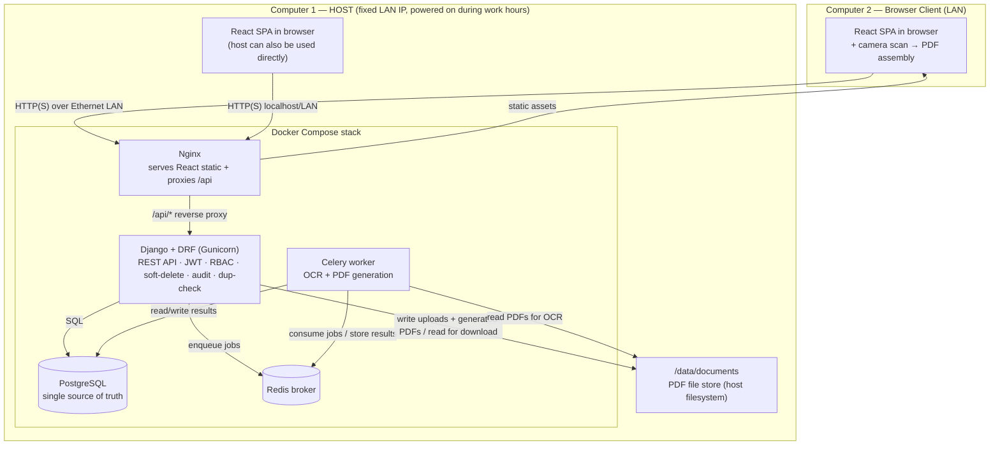
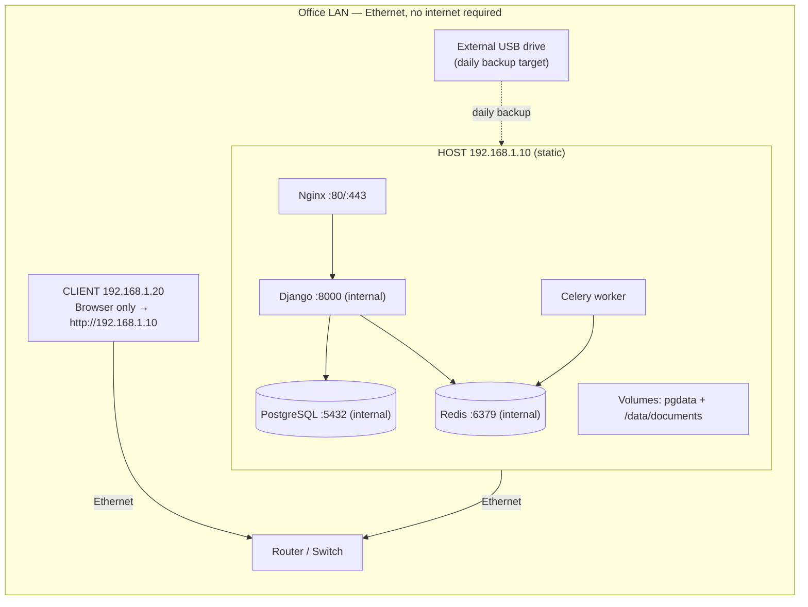
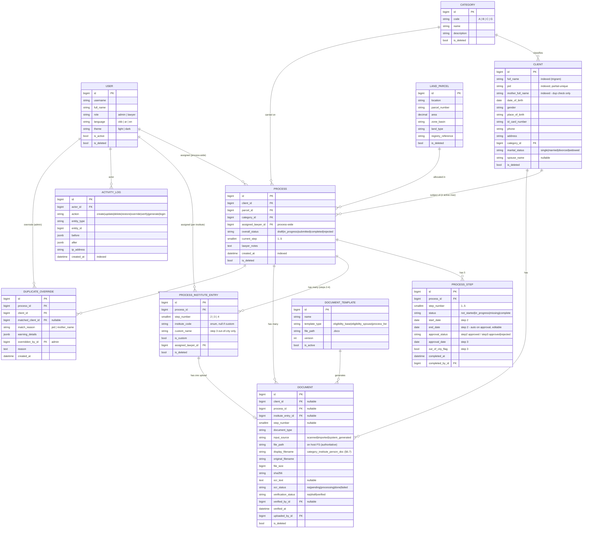
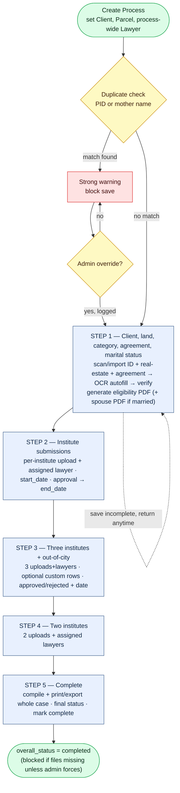
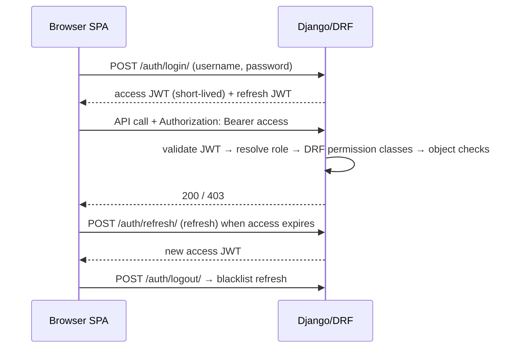
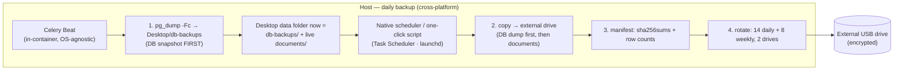

# Offline Government Land-Allocation Case Management System — System Architecture

**Document status:** Production-ready architecture specification
**Audience:** Implementing engineers, the government office's IT owner, reviewers
**Constraints honored:** 100% offline · two computers · single shared host · PostgreSQL · Django REST + Celery · React + RTK Query · local Sorani/Arabic/English OCR · soft-delete everywhere · full audit trail · data-safety first

---

## 0. Implementation deviations from this spec (living — updated through Iteration 2)

This section records where the **built system intentionally differs** from the design below. It is the authoritative changelog; where a section further down conflicts, this table wins. All core invariants (soft-delete, append-only audit, DB-level dedup, server-side RBAC, optimistic locking, full i18n/RTL) are upheld.

### Permanent deviations & additions

| Area | Spec says | Built instead | Reason |
|------|-----------|---------------|--------|
| **User theme/language** | `theme`/`language` fields on `User`; `PATCH /users/me/` edits them (§7, §4.2) | Both fields **removed**; preferences live in the browser (localStorage) only; `GET /users/me/` is read-only | Product decision — client-only UI prefs |
| **`Client.created_by`** | not present | Added FK `created_by` on `Client` | Lets the lawyer who created a client edit it before a process links them |
| **`GET /api/v1/lawyers/`** | not present (only admin `GET /users/`) | Added: read-only `id`+`username` of active users, any authenticated caller | Non-admin assignees need it for the per-institute lawyer dropdowns; the full Users API stays admin-only |
| **User soft-delete** | "every domain model extends `SoftDeleteModel`" | `User` **mirrors** the soft-delete fields (`is_deleted/deleted_at/deleted_by/version`) rather than extending it | `AbstractUser` cannot cleanly multi-inherit `SoftDeleteModel`; behavior is identical (a deleted user is also `is_active=False`) |
| **`version` field** | not shown in the `SoftDeleteModel` snippet (§3.1) | Present on every soft-deletable model incl. `User` | Required by the optimistic-locking invariant (§4.1, §12) |
| **UI component library** | shadcn/ui (§8) | Hand-built shadcn-*style* primitives (Dialog/Select/Accordion have **zero** Radix deps) | Offline footprint + avoid dependency churn; same look and behavior |

### Temporary simplifications (revisit when the named iteration lands)

| Area | Spec target | Current build | Revisit at |
|------|-------------|---------------|-----------|
| **`overall_status` values** | `draft \| in_progress \| submitted \| completed \| rejected` (§5.2) | `draft \| in_progress \| complete \| rejected` (no `submitted`; `complete`, not `completed`) | It.4 (compiled export adds the `submitted` stage) |
| **Step-1 completion** | also requires the generated eligibility PDF (§3.6) | completes on the three client documents + header fields | It.3 (eligibility generation) |
| **Document naming** | friendly name composed **at verification**; temp `__<id>.pdf` during OCR draft (§6.7) | full name composed **at upload** | It.5 (OCR draft phase introduces the temp-name window) |
| **Per-step `missing` status** | four states incl. auto-derived `missing` (§5.4) | `not_started / in_progress / complete` computed; `missing` not auto-set | It.4/It.5 (when file-expectation rules firm up) |
| **`document_type` vocabulary** | e.g. `ClientID, SignedAgreement, ApprovalLetter, EligibilityBase` (§6.7) | `ClientID, RealEstate, SignedAgreement` + generic `InstituteDoc` for Steps 2–4 | as document types are finalized |
| **`ProcessStep.approval_status`** | step carries approval | dead field — approval moved to `ProcessInstituteEntry` | cleanup (drop the field in a later migration) |

---

## Table of Contents

> **New to the project?** Start with **[Orientation for Engineers](#orientation-for-engineers-start-here)** (plain-language summary + end-to-end walkthrough), and keep the **[Glossary](#glossary)** handy for any unfamiliar term.

1. [High-Level Architecture Overview](#1-high-level-architecture-overview)
2. [Network & Deployment Topology](#2-network--deployment-topology)
3. [Data Model / ER Design](#3-data-model--er-design)
4. [REST API Design](#4-rest-api-design)
5. [Process Workflow Design (5 Steps)](#5-process-workflow-design-5-steps)
6. [Document + OCR Pipeline](#6-document--ocr-pipeline)
7. [Authentication & Authorization](#7-authentication--authorization)
8. [Frontend Architecture](#8-frontend-architecture)
9. [Internationalization & RTL](#9-internationalization--rtl)
10. [Reporting & Printing](#10-reporting--printing)
11. [Soft-Delete, Audit & Activity Logging](#11-soft-delete-audit--activity-logging)
12. [Security & Data Safety](#12-security--data-safety)
13. [Scalability, Backup & Recovery](#13-scalability-backup--recovery)
14. [Clean Project / Repo Structure](#14-clean-project--repo-structure)
15. [Recommended Build Order](#15-recommended-build-order)
16. [Consolidated Risk Register](#16-consolidated-risk-register)

---

## Orientation for Engineers (Start Here)

*New to this document? Read this section first — it explains the whole system in plain language before the detailed specs. Hit an unfamiliar term anywhere? It's defined in the [Glossary](#glossary).*

### What this system is (one paragraph)

It's an internal **web app for a government land-allocation office**. The office grants plots of land to eligible citizens; lawyers take each allocation through a legal/administrative workflow and file the supporting paperwork. Today that paperwork is physical — this app replaces the paper archive with a digital one. For each citizen, a lawyer opens a **case** (called a **Process**), scans or uploads the documents, and the app reads them with **OCR**, stores them, and tracks the case through **5 steps**. It runs on **two office computers over a local network, with no internet at all**.

### The shape of it (mental model)

If you've built a normal CRUD web app, you already know ~80% of this:

- a **React** single-page app in the browser (the UI),
- a **Django REST** backend (the business rules + the API),
- **PostgreSQL** for structured records, and **PDF files on disk** (the files are *not* stored in the database — just their paths and metadata are),
- plus one extra piece most CRUD apps don't have: a **background worker (Celery)** that runs slow jobs — reading scanned documents (OCR) and generating PDFs — so the web app never freezes while it waits.

Everything runs in **Docker** on one computer (the "**host**"); the second computer just opens a browser pointed at the host's fixed local IP address.

### What's unusual (where to focus)

Three requirements drive nearly every non-obvious decision in this document:

1. **Fully offline** — no cloud, no CDN, no internet APIs. Every library, font, and OCR model is bundled and runs locally.
2. **Local OCR for Kurdish Sorani + Arabic (right-to-left text)** — the hardest technical part. Accuracy is imperfect, so **a human always confirms** what the OCR read before it's saved.
3. **Government-grade data safety** — nothing is ever truly deleted (**soft delete**), every change is **logged** (audit trail), and the same citizen can't be granted land twice (**duplicate prevention**).

### One request, end to end (a concrete walkthrough)

Here's what actually happens when a lawyer scans a client's ID card — it touches almost every component, so if you follow this, the rest of the document is just detail:

1. In the browser, the lawyer captures the ID with the computer's camera; the browser stitches the photos into a **PDF** and uploads it to the backend.
2. **Django** saves the PDF to the file store on disk, records its metadata in **PostgreSQL**, and puts an OCR job on the **queue** (Redis).
3. The **Celery worker** picks up the job, cleans the image (deskew/denoise), runs **OCR**, extracts fields (name, ID number…), and marks the job done.
4. The browser has been **polling** "is it done yet?"; when it is, it shows the extracted text **beside the scan** and asks the lawyer to confirm it matches.
5. The lawyer corrects any mistakes and confirms; the record is marked **verified** and saved — and every one of these actions is written to the **audit log**.

### Where to start, by role

| You are… | Read next (after this section) |
|----------|-------------------------------|
| **Anyone** | §1 Architecture overview → §5 the 5-step workflow (the heart of the app) |
| **Backend dev** | §3 Data model → §4 API → §6 OCR pipeline → §7 Auth → §11–13 Audit/Security/Backup |
| **Frontend dev** | §8 Frontend architecture → §5 Workflow UI → §9 Internationalization / RTL |
| **Deploying / DevOps** | §2 Deployment & network → §2.5 Host OS & data folder → §13 Backup/restore → §14 Repo layout |
| **Reviewing the design** | Guiding Decisions (below) → §16 Risk register → §12 Security |

Everything below assumes the plain-language picture above; any term you don't recognize is in the **[Glossary](#glossary)**.

---

## Guiding Priorities & Key Decisions (read first)

Every judgment call below follows the mandated priority order: **(1) data safety & integrity → (2) simplicity & maintainability → (3) reliability.** The decisions that shape the whole design:

| # | Decision | Rationale (one line) |
|---|----------|----------------------|
| D1 | **Single shared PostgreSQL on the host; no offline-first sync** | One source of truth eliminates merge/conflict risk — the #1 data-integrity hazard — exactly as the constraints require. |
| D2 | **PDFs live on the host filesystem; DB stores path + metadata + OCR text** | Keeps the DB small and fast, makes filesystem-level backup trivial, and matches the hard constraint. |
| D3 | **Scan-to-PDF is assembled client-side in the browser** (camera capture + bundled WASM), with an optional **local scanner helper** on the host | Works fully offline from either computer's own camera; the helper covers sheet-fed USB scanners physically attached to one machine. |
| D4 | **OCR runs async in Celery; output is always a human-verified draft** | Uploads never block; Sorani accuracy is unreliable, so a human-in-the-loop gate is designed in, not bolted on. |
| D5 | **Step-1 eligibility PDFs are generated server-side** (`docxtpl` → headless LibreOffice) | Server-side template fill is far more reliable offline than browser rendering and produces correct RTL layout. |
| D6 | **Institute list is a single Python enum**, exposed read-only to the frontend | One source of truth for backend + frontend; no drift between the two sides. |
| D7 | **Soft-delete + audit implemented in a shared base model + explicit service layer** | Uniform enforcement everywhere; explicit actor attribution that DB signals cannot reliably provide. |
| D8 | **Structured indexed search only** (date, PID, name) — no document/OCR full-text search | Matches the requirement and keeps lookups index-fast at tens of thousands of rows. |
| D9 | **At-rest protection via host full-disk encryption (BitLocker on Windows prod / FileVault on macOS dev)** | The only at-rest option that protects both PostgreSQL data and the PDF store without breaking OCR/preview, and needs no internet. |
| D10 | **Nginx container serves the static React build and reverse-proxies the API** | Single origin for the LAN client, clean static serving, and a natural place to enforce upload size limits. |
| D11 | **Single-folder monorepo — frontend + backend + deploy in one project folder** | One clone, one `docker compose up`; no cross-repo drift; the shared institute enum generates backend→frontend in one build step (§14.1). |
| D12 | **One Desktop data folder for documents + DB dumps; live Postgres in a Docker named volume; entire stack in Linux containers** | Consolidates durable data in one easy-to-protect place, avoids slow/unsafe live-Postgres on a Windows bind mount, and makes Windows-production and macOS-development behave identically (§2.5). |

---

## 1. High-Level Architecture Overview

The system is a classic three-tier application collapsed onto **one physical host** for full-offline operation, with a **second computer acting purely as a browser client** over the LAN. All moving parts run as Docker containers on the host so the entire stack starts with one command and has no external dependencies.

**Components and responsibilities:**

- **React SPA (static build)** — the entire UI (login, processes, dashboard, reports, settings, admin pages). Runs in the browser on *either* computer. Talks to the backend only through the REST API. Performs the client-side camera scan and PDF assembly.
- **Nginx (host container)** — serves the compiled React static files and reverse-proxies `/api/*` to Django. Single origin the LAN client points its browser at. Enforces the max upload body size.
- **Django + Django REST Framework (host container, Gunicorn)** — the REST API, business rules, JWT auth, RBAC, soft-delete, audit writes, duplicate checks, permission-guarded document download, and enqueuing of Celery jobs. The single authority over all data.
- **PostgreSQL (host container)** — the one shared database; handles concurrent writes from both computers. Stores everything except the PDF bytes.
- **Celery worker (host container)** — runs OCR jobs and server-side PDF generation off the request path.
- **Broker — Redis (host container)** — the local, offline Celery broker/result backend.
- **File store (host filesystem, bind-mounted volume)** — the organized directory tree of PDF files. Written by Django (uploads, generated PDFs) and read by both Django (download endpoint) and the Celery worker (OCR input).

**Communication rules:** the browser only ever speaks HTTP(S) to Nginx; Django is the only writer to PostgreSQL and the file store; Celery communicates with Django only through Redis and the shared database/file volume. Nothing reaches the internet — there is no egress path in the design.



**Why this shape:** collapsing the tiers onto one host removes every network hop that could fail or need syncing, while Docker Compose keeps the pieces cleanly separated and reproducible. The second computer needs nothing installed but a browser — the lowest-maintenance client possible for a small office.

---

## 2. Network & Deployment Topology

### 2.1 Physical & network layout

Two computers connect to a simple office **router/switch over Ethernet**. The host holds a **fixed/static local IP** (either a DHCP reservation on the router or a statically configured address, e.g. `192.168.1.10`). The client computer reaches the app at `http://192.168.1.10` (port 80/443 via Nginx). No internet uplink is required for the app to function; the router can be a plain unmanaged switch with no WAN at all.



**Port exposure (deliberately minimal):** only Nginx (`80`, and `443` if TLS is enabled) is published to the LAN. PostgreSQL (`5432`), Redis (`6379`), and Django (`8000`) are **not** published to the host's LAN interface — they are only reachable inside the Docker network. This means the "two computers share one database" requirement is satisfied *through the API*, not by exposing Postgres on the wire (which would be a data-safety hole). Concurrency is handled by PostgreSQL because both browsers hit the same Django/PG instance.

### 2.2 What runs where

| Layer | Where it runs | Notes |
|-------|---------------|-------|
| React SPA | In the browser on **both** computers | Static files delivered by Nginx; no per-client install |
| Nginx | Host container, published `:80`/`:443` | Only LAN-exposed service |
| Django/DRF (Gunicorn) | Host container, internal `:8000` | All business logic + auth |
| PostgreSQL | Host container, internal `:5432`, `pgdata` volume | The shared DB |
| Celery worker + Redis | Host containers, internal only | OCR & PDF generation |
| PDF file store | Host filesystem bind mount `/data/documents` | Backed up to external drive |

### 2.3 Docker Compose layout

A single `docker-compose.yml` on the host defines five services (six with the optional scanner-helper). Images are **built once and saved** (`docker save`) so the host can be provisioned with zero internet (`docker load`).

```yaml
# docker-compose.yml (host) — illustrative
services:
  db:
    image: postgres:16
    volumes: ["pgdata:/var/lib/postgresql/data"]
    env_file: [./.env.db]           # POSTGRES_USER/PASSWORD/DB
    restart: unless-stopped
    # no ports published to LAN — internal only

  redis:
    image: redis:7
    restart: unless-stopped
    # internal only

  backend:
    build: ./backend
    command: gunicorn config.wsgi:application --bind 0.0.0.0:8000 --workers 3
    volumes: ["docdata:/data/documents"]
    env_file: [./.env.backend]
    depends_on: [db, redis]
    restart: unless-stopped

  worker:
    build: ./backend
    command: celery -A config worker -l info --concurrency=2
    volumes: ["docdata:/data/documents"]   # same file store as backend
    env_file: [./.env.backend]
    depends_on: [db, redis]
    restart: unless-stopped

  nginx:
    image: nginx:1.27
    volumes:
      - ./frontend/dist:/usr/share/nginx/html:ro   # compiled React build
      - ./nginx/default.conf:/etc/nginx/conf.d/default.conf:ro
    ports: ["80:80"]                # (and 443:443 if TLS enabled)
    depends_on: [backend]
    restart: unless-stopped

  # Optional 6th service on the host only: scanner-helper (see §6.3)

volumes:
  pgdata:        # NAMED volume (stays in the Docker/WSL2 VM) — do NOT bind-mount live Postgres to the Desktop on Windows
  docdata:       # bind-mount to the Desktop data folder's documents/ (see §2.5):
                 #   Windows: C:\Users\<user>\Desktop\LandAllocationData\documents
                 #   macOS:   /Users/<user>/Desktop/LandAllocationData/documents
```

`restart: unless-stopped` means the whole stack comes back automatically after a power cycle — important because the host is switched on each working morning.

### 2.4 Startup / shutdown expectations

- **Morning start:** power on the host; Docker + `restart: unless-stopped` bring the stack up with no operator action. The client computer just opens the browser.
- **During the day:** the host must stay on; it is the single source of truth. The client is stateless.
- **Evening shutdown:** run the **daily backup** (§13) — ideally an automated scheduled task (Windows Task Scheduler in production / macOS launchd in development, §2.5) so it does not depend on someone remembering — then the host can be powered off. The schedule must fall within working hours (the host is off overnight), and the host should stay on until it completes.
- **Health:** a tiny `/api/health/` endpoint (DB + Redis + file-store writability check) lets the office confirm "the system is up" without technical knowledge.

**Risk flag:** the host is a single point of failure. Mitigations are the daily external-drive backups (§13) and keeping a *tested* restore procedure plus a spare machine image so the stack can be brought up on replacement hardware quickly.

### 2.5 Host OS & the data root (Windows in production, macOS in development)

The **production host runs Windows**; **development is on macOS**. This is safe because **every service runs inside a Linux container** (Docker Desktop uses the WSL 2 Linux backend on Windows and a Linux VM on macOS). So Django, PostgreSQL, Celery, Redis, Nginx, **and the OCR/LibreOffice engines are identical on both machines** — the host OS never touches application behavior. Only four things are host-OS-specific, and all are pinned below: the data-root path, the disk-encryption tool, the backup scheduler, and the optional scanner helper.

**One data folder on the Desktop.** All persistent data — the document PDFs and the database's daily dumps — lives together in **one folder on the Desktop**, kept entirely **outside the code repo** so the data is easy to find, protect, and copy to the external drive as a single unit:

```
Desktop/LandAllocationData/          # the ONE data folder (never inside land-allocation/)
├── documents/                       # live PDF file store → bind-mounted into backend+worker as /data/documents
│   └── <CATEGORY>/<client>/<document_id>.pdf     # layout in §6.7
├── db-backups/                      # daily pg_dump output (.dump files)
└── manifests/                       # per-backup checksums + row counts
```

| Path | Production (Windows) | Development (macOS) |
|------|----------------------|---------------------|
| Data root | `C:\Users\<user>\Desktop\LandAllocationData\` | `/Users/<user>/Desktop/LandAllocationData/` |

**Important nuance — the *live* database is NOT a Desktop file.** PostgreSQL's live data directory stays in a **Docker named volume (`pgdata`)**, not in the Desktop folder. Running a live Postgres data directory on a Windows Desktop bind mount (DrvFS across the WSL 2 boundary) is slow and can cause file-locking/corruption problems. So the split is: **live DB → fast/safe Docker volume**; **Desktop folder → the consolidated *durable* copy** (live documents + the DB's daily dumps), which is exactly what gets mirrored to the external drive. The `documents/` store *is* bind-mounted to the Desktop folder because PDFs are write-once and immune to those performance concerns. (On macOS dev a Postgres bind mount would also work, but keeping the named volume makes dev and prod identical.)

**Host-OS equivalents (the only differences between the two machines):**

| Concern | Production — Windows | Development — macOS |
|---------|----------------------|---------------------|
| Container runtime | Docker Desktop (WSL 2, Linux containers) | Docker Desktop (Linux VM) |
| Auto-start on boot | Docker Desktop "Start on login" + `restart: unless-stopped` | same |
| Disk encryption (at rest) | **BitLocker** on the system/data drive | **FileVault** |
| Internal consistent backup | **Celery Beat** task (in-container, OS-agnostic) writes the `pg_dump` into `Desktop/…/db-backups/` | same |
| External-drive copy scheduler | **Windows Task Scheduler** runs `backup.bat` | **launchd**/`cron` runs `backup.sh` |
| Optional scanner helper (§6.3) | NAPS2 / WIA | Image Capture / SANE |

Because the consistent DB dump is produced by an in-container **Celery Beat** job, the only genuinely host-specific automation is the final "copy the Desktop data folder to the external USB drive" step — a tiny native scheduled task (or the provided one-click `backup.bat`/`backup.sh`).

---

## 3. Data Model / ER Design

> **In plain terms:** this is the list of database tables and how they link together. Everything centers on the **Process** (one land-allocation case); the other tables hang off it. If you read only one diagram in this document, make it the ER diagram just below.

The model is normalized around one central entity — **Process** — with **Client**, **LandParcel**, and **Category** as its inputs, and **Documents**, **ProcessSteps**, and **ProcessInstituteEntries** hanging off it. Two cross-cutting concerns — **soft-delete** and **audit** — are implemented once in abstract base models and inherited everywhere.

### 3.1 Base models (inherited by all domain tables)

```python
class TimeStampedModel(models.Model):
    created_at = models.DateTimeField(auto_now_add=True, db_index=True)
    updated_at = models.DateTimeField(auto_now=True)
    class Meta: abstract = True

class SoftDeleteModel(TimeStampedModel):
    is_deleted  = models.BooleanField(default=False, db_index=True)
    deleted_at  = models.DateTimeField(null=True, blank=True)
    deleted_by  = models.ForeignKey("accounts.User", null=True, blank=True,
                                    on_delete=models.PROTECT, related_name="+")
    objects     = ActiveManager()   # filters is_deleted=False by default
    all_objects = models.Manager()  # includes soft-deleted (admin/restore/audit)
    class Meta: abstract = True
```

Every domain table below extends `SoftDeleteModel`, so **soft-delete, timestamps, and "who deleted" are uniform system-wide** (satisfies the soft-delete-only and audit constraints at the schema level). `on_delete=models.PROTECT` on foreign keys guarantees nothing is ever hard-deleted by cascade.

### 3.2 Entity–Relationship diagram



### 3.3 Entity/field reference

| Entity | Purpose | Key fields | Notable relationships |
|--------|---------|-----------|----------------------|
| **User** | Login account, assignment, audit attribution | `role` (admin/lawyer) — *`language`/`theme` removed, see §0* | 1→N Process (process-wide), 1→N ProcessInstituteEntry (per-institute), 1→N ActivityLog |
| **Category** | A/B/C/G institute grouping, admin-managed | `code`, `name` | 1→N Client, 1→N Process |
| **Client** | Land beneficiary; all gov-ID fields | `full_name`, `pid`, `mother_full_name`, `marital_status`, `spouse_name`, `created_by` *(§0)* | N→1 Category; 1→N Document; 1→N Process |
| **LandParcel** | The land allocated | `parcel_number`, `location`, `area`, `zone_basin`, `registry_reference` | 1→N Process |
| **Process** | Central allocation case | `overall_status`, `current_step`, `assigned_lawyer`, `lawyer_notes` | N→1 Client/Parcel/Category/Lawyer; 1→N Step/InstituteEntry/Document |
| **ProcessStep** | Per-step status + step-level dates/approval | `step_number`, `status`, `start_date`, `end_date`, `approval_status`, `out_of_city_flag` | N→1 Process |
| **ProcessInstituteEntry** | One institute's upload + assigned lawyer in steps 2–4 | `institute_code` OR `custom_name`, `is_custom`, `assigned_lawyer` | N→1 Process; 1→1 Document (single owning FK: `Document.institute_entry_id`) |
| **Document** | A PDF (scanned/imported/generated) + OCR draft | `file_path`, `input_source`, `ocr_status`, `verification_status`, `sha256` | N→1 Client/Process/InstituteEntry |
| **DocumentTemplate** | `.docx` templates for generated PDFs — Step-1 eligibility + Processes-page list docs (§6.8) | `template_type`, `file_path`, `version`, `is_active` | 1→N generated Documents |
| **ActivityLog** | Immutable audit trail | `actor`, `action`, `entity_type/id`, `before`, `after` | N→1 User (actor) |
| **DuplicateOverride** | Records a fired duplicate warning + admin override | `match_reason`, `overridden_by`, `reason` | N→1 Process/Client/Admin |

### 3.4 The shared institute enum (single source of truth)

The Step 2–4 institutes are **defined once in Python** and consumed by both sides — the backend validates `institute_code` against it, and the frontend fetches it read-only (see §4). Names are placeholders per the spec.

```python
# catalog/institutes.py — the ONE definition
class InstituteStep(models.IntegerChoices):
    STEP_2 = 2; STEP_3 = 3; STEP_4 = 4

INSTITUTES = [
    # code,           display_key (i18n),   step
    ("INST_S2_A",     "institute.s2_a",     2),
    ("INST_S2_B",     "institute.s2_b",     2),
    ("INST_S3_A",     "institute.s3_a",     3),
    ("INST_S3_B",     "institute.s3_b",     3),
    ("INST_S3_C",     "institute.s3_c",     3),   # Step 3 = three fixed institutes
    ("INST_S4_A",     "institute.s4_a",     4),
    ("INST_S4_B",     "institute.s4_b",     4),   # Step 4 = two fixed institutes
]
```

The frontend never hard-codes this list — it reads `GET /api/institutes/`. Institute **display names** are i18n keys, not literals, so Sorani/Arabic/English labels come from the translation files while the stable machine `code` lives in the DB. `ProcessInstituteEntry.institute_code` stores the enum code for fixed institutes; `is_custom=True` + `custom_name` covers Step 3's out-of-city rows (which have no enum code).

### 3.5 Marital status & generated documents at the schema level

`Client.marital_status` + nullable `Client.spouse_name` capture the Step-1 marital input. Generated eligibility PDFs are ordinary `Document` rows with `input_source="system_generated"`, `ocr_status="na"`, `verification_status="na"`, linked to the process — so they preview/print/download through the same document machinery as everything else. A married client simply yields **two** generated Documents (base + spouse); a single client yields one.

### 3.6 Per-step required-vs-missing status

`ProcessStep.status` is derived from a **declarative per-step requirement spec** (which documents / institute uploads must be present) and recomputed on every save. Storing it (rather than computing on read) lets list/badge queries stay index-fast and gives the audit log a concrete before/after value.

| Step | Required for "complete" |
|------|-------------------------|
| 1 | Client + parcel + category + marital status set; client-ID doc, real-estate doc, signed-agreement doc present; base eligibility PDF generated (+ spouse PDF if married); duplicate check cleared/overridden |
| 2 | Every Step-2 institute entry has a document + assigned lawyer; start_date set; approval recorded (sets end_date) |
| 3 | All three Step-3 institute entries complete; each out-of-city row (if flag on) has name + doc + lawyer; approved/rejected + date recorded |
| 4 | Both Step-4 institute entries have a document + assigned lawyer |
| 5 | All prior steps complete (no missing files) unless admin-forced; final status recorded |

Status values: `not_started` (no data), `in_progress` (some data, some required items missing), `missing` (explicitly flagged outstanding files), `complete`. These drive the accordion badge colors (§5, §8).

### 3.7 Search & indexing strategy

Processes are searched/filtered **only** by structured fields — **date, client PID, client name** — plus list filters (category, status, assigned lawyer). No document/OCR full-text search. Mother's full name is a **duplicate-detection key only**, never a search field.

| Index | Table.column(s) | Type | Serves |
|-------|-----------------|------|--------|
| `ix_client_pid_active` | `client (pid) WHERE NOT is_deleted` | **partial unique** btree | PID lookup **and** dedups client *identities* (one active client row per PID) |
| `ix_process_active_alloc` | `process (client_id) WHERE NOT is_deleted AND overall_status <> 'rejected'` | **partial unique** btree | enforces **one active allocation per client** — the actual "no land twice" guarantee (rejected/soft-deleted attempts still allowed) |
| `ix_client_name_trgm` | `client (full_name)` | GIN **trigram** (`pg_trgm`) | fast partial/fuzzy name search |
| `ix_client_mother_trgm` | `client (mother_full_name)` | GIN trigram | duplicate detection (fuzzy) — not user search |
| `ix_process_created_at` | `process (created_at)` | btree | date filter/sort |
| `ix_process_filters` | `process (category_id, overall_status, assigned_lawyer_id)` | composite btree | list-page filters |
| `ix_process_client` | `process (client_id)` | btree | join to client for PID/name search |
| `ix_doc_process_step` | `document (process_id, step_number) WHERE NOT is_deleted` | partial btree | per-step document presence checks |
| `ix_entry_process` | `process_institute_entry (process_id, step_number)` | btree | load a process's institute entries |
| `ix_activity_created` | `activity_log (created_at)`, `(entity_type, entity_id)` | btree | Activities page filters |

**Search implementation:** the Processes list joins Process→Client with `select_related`, filters on the indexed columns, and paginates. Because PID is exact and name uses `pg_trgm` `%`/`ILIKE`, both stay fast at tens of thousands of rows. Duplicate prevention (§5.7) rests on **two** partial-unique indexes, not one — `ix_client_pid_active` (no duplicate client identities) and `ix_process_active_alloc` (no second active allocation per client). Application-level checks can race between the two computers; these indexes cannot.

**Soft-delete + audit at schema level:** every table carries `is_deleted/deleted_at/deleted_by`; the default manager hides deleted rows so normal views and search exclude them automatically, while `all_objects` powers restore and admin views. Audit is a separate append-only `activity_log` table (never updated or deleted) with `before`/`after` JSONB snapshots.

---

## 4. REST API Design

A **REST** API (explicitly not GraphQL) under `/api/`, versioned `/api/v1/`, JSON everywhere except file bytes. DRF `ModelViewSet`s where CRUD is standard, plus custom actions for the workflow-specific operations (per-step save, generate, verify, override). All list endpoints support the same filter/sort/paginate contract.

### 4.1 Conventions

- **Auth:** `Authorization: Bearer <access_jwt>` on every call except login/refresh.
- **Soft-delete:** `DELETE` sets `is_deleted=True` (never removes); `POST /{id}/restore/` brings it back (admin).
- **Pagination:** `?page=&page_size=` (default 25, max 100), ordered results for stable paging.
- **Filtering:** `django-filter` backends; documented per endpoint below.
- **Errors:** consistent envelope `{ "detail": "...", "code": "...", "fields": {...} }`.
- **Idempotent step saves:** step endpoints are `PATCH` (partial) so a process can be saved incomplete repeatedly.
- **Optimistic concurrency:** every writable resource carries a `version` (or `updated_at`); a `PATCH` sends the base version and the server returns **HTTP 409** if it is stale, so when both computers edit the same process one user cannot silently overwrite the other's save. The client re-fetches and retries.

### 4.2 Endpoint reference

| Area | Method & path | Purpose | Access |
|------|---------------|---------|--------|
| **Auth** | `POST /api/v1/auth/login/` | Obtain access + refresh JWT | All |
| | `POST /api/v1/auth/refresh/` | Refresh access token | All |
| | `POST /api/v1/auth/logout/` | Blacklist refresh token | All |
| | `GET /api/v1/auth/me/` | Current user (role) — *read-only; `PATCH /users/me/` removed, see §0* | All |
| **Users** | `GET/POST /api/v1/users/` | List / create users | Admin |
| | `GET/PATCH/DELETE /api/v1/users/{id}/` | Retrieve / update / soft-delete | Admin |
| | `POST /api/v1/users/{id}/restore/` | Restore soft-deleted user | Admin |
| **Lawyers** | `GET /api/v1/lawyers/` | **Read-only** `id`+`username` of active users, for per-institute assignment dropdowns *(§0)* | All |
| **Categories** | `GET /api/v1/categories/` | List A/B/C/G | All (read) |
| | `POST/PATCH/DELETE /api/v1/categories/{id}/` | CRUD | Admin |
| **Institutes** | `GET /api/v1/institutes/` | **Read-only shared enum** (code, i18n key, step) | All |
| **Clients** | `GET/POST /api/v1/clients/` | List / create; `?search=&pid=` | All (create) |
| | `GET/PATCH/DELETE /api/v1/clients/{id}/` | Retrieve / update / soft-delete | Admin or process assignee |
| **Parcels** | `GET/POST /api/v1/parcels/` | List / create land parcels | All (create) |
| | `GET/PATCH/DELETE /api/v1/parcels/{id}/` | CRUD | Admin or process assignee |
| **Processes** | `GET /api/v1/processes/` | **Search/filter list** (see 4.3) | All (read all) |
| | `POST /api/v1/processes/` | Create case (sets process-wide lawyer) | All |
| | `GET /api/v1/processes/{id}/` | Full case with steps, entries, documents | All |
| | `PATCH /api/v1/processes/{id}/` | Update case header / lawyer_notes | Assignee or Admin |
| | `DELETE /api/v1/processes/{id}/` | Soft-delete case | Assignee or Admin |
| | `POST /api/v1/processes/{id}/restore/` | Restore | Admin |
| **Per-step save** | `PATCH /api/v1/processes/{id}/steps/{n}/` | **Save step n incomplete or complete** | Assignee or Admin |
| | `GET /api/v1/processes/{id}/steps/{n}/` | Step n data + computed status | All |
| | `POST /api/v1/processes/{id}/steps/5/complete/` | Mark complete (enforces missing-file rule; admin can force) | Assignee or Admin |
| **Institute entries** | `GET /api/v1/processes/{id}/institute-entries/` | Entries for steps 2–4 | All |
| | `POST /api/v1/processes/{id}/institute-entries/` | Add entry (fixed or custom out-of-city) + assigned lawyer | Assignee or Admin |
| | `PATCH/DELETE /api/v1/institute-entries/{id}/` | Update lawyer/doc / soft-delete row | Assignee or Admin |
| **Documents** | `POST /api/v1/documents/` | **Upload a PDF** (multipart) — scanned or imported; body: `input_source`, `document_type`, links | Assignee or Admin |
| | `GET /api/v1/documents/{id}/` | Metadata + OCR draft + verification status | Per parent access |
| | `GET /api/v1/documents/{id}/file/` | **Download PDF** (permission-checked stream) | Per parent access |
| | `GET /api/v1/documents/{id}/ocr/` | **OCR status poll** (`pending/processing/done/failed`) + parsed fields | Per parent access |
| | `POST /api/v1/documents/{id}/verify/` | Mark OCR draft verified (records who/when) | Assignee or Admin |
| | `DELETE /api/v1/documents/{id}/` | Soft-delete document | Assignee or Admin |
| **Eligibility PDF** | `POST /api/v1/processes/{id}/generate-eligibility/` | Server-side template→PDF (base always; +spouse if married); returns job id | Assignee or Admin |
| | `GET /api/v1/processes/{id}/generate-eligibility/{job}/` | Generation status → resulting Document ids | Assignee or Admin |
| **Doc templates** | `GET /api/v1/document-templates/` | List templates for selection; `?type=process_list` | All (read) |
| | `POST/PATCH/DELETE /api/v1/document-templates/{id}/` | Manage templates (upload `.docx`) | **Admin only** |
| **Bulk document** (§6.8) | `POST /api/v1/processes/generate-document/` | Generate 1 PDF from selected `process_ids` + `template_id`; returns job id | All |
| | `GET /api/v1/processes/generate-document/{job}/` | Generation status → PDF to save/print | All |
| **Duplicate check** | `POST /api/v1/clients/duplicate-check/` | Check PID **or** mother name → matches + warning | All |
| | `POST /api/v1/processes/{id}/override-duplicate/` | **Admin override** with reason (logged) | **Admin only** |
| **Reports** | `GET /api/v1/reports/processes/` | Aggregates, filters `?date_from=&date_to=&category=` | **Admin only** |
| | `GET /api/v1/reports/users/` | Per-user completed-task report | **Admin only** |
| **Dashboard** | `GET /api/v1/dashboard/` | Home stats (records this week, per-user counts) | All |
| **Activities** | `GET /api/v1/activities/` | Audit log; filters actor/entity/action/date | **Admin only** |
| **Health** | `GET /api/v1/health/` | DB + Redis + file-store check | All |

### 4.3 Process search & filter contract

```
GET /api/v1/processes/?search=<name>&pid=<exact>&date_from=2026-01-01&date_to=2026-07-01
                       &category=A&status=in_progress&assigned_lawyer=7&page=1&page_size=25
```

- `pid` → exact match on the partial-unique PID index (fast).
- `search` → trigram `ILIKE` on `client.full_name` (partial/fuzzy).
- `date_from/date_to` → range on `process.created_at` index.
- `assigned_lawyer` → matches the **process-wide** assignee **or** any per-institute assignee (documented so the UI can label which). Response includes `step_status_summary` so the list can show per-step badges without extra calls.

### 4.4 How the tricky operations work over REST

**Partial / step saves.** Each step is a sub-resource `PATCH`ed independently. The server validates only what is present, updates `ProcessStep.status` via the requirement spec, writes the audit entry, and returns the recomputed status. Nothing forces a step to be complete — "save incomplete" is the default path, and `overall_status` stays `draft`/`in_progress`.

**PDF upload (scan or import — same endpoint).** Both the browser-assembled scan PDF and an imported file hit `POST /api/v1/documents/` as `multipart/form-data`. The server: validates it is a real PDF (magic bytes + size limit), writes it to the file store under a deterministic path, computes `sha256`, creates the `Document` row (`input_source` = `scanned`|`imported`), and — for scanned/imported docs — **enqueues the OCR Celery job**, returning `201` immediately with `ocr_status="pending"`.

**File download.** `GET /documents/{id}/file/` never serves the file statically. Django checks the caller's permission against the document's parent (client/process), then streams the bytes with `Content-Disposition` set to the human-readable `display_filename` (`category_institute_person_document`, §6.7) so the saved file is friendly regardless of the opaque path on disk. PDFs are outside Nginx's static root so they cannot be fetched by guessing a URL.

**OCR status polling.** The client polls `GET /documents/{id}/ocr/` (RTK Query polling, §8) until `done`/`failed`. On `done` the response carries `ocr_text` + `parsed_fields` (candidate structured values) that pre-fill the form; on `failed` the UI falls back to manual entry. A local in-app notification fires on completion.

---

## 5. Process Workflow Design (5 Steps)

Creating a Process starts a **5-step data-entry flow rendered as collapsible accordion sections**. Any step can be saved incomplete and returned to at any time — partial saves are the **norm**, because lawyers wait on external institutes. The process-wide responsible lawyer is set **at creation** and drives edit/soft-delete permission; per-institute lawyers are assigned inside Steps 2–4. A **Lawyer Notes** free-text field is available across all steps, editable anytime by the assignee or an admin, and every change is audited.



### 5.1 Per-step fields, institutes & uploads

| Step | Inputs | Documents (scan **or** import) | Institutes (from shared enum) | Approval / dates | Lawyer |
|------|--------|-------------------------------|------------------------------|------------------|--------|
| **1** | All gov-ID client fields, real-estate fields, **Category (A/B/C/G)**, **marital status (+spouse name if married)** | Client ID, real-estate papers, signed agreement → **OCR autofill + verify**; **generated** base eligibility PDF (always) + spouse PDF (if married) | — | — | process-wide only (set at creation) |
| **2** | `start_date` (user) | one upload **per Step-2 institute** + the approved paperwork | Step-2 institutes | **approval recorded → sets `end_date`** (editable later) | **per-institute** assigned lawyer |
| **3** | out-of-city flag; `approval_date` | one upload per **three** Step-3 institutes; **+ repeatable custom rows** (name+doc+lawyer) when flag on | three Step-3 institutes + custom | **approved / rejected + date** | per-institute + per-custom-row lawyer |
| **4** | — | one upload per **two** Step-4 institutes | two Step-4 institutes | — | per-institute assigned lawyer |
| **5** | final status/outcome | **compiled export** of all prior data + documents (print/PDF) | — | mark complete (respects missing-file status) | — |

### 5.2 Save-incomplete behavior

Each accordion section maps to `PATCH /processes/{id}/steps/{n}/`. Saving validates only present fields, updates that step's `status`, and leaves the process `draft`/`in_progress`. There is **no forced sequence** — a lawyer can fill Step 4 before Step 2 finishes (common while waiting on institutes). The only ordering gate is Step 5 completion, which checks all steps' missing-file status.

**`overall_status` lifecycle:** a process is `draft` on creation, flips to `in_progress` once real step data is saved, becomes `submitted` when Step 5 compiles and sends the case to leadership, and finally settles as `completed` or `rejected` per the Step-5 outcome. `current_step` is informational (the furthest step reached) — because editing is non-linear, it is not a gate.

> **Implementation note (through It.2, see §0):** the built enum is `draft \| in_progress \| complete \| rejected` — Step-5 completion sets `complete` directly. The `submitted` stage (and renaming `complete`→`completed`) arrives with the Iteration-4 compiled export. Editing a completed process that breaks a step reverts it to `in_progress`.

### 5.3 Accordion, editable anytime

Steps render as shadcn `Accordion` items, each independently expandable and editable at any time. Re-opening a completed step and editing it re-runs that step's status computation and (for Step 2) keeps the auto-set `end_date` editable. Every edit is audited.

### 5.4 Per-step missing-document status / color indicators

Each accordion header shows a colored badge from `ProcessStep.status`:

| Badge | Meaning | Color intent |
|-------|---------|--------------|
| `not_started` | no data entered | grey |
| `in_progress` | some data, required items still missing | amber |
| `missing` | required files explicitly outstanding | red |
| `complete` | all required docs/uploads present | green |

The whole-process header shows a rollup ("3 of 5 steps complete, 2 files missing") so a lawyer sees outstanding work at a glance. Status is computed server-side from the requirement spec (§3.6) and returned in `step_status_summary`, so the badges are authoritative, not guessed by the UI.

### 5.5 Marital-status-driven eligibility PDF generation (Step 1)

On Step-1 save, `POST /processes/{id}/generate-eligibility/` runs a Celery task that fills the stored `.docx` template(s) with the client name — **always the base PDF**, and **additionally the spouse PDF when `marital_status = married`** (spouse name inserted). Outputs are stored as `Document(input_source="system_generated")` attached to the process, so they preview/print/download like any other document. Regenerating (e.g. after a name correction) supersedes the previous generated docs (old ones soft-deleted, audited).

### 5.6 Step-3 out-of-city repeatable rows

Checking `out_of_city_flag` reveals a **dynamic array** of `(custom institute name + PDF upload + assigned lawyer)` rows (frontend `useFieldArray`; backend `ProcessInstituteEntry` with `is_custom=True`, `custom_name`, no `institute_code`). The user can add one or more. These rows count toward Step-3 completion only when the flag is on.

### 5.7 Duplicate warning → admin override flow

When attaching/creating a client on a process, `POST /clients/duplicate-check/` runs **before save**, matching on **PID exact OR mother's full name (fuzzy trigram)**. On a match:

1. A **strong, blocking warning** shows the matched client/allocation.
2. The process can be saved as a **`draft`** (so it gets an id and the entered data isn't lost) but is **flagged and blocked from advancing** past Step 1.
3. Only an **Admin** can clear the block via `POST /processes/{id}/override-duplicate/` with a mandatory reason — or, if it truly is a duplicate, the draft is abandoned/soft-deleted.
4. The override writes a `DuplicateOverride` row **and** an `ActivityLog` entry (who, when, reason) — fully auditable.

**The two match types are not equivalent, and the design treats them differently:**

- A **PID match** means the *same person* (PID is unique per individual) already holds an active allocation. This is a hard duplicate: the `ix_process_active_alloc` index (§3.7) refuses a second active allocation for that client at the storage layer, so even an override cannot silently create one — a PID-match override is an exceptional, heavily-scrutinized correction (e.g. reinstating a wrongly-rejected case), not a routine bypass.
- A **mother's-name match** frequently flags a *different* person — most often a **sibling**, who shares a mother but has a different PID and is legitimately eligible. This is the common, expected false positive, and is exactly what the routine admin override exists for: a new client row (different PID) and a new allocation are created, violating no index.

So "no land twice" holds at the storage layer — even under a race between the two computers — because `ix_client_pid_active` blocks duplicate identities and `ix_process_active_alloc` blocks a second active allocation per client; the app-level check and admin override sit on top for usability and the sibling case.

### 5.8 End-date auto-set-but-editable rule (Step 2)

When the Step-2 approval is recorded, the server sets `ProcessStep(step=2).end_date = today` automatically. If the step is later edited, `end_date` remains a normal editable field — the auto-set is a convenience default, not a lock. Both the auto-set and any manual change are audited.

---

## 6. Document + OCR Pipeline

Every document is a **PDF**, added one of three ways: **(a)** the built-in scan/capture builds the PDF in the browser, **(b)** the user imports an existing file, or **(c)** the system generates it from a template (Step-1 eligibility). Only (a) and (b) go through OCR; (c) skips it. The pipeline is designed around one truth: **Sorani OCR is not reliable enough to trust automatically**, so it produces a *draft* that a human must confirm.

```mermaid
flowchart LR
    subgraph BROWSER["Browser (either computer, offline)"]
        CAM["Camera / doc-camera<br/>getUserMedia"] --> CAP["Capture pages → canvas<br/>optional deskew/enhance (opencv.js WASM, bundled)"]
        CAP --> ASM["Assemble multi-page PDF<br/>(pdf-lib / jsPDF, bundled — no CDN)"]
        IMP["Import existing file<br/>(file picker)"] --> PDFCHK["Ensure PDF"]
        ASM --> UP
        PDFCHK --> UP["POST /documents/ (multipart PDF)"]
    end

    UP --> API["Django: validate PDF · store file · sha256 · create Document(ocr_status=pending) · enqueue"]
    API --> RB[("Redis")]
    RB --> CEL["Celery worker"]

    subgraph CELERY["Celery OCR job (host)"]
        CEL --> RAS["PDF → page images<br/>(pdfium/pdf2image)"]
        RAS --> PRE["OpenCV/Pillow pre-process<br/>deskew · denoise · CLAHE contrast · binarize"]
        PRE --> OCR["Tesseract -l ckb+ara+eng<br/>(and/or PaddleOCR) RTL-aware"]
        OCR --> PARSE["Field parse heuristics<br/>→ parsed_fields (JSON)"]
        PARSE --> SAVE["Save ocr_text + parsed_fields<br/>ocr_status=done"]
    end

    SAVE --> POLL["Frontend polls /documents/{id}/ocr/<br/>+ local notification 'OCR finished'"]
    POLL --> REVIEW["Side-by-side review screen:<br/>scan preview | pre-filled fields"]
    REVIEW --> MATCH{"Match warning:<br/>confirm data matches?"}
    MATCH -- "edit / confirm" --> VER["POST /documents/{id}/verify/<br/>verification_status=verified (+who/when)"]
```



### 6.1 Document input — the offline scan-to-PDF approach (concrete)

Because the app is a fully-offline browser SPA, the **default, first-class scan path assembles the PDF client-side**:

1. **Capture** — `navigator.mediaDevices.getUserMedia({ video: … })` opens the computer's own webcam or an attached USB document camera. The user captures each page to a `<canvas>`. This works on **either** computer because capture and assembly happen in that machine's browser, then only the finished PDF is uploaded over the LAN.
2. **Enhance (optional, offline)** — a **bundled** `opencv.js` (WASM, shipped inside the app — no CDN) applies deskew, grayscale, contrast, and adaptive threshold on the canvas for cleaner pages. Pure-canvas fallbacks (grayscale/contrast) exist if WASM is disabled.
3. **Assemble** — a **bundled** `pdf-lib` (or `jsPDF`) stitches the page images into a single multi-page PDF entirely in the browser.
4. **Upload** — the PDF blob is `POST`ed to `/api/v1/documents/` with `input_source="scanned"`.

**Optional desktop-scanner path (host only).** For a real sheet-fed USB scanner, browsers cannot talk to TWAIN/SANE directly. A tiny **local scanner-helper** service on the **host** (e.g. Python + SANE `scanimage`, or NAPS2's CLI) exposes `http://127.0.0.1:PORT/scan` that returns a PDF; the browser on the host calls it and forwards the PDF to the upload endpoint. **Constraint to flag:** this helper only serves the machine the scanner is physically attached to — the LAN client computer would need its own camera (path above) or its own attached scanner. Recommendation: **make camera-capture the primary path** (works everywhere, zero extra services) and add the helper only if the office already owns a document scanner.

**Import path.** The file picker accepts a file; the frontend confirms it is a PDF (and can wrap a single image into a PDF with the same bundled library if the office scans to image). Uploaded with `input_source="imported"`.

### 6.2 OCR — engine, pre-processing, languages

- **Engine:** **Tesseract 5** with `ckb` (Central Kurdish / Sorani), `ara` (Arabic), `eng` traineddata **bundled locally** in the worker image (`-l ckb+ara+eng`), which handles mixed scripts and RTL. **PaddleOCR** (Arabic-script model) is included as an **alternative/parallel** engine so results can be compared and the better one chosen per document type — valuable because Tesseract and Paddle fail on different inputs.
- **Pre-processing (OpenCV/Pillow):** deskew (min-area-rect / Hough), denoise, CLAHE contrast, adaptive binarization, DPI normalization. This is where most real-world accuracy is won or lost for Arabic-script scans.
- **Output:** raw `ocr_text` + a `parsed_fields` JSON of candidate structured values (name, PID, DOB, …) produced by field heuristics/regex tuned to the ID layout. **The confirmed structured fields — not the raw text — are what users later search by**, which is exactly why full-text search over OCR is unnecessary.

### 6.3 Where Celery fits & how the UI reflects progress

Upload returns instantly with `ocr_status="pending"`; the heavy work runs in the Celery worker so requests never block. The review screen shows a spinner and polls `/documents/{id}/ocr/`; on `done` it pre-fills the form and raises a local "OCR finished" notification; on `failed` it cleanly falls back to manual entry (the document is still saved and usable). Concurrency is bounded (`--concurrency=2`) so OCR cannot starve the small host. Because the DB `ocr_status` is the source of truth (not the broker), tasks use Celery retries, and a periodic sweep re-enqueues any document stuck in `pending`/`processing` beyond a threshold — covering the case where the host reboots mid-job and the in-Redis task is lost.

### 6.4 Auto-fill → human-verify (the match warning)

When OCR completes, the **side-by-side review screen** shows the scanned PDF on one side and the pre-filled form on the other. Fields carry a "from OCR — please confirm" marker. Before saving, a **match warning** ("Confirm the extracted data matches the document") must be acknowledged. Saving sets `verification_status="verified"` with `verified_by`/`verified_at`. Design intent, restated: **input → OCR draft → human review → verified** — never trust extraction blindly.

### 6.5 Sorani accuracy — honest risk & improvement path

**This is the highest technical risk in the system.** Tesseract's `ckb` model and Arabic-script OCR generally struggle with real scanned Kurdish (font variety, ligatures, diacritics, low-quality paper, mixed Sorani/Arabic/Latin). Expect **meaningful error rates**, especially on names and hand-filled fields. Mitigations, in order of payoff:

1. **Keep the human-in-the-loop gate** (already core) — correctness never depends on OCR being right.
2. **Invest in pre-processing** — deskew/denoise/binarize typically helps Arabic-script accuracy more than swapping engines.
3. **Compare Tesseract vs PaddleOCR/EasyOCR** per document type and pick the winner.
4. **Collect corrections** — the document keeps its original `parsed_fields` (the OCR candidates) unchanged while the human-corrected values are saved on the entity; the two together form (predicted, corrected) pairs — a labeled dataset built at zero extra effort.
5. **Fine-tune over time** — use that dataset with `tesstrain` to fine-tune `ckb`, or build custom traineddata for the specific ID fonts; ship the improved traineddata to the worker image. **Sequence a Sorani OCR spike in Phase 0/1** (§15) to measure real accuracy before committing UI polish.
6. **Constrain the problem** — OCR only needs to *assist* a few high-value fields; manual entry is always available, so partial OCR is still a win.

### 6.6 Step-1 template → PDF generation (separate from OCR)

A distinct **server-side** pipeline, chosen for offline reliability (D5):

1. `POST /processes/{id}/generate-eligibility/` enqueues a Celery task.
2. The task loads the active `.docx` `DocumentTemplate`(s), fills placeholders with `docxtpl` (Jinja2-in-Word): client name always; **spouse name when married** (second template).
3. Convert `.docx → PDF` with **headless LibreOffice** (`libreoffice --headless --convert-to pdf`, bundled in the worker image) — chosen because it renders **RTL Sorani/Arabic correctly**, unlike lightweight HTML-to-PDF libraries.
4. Store each output as `Document(input_source="system_generated")` on the process; notify the UI; the docs are previewable/printable/downloadable.

Running generation in Celery (not the request) keeps LibreOffice's startup cost off the request path and reuses the same notification/status plumbing as OCR.

### 6.7 Document file-store directory layout & file naming (category → person → document)

Two things here: the **folder hierarchy** (category → person → documents, mirroring the paper archive) and the **file name**. Per your requirement, files are named for humans in the pattern:

```
<CATEGORY>_<INSTITUTE>_<PERSON>_<DOCUMENT>__<shortid>.pdf
```

The folders stay keyed by **stable IDs** (so a data edit never moves a folder), while the file name is the human-readable string you asked for — made safe with sanitization and a short unique suffix (both explained below).

```
documents/                                  # bind-mounted from Desktop/LandAllocationData/documents (§2.5)
├── A/                                       # Category code: A / B / C / G
│   ├── 000123_1990XXXXXXX/                  # one folder per person = <client_id>_<pid>
│   │   ├── A_LandRegistry_AhmadMohammed_SignedAgreement__7f3ae2.pdf
│   │   ├── A_Municipality_AhmadMohammed_ApprovalLetter__9b1204.pdf
│   │   └── A_General_AhmadMohammed_EligibilityBase__e77c9a.pdf   # no institute → "General"
│   └── 000488_1985XXXXXXX/
├── B/
├── C/
└── G/
```

**Filename composition — every part comes from a controlled, safe source:**

| Part | Source | Notes |
|------|--------|-------|
| `<CATEGORY>` | `Category.code` (A/B/C/G) | stable and safe by construction |
| `<INSTITUTE>` | canonical institute label from the shared enum (§3.4); `custom_name` for out-of-city rows; **`General`** when the document has no institute (Step-1 client papers, generated eligibility/compiled PDFs) | a **fixed canonical (romanized) label**, *not* the per-user UI translation — so the filename never changes with the viewer's language |
| `<PERSON>` | `Client.full_name`, sanitized | see sanitization below |
| `<DOCUMENT>` | `Document.document_type` — a controlled label (e.g. `ClientID`, `SignedAgreement`, `ApprovalLetter`, `EligibilityBase`) | controlled vocabulary keeps it stable and safe |
| `__<shortid>` | first 6–8 hex of the document UUID | **guarantees uniqueness** — no collisions when several files share the other four parts |

**Why the suffix + sanitization are non-negotiable (this is how human-readable names are done safely):**

- **Uniqueness.** Two scanned pages of the same type, a re-upload, or two documents sharing category+institute+person+type would otherwise overwrite each other. The `__<shortid>` suffix makes every name unique, and stays constant across renames so the file is always traceable.
- **Filesystem safety — important here because names are Sorani/Arabic.** The name composer emits safe strings: Unicode **NFC-normalized**, spaces → `_`, and Windows-illegal characters (`< > : " / \ | ? *`, control chars, trailing dots/spaces) stripped; total length capped (~150 chars) to stay under path limits. Unicode filenames are fine on NTFS/APFS/exFAT, so Sorani/Arabic names survive — but because RTL names can confuse some backup/zip tools, a **build-time toggle** offers **Latin transliteration** of the person/institute parts for maximum portability.
- **The database stays authoritative.** `Document.file_path` (the physical relative path) and `Document.display_filename` (the composed name) are both stored; the app **never parses a filename to find a file** — it always uses `file_path`, so a stray rename on disk can't hurt correctness. Path traversal is impossible because every component is whitelist-sanitized. Downloads/exports serve `display_filename` via `Content-Disposition` (§4.4), so the user always sees the friendly name even though lookups use the stable pointer.

**Edge cases / renames (the cost of human-readable names, handled):**

- **A name component changes** — an OCR name correction, a category change, or an institute relabel — triggers an **audited "re-file" service operation**: it recomputes the canonical name, renames the file on disk, and updates `file_path`/`display_filename` in one transaction (a category change also moves the person folder to the new letter). The `__<shortid>` never changes, so the file is traceable across any rename.
- **Assign the name at verification, not at raw upload.** During the OCR-draft phase the person's data isn't confirmed yet, so the file is written under a temporary `__<shortid>.pdf`; the full `category_institute_person_document` name is composed once the document/person data is **verified** — this avoids churn during data entry.
- **Multiple allocations for one person.** A person keeps **one** folder; documents from any of their processes live under it, separated in the DB by `process_id`/`step_number`. (Per §5.7 there is at most one *active* allocation, but rejected/historical ones may exist.)
- **Generated PDFs** (eligibility, compiled case) land in the same person folder with `input_source=system_generated` and the same naming (`INSTITUTE=General`), so scanned, imported, and generated documents for a person are all in one place.

**A fully-churn-free alternative if you prefer it later.** Store the physical file under only the opaque `__<shortid>.pdf`, and compose the full `category_institute_person_document` name **solely at download/export** via `Content-Disposition`. Users still get the friendly filename every time they open or export a document, but nothing on disk is ever renamed (no re-file operation). The scheme above puts the friendly name **on disk too** — better when staff browse the raw backup folder — at the cost of the re-file step. Both are driven by the same `display_filename` field, so switching between them is a config choice, not a redesign.

### 6.8 Bulk document generation from the Processes page (selected rows → template → PDF)

A **Processes-page** feature (the list/overview level — *not* the process-details/workflow view): each row in the processes list carries a **checkbox**; the user selects one or more processes, picks a stored **template**, and the system produces a single document with the **selected clients' names inserted automatically**, ready to **save or print**. It reuses the exact same offline, server-side pipeline as the Step-1 eligibility PDFs (§6.6) — no new technology is introduced.

**Flow:**

1. On the Processes list, tick the checkboxes for the desired rows (with a select-all that respects the current filter); a **"Generate document"** toolbar action shows the number selected.
2. The user picks a **template** (from admin-managed `DocumentTemplate`s of type `process_list`) and confirms.
3. `POST /api/v1/processes/generate-document/` with `{ template_id, process_ids: [...] }` enqueues a **Celery** task (same plumbing as eligibility generation).
4. The task loads the `.docx` template and **`docxtpl` loops over the selected processes**, inserting each one's client `full_name` (plus any other placeholders the template declares — e.g. PID, category, parcel) into a repeating region/table; headless **LibreOffice** renders it to **PDF** (correct RTL for Sorani/Arabic).
5. The UI polls for completion, then opens the PDF for **print** and **save/download**.

**Design notes (consistent with the rest of the system):**

- **Templates are admin-managed** (like Categories) through the `DocumentTemplate` model — a new `template_type = process_list`. Lawyers and Admins may *use* templates; only Admins create/edit them.
- **Permissions:** any user may generate (it only exports data they can already see — all users see all processes); enforced server-side.
- **Audit:** every generation writes an `ActivityLog` entry (who, when, which template, which `process_ids`), so bulk exports are traceable — matching the data-safety posture (§11, §12).
- **Storage:** because this document spans *multiple* people/categories it does **not** fit the per-person file tree (§6.7). Default is to **stream it to the user to save/print without persisting**; if the office wants a copy kept, it is stored as a standalone `Document(input_source="system_generated")` under a dedicated `documents/_generated/lists/` folder (not under any one person), recording the source `process_ids`.
- **Selection integrity:** the request carries explicit `process_ids` taken from the permission-filtered list, and the server re-validates each id, so a hidden/stale row cannot be smuggled into the output.

---

## 7. Authentication & Authorization

**JWT (SimpleJWT)** over the local network. Two roles — **Admin** (full access) and **Lawyer** (restricted). **Every rule is enforced server-side**; the UI merely hides what the server would reject anyway.

### 7.1 JWT flow



- **Access token** short-lived (e.g. 60 min — generous for a single trusted office); **refresh** longer (e.g. 12 h, expiring at end of workday). Refresh rotation + blacklist on logout.
- **Token storage:** access token in memory (Redux); refresh token in an **httpOnly, SameSite cookie** if TLS is enabled on the LAN, otherwise in memory with silent re-login — flagged in §12.
- **Login** is itself audited (`action="login"`).

### 7.2 Server-side permission layers

1. **Authentication** — `IsAuthenticated` globally (except login/refresh/health).
2. **Role gate** — `IsAdmin` permission class on admin-only viewsets (Users, Categories write, Reports, Activities, duplicate override).
3. **Object-level** — `IsProcessAssigneeOrAdmin` on Process edit/soft-delete: a Lawyer may edit/delete **only processes where they are the process-wide `assigned_lawyer`**. **Being a per-institute assignee does NOT grant process-wide edit/delete rights** — that check is explicit in the permission class.
4. **Field-level** — serializers drop fields a role may not set (e.g. a Lawyer cannot change `assigned_lawyer` or force completion).

### 7.3 Role × page/action permission matrix

| Page / Action | Lawyer | Admin |
|---------------|--------|-------|
| Login | ✅ | ✅ |
| Processes — view all | ✅ | ✅ |
| Processes — create | ✅ | ✅ |
| Processes — **generate document from selected rows** (§6.8) | ✅ | ✅ |
| Processes — **edit / soft-delete** | ✅ only if **process-wide assignee** | ✅ all |
| Process — per-step save / upload / verify | ✅ if assignee | ✅ |
| Process — **override duplicate** | ❌ | ✅ |
| Process — force-complete with missing files | ❌ | ✅ |
| Home dashboard | ✅ | ✅ |
| Reports | ❌ | ✅ |
| Settings (own profile, language, theme) | ✅ | ✅ |
| Users — CRUD | ❌ | ✅ |
| Categories — CRUD | ❌ (read) | ✅ |
| Document templates — manage (`.docx`) | ❌ (use only) | ✅ |
| Activities (audit log) | ❌ | ✅ |
| Institutes enum (read) | ✅ | ✅ |

Restating the two rules the spec calls out explicitly: **(a)** a Lawyer edits/soft-deletes only processes they are the *process-wide* assignee of — per-institute assignment alone grants nothing extra; **(b)** the duplicate override is **admin-only** and always logged.

---

## 8. Frontend Architecture

A **React SPA**, **feature-based** folders, **Redux Toolkit** with **RTK Query for all server data** and thin slices only for global UI state (auth user/role, theme, language, notifications). **Tailwind + shadcn/ui** for styling, **i18next** for i18n/RTL.

### 8.1 State strategy

- **RTK Query** owns every server interaction — fetching, caching, invalidation — split into **API slices per domain** (`authApi`, `clientsApi`, `processesApi`, `documentsApi`, `institutesApi`, `reportsApi`, `activitiesApi`, `usersApi`). **Tag-based invalidation**: e.g. a step `PATCH` invalidates `['Process', id]` so the accordion, badges, and rollup refetch consistently. OCR/generation status use **RTK Query polling** (`pollingInterval`) that stops on `done`/`failed`.
- **Redux slices** hold **only** global UI state: `auth` (current user, role, tokens-in-memory), `ui` (theme, language, sidebar), `notifications` (in-app toasts + persistent list). No server entities are duplicated into slices.

### 8.2 Feature-based structure

```
src/
├── app/
│   ├── store.ts                 # configureStore, RTK Query middleware
│   └── rootReducer.ts
├── api/
│   └── baseApi.ts               # fetchBaseQuery + auth header + refresh-on-401
├── features/
│   ├── auth/                    # login, useAuth, authSlice, guards
│   ├── processes/
│   │   ├── api/processesApi.ts
│   │   ├── components/          # ProcessAccordion, StepBadge, StepSection...
│   │   ├── steps/               # Step1..Step5 forms
│   │   ├── DuplicateWarningDialog.tsx
│   │   └── LawyerNotes.tsx
│   ├── documents/               # UploadDropzone, ScanCapture, OcrVerifyScreen
│   ├── clients/  parcels/  categories/  institutes/
│   ├── reports/  dashboard/  activities/  users/  settings/
├── components/ui/               # shadcn components
├── i18n/                        # i18next config + dir handling
├── locales/{ckb,ar,en}/*.json
├── lib/                         # pdf assembly, opencv wrapper, format utils
├── hooks/  routes/  styles/
```

### 8.3 Key UI pieces

- **Multi-step accordion form with per-step save** — shadcn `Accordion`; each `StepSection` has its own `PATCH` mutation and dirty-tracking; a save button per step; badges from `step_status_summary`. Steps are independently editable at any time.
- **Per-step missing-file status/color badges** — a `StepBadge` maps `status` → grey/amber/red/green (§5.4), plus a process-level rollup.
- **Side-by-side scan / OCR-verify screen** — `OcrVerifyScreen`: PDF preview pane + pre-filled fields pane, OCR-source markers, and the **match-warning** confirmation gate before save.
- **Scan capture** — `ScanCapture` uses `getUserMedia` + bundled `opencv.js`/`pdf-lib` to build the PDF client-side; same upload path as import.
- **Repeatable custom-institute rows (Step 3)** — `react-hook-form` `useFieldArray` renders add/remove `(custom name + upload + lawyer)` rows, shown when `out_of_city_flag` is on.
- **Shared institute enum** — `institutesApi` fetches `GET /institutes/` once and caches it; every institute dropdown/label reads from that cache, so the frontend never hard-codes the list.
- **Processes-list multi-select → generate document (§6.8)** — a checkbox column on the processes table with filter-aware select-all; the selected rows drive a **"Generate document"** toolbar action that picks a `process_list` template and calls `POST /processes/generate-document/`, then opens the resulting PDF to print/save (progress via the same generation polling).
- **Notifications** — a `notifications` slice + shadcn/sonner toasts for OCR-finished, document-generated, approval/stage change, missing-document reminders, and the duplicate warning.

### 8.4 Auth handling on the client

`baseApi.ts` injects the Bearer token, and on `401` transparently calls `/auth/refresh/` once and retries; on refresh failure it dispatches logout. Route guards read `auth.role` to hide admin-only pages — but the server is always the real gate.

---

## 9. Internationalization & RTL

Three languages — **Kurdish Sorani (`ckb`, primary), Arabic (`ar`), English (`en`)** — with full **RTL/LTR** and **per-user** switching (persisted on the User profile).

- **i18next** with one namespace per feature; language resolved from the logged-in user's `language` field, changeable in Settings. Institute names, document types, statuses are **i18n keys**, so the same stable codes render in any language.
- **Direction** — on language change, set `document.documentElement.dir = (lang==='en'?'ltr':'rtl')` and `lang`. Layout uses **Tailwind logical utilities** (`ps-*`, `pe-*`, `ms-*`, `me-*`, `text-start`) and `rtl:`/`ltr:` variants so components mirror automatically instead of hard-coded left/right.
- **Mixed-direction content** — Latin PIDs/numbers inside RTL text are wrapped with Unicode bidi isolation (`<bdi>` / `dir="auto"`) so PIDs, dates, and parcel numbers don't scramble inside Sorani/Arabic sentences.
- **Fonts (offline)** — bundle Arabic/Kurdish-capable fonts **locally** (e.g. Noto Naskh Arabic / Noto Sans Arabic / Vazirmatn / a Kurdish-tuned face) served by Nginx — **no Google Fonts CDN**.
- **RTL / multilingual printed output** — the risky part. Browser print (dashboard/report screens) uses `@media print` with explicit `direction`. The **compiled case export and eligibility PDFs are produced server-side via LibreOffice** (§6.6, §10), which lays out RTL Sorani/Arabic reliably — avoiding the well-known RTL breakage of lightweight HTML-to-PDF engines. **Flagged risk:** verify RTL numerals, mixed-script lines, and table mirroring on real documents early.

---

## 10. Reporting & Printing

### 10.1 Home dashboard (all users)

`GET /api/v1/dashboard/` returns pre-aggregated activity stats so the Home page renders in one call: **records entered this week**, **processes each user handled this week**, processes by status/step, and outstanding-missing-files count. Aggregations run as indexed `COUNT`/`GROUP BY` over `created_at` and `activity_log`, cheap at this scale. Charts use **recharts** (bundled).

### 10.2 Reports page (Admin only)

`GET /api/v1/reports/processes/` and `/reports/users/` with **date range + category (A/B/C/G)** filters: users' completed tasks, processes in the system, throughput by category. Server-side aggregation keeps payloads small; results are exportable (CSV/print). Admin-only, enforced by `IsAdmin`.

### 10.3 Step-5 compiled case export (data + documents)

Step 5 compiles the whole case for higher operations/leadership. Implemented **server-side** for correct RTL layout:

1. Render a **case summary** (all step data, client, parcel, approvals, institutes, assigned lawyers) by filling a `.docx` summary template with `docxtpl` → PDF via **headless LibreOffice** (reliable RTL).
2. **Merge** that summary PDF with all of the process's document PDFs (in step order) using `pypdf`/`pikepdf` into **one compiled PDF**.
3. Offer **print** and **download**; store the compiled file as a `Document(input_source="system_generated")` so it is reproducible and audited.

This reuses the same LibreOffice + Celery plumbing as eligibility generation, so there is one RTL-PDF path to maintain, not several. **RTL/multilingual layout is a known hard spot** — validate the summary template with real Sorani/Arabic data before rollout.

---

## 11. Soft-Delete, Audit & Activity Logging

### 11.1 Soft-delete enforced everywhere

All domain tables extend `SoftDeleteModel` (§3.1). The **default manager hides `is_deleted=True`**, so every list, search, and report excludes deleted rows automatically — a developer cannot *accidentally* show or hard-delete data. `DELETE` endpoints set the flag + `deleted_at` + `deleted_by`; `POST /{id}/restore/` (admin) reverses it. FK `on_delete=PROTECT` blocks cascade deletes. Uniqueness (PID) uses a **partial unique index excluding deleted rows**, so a soft-deleted client doesn't block re-entry while an active duplicate still can't slip through.

### 11.2 Every change recorded (who / what / when / before-after)

Audit is written from an **explicit service layer**, not signals, because the service layer has the authenticated actor and full before/after context (D7). Each create/update/delete/restore/verify/override/generate/login writes an immutable `ActivityLog` row with `actor`, `action`, `entity_type`, `entity_id`, `before` (JSONB), `after` (JSONB), `ip_address`, `created_at`.

```python
# processes/services.py — illustrative
def update_process(process, data, *, actor, ip):
    before = snapshot(process)
    apply_changes(process, data)          # domain rules, status recompute
    process.save()
    log_activity(actor=actor, action="update", instance=process,
                 before=before, after=snapshot(process), ip=ip)
    return process
```

A thin middleware stashes the request user/IP for any code path that can't pass them explicitly, but the primary pattern is **actor passed into the service** so attribution is never guessed.

### 11.3 Activities page

`GET /api/v1/activities/` (admin-only) reads `ActivityLog` with filters by actor, entity type, action, and date range (indexed). It surfaces the full "who did what, when, before→after" trail — including duplicate overrides and Lawyer Notes edits — as required.

**Audit integrity:** the app is granted **no UPDATE/DELETE** capability on `activity_log` (enforced by a restricted DB role, §12), making the trail effectively append-only at the database layer.

---

## 12. Security & Data Safety (Priority #1)

> **In plain terms:** the checklist of how the data is protected. The recurring theme: the *server* enforces every rule (never the browser), nothing is ever truly deleted, and every change is logged.

This is sensitive government data on an offline host; correctness and safety are non-negotiable. The design defends it in layers.

| Concern | Control |
|---------|---------|
| **Access control** | Server-side RBAC (§7): auth → role gate → object-level → field-level. UI hiding is never the boundary. |
| **Audit integrity** | Append-only `activity_log`; app DB role has no UPDATE/DELETE on it; before/after JSONB; login/override/verify all logged. |
| **At-rest protection (offline)** | **Full-disk encryption on the host** — **BitLocker** in production (Windows), **FileVault** in development (macOS) — protects **both** the Postgres `pgdata` volume and the Desktop document store without breaking OCR/preview; the only at-rest option that works fully offline with these workloads (D9). Encrypt the external backup drive too. |
| **Document store safety** | PDFs live **outside** any web/static root (in the Desktop data folder, §2.5); served only via the permission-checked `/documents/{id}/file/` endpoint; folders keyed by stable IDs and human-readable filenames are **whitelist-sanitized (NFC, illegal chars stripped) with a unique suffix** (§6.7), and the app **never trusts a filename for lookup** — it uses `file_path` — so path traversal is impossible; `sha256` per file to detect corruption/tampering; strict PDF magic-byte + size validation on upload. |
| **Duplicate-prevention integrity** | App-level check **and** two DB partial-unique indexes — `ix_client_pid_active` (identities) + `ix_process_active_alloc` (one active allocation per client); admin-only override with mandatory reason, recorded in both `DuplicateOverride` and `ActivityLog`. The indexes hold even under a two-computer race. |
| **Concurrent edits (lost updates)** | Optimistic locking: a `version`/`updated_at` check on every `PATCH` returns HTTP 409 on a stale write, so the two computers cannot silently overwrite each other. |
| **Least privilege (DB)** | The app connects as a role that can CRUD domain tables but **cannot** UPDATE/DELETE `activity_log` and cannot DROP/ALTER schema; migrations run as a separate privileged role. |
| **Transport** | On an isolated no-internet LAN, HTTP is defensible; **preferably enable TLS with a self-signed cert** on Nginx so tokens/PII aren't plaintext on the wire. If HTTP is kept, keep refresh tokens in memory (not cookies) and document the tradeoff. |
| **Secrets** | JWT signing key and DB credentials in `.env` files with locked-down file permissions on the host; not committed to the repo; rotate on staff change. |
| **Host hardening** | No internet egress; OS firewall allows only LAN clients to Nginx's port; internal service ports unpublished; OS auto-lock; limited OS accounts. |
| **Input safety** | DRF validation on every field; file uploads type/size-checked; parameterized ORM queries (no raw SQL for user input). |

**Restating the safety priority:** the combination of *server-side RBAC + append-only audit + soft-delete-only + DB-level duplicate guard + permission-gated file store + full-disk encryption + daily tested backups* is what makes losing or corrupting this data hard by construction.

---

## 13. Scalability, Backup & Recovery

> **In plain terms:** how the app stays fast as records pile up, and — most importantly — how the office copies both the database and the PDF files to an external drive every day so nothing is ever lost.

### 13.1 Staying fast at tens of thousands of records

- **Indexes** (§3.7): PID exact, name trigram, `created_at`, composite filter index, per-step doc-presence partial indexes.
- **Query hygiene:** `select_related`/`prefetch_related` on the process list and detail to avoid N+1; OCR text/JSON excluded from list serializers (fetched only on document detail) so big text never bloats list queries.
- **Pagination** everywhere; stable ordering for consistent paging.
- **Keep bytes out of the DB:** PDFs on the filesystem keep the DB small, so it stays entirely in RAM cache at this scale.
- **Bounded Celery concurrency** protects the small host from OCR spikes.
- **Headroom:** PostgreSQL on a single office host handles tens of thousands of rows and low-double-digit concurrent users comfortably — the target here is far inside its capacity.

### 13.2 Daily external-drive backup (DB **and** file store, kept consistent)

Losing this data is unacceptable, so back up **both** stores together on an automated schedule to an attached external drive.



**Order matters — DB dump first, then files (deliberate).** The dangerous case on restore is a `Document` row that points at a file missing from the backup. Dumping the **DB first** prevents it: a row is only committed *after* its PDF is written to disk, so every row captured in the dump already has its file present — and the `rsync` that runs next therefore copies it. A document uploaded *during* the backup window lands on the drive with no matching row: a harmless orphan file. (Doing it the other way — files first — has the opposite, unsafe failure: a file + row created between the rsync finishing and the dump running would be captured in the DB dump but missed by the file copy, yielding a row with no file.) For a bit-for-bit consistent pair even under heavy concurrent writes, the gold standard is an atomic volume snapshot (LVM/ZFS) or running the backup in a quiet window; **DB-dump-then-files** is the pragmatic offline choice that is safe for this office's low write concurrency.

The same DB-first ordering governs the **external-drive copy** in stage 2 (copy `db-backups/` before `documents/`), so the drive is always internally consistent.

- **Stage 1 — DB dump (in-container, OS-agnostic):** a **Celery Beat** task runs `pg_dump -Fc` daily into `Desktop/LandAllocationData/db-backups/` — a transactionally consistent snapshot, identical on Windows and macOS. Optional WAL archiving for point-in-time recovery. The `documents/` store is already in the Desktop folder (bind-mounted, write-once), so nothing extra is staged for it.
- **Stage 2 — external-drive copy (host-native):** a scheduled task mirrors the whole Desktop data folder to the external drive — **Windows Task Scheduler → `backup.bat` (robocopy)** in production, **launchd/cron → `backup.sh` (rsync)** in development — during working hours while the host is on; a completion log confirms success.
- **Rotation:** keep e.g. 14 daily + 8 weekly and **rotate two physical drives** so one can go off-site.
- **Encryption:** the external drive is encrypted (BitLocker To Go on Windows / encrypted APFS or VeraCrypt on macOS) since it leaves the office.

### 13.3 Tested restore procedure

A backup never restored is not a backup. Documented, **rehearsed** steps:

1. Provision the host stack (`docker load` the saved images, bring up `db`/`redis`).
2. **Restore files:** copy `documents/` from the drive back into the Desktop data folder (`robocopy` on Windows / `rsync` on macOS).
3. **Restore DB:** `pg_restore` the latest `.dump` from `db-backups/` into a fresh `pgdata` volume.
4. **Verify:** compare `sha256sums` in the manifest against restored files; check row counts; run an app integrity check (every `Document.file_path` exists on disk and checksum matches).
5. Start `backend`/`worker`/`nginx`; smoke-test login, a process, a document download.

**Recommendation:** schedule a **quarterly restore drill** onto spare hardware or a scratch volume and record the result — this is the single most important operational safeguard against the host being a single point of failure.

---

## 14. Clean Project / Repo Structure

Cleanliness and maintainability are explicit priorities (#2). The backend is organized by **domain apps** with a **thin views → services → selectors** separation; the frontend by **feature modules**. Business rules live in `services.py` (writes) and `selectors.py` (reads), so views stay thin and rules are unit-testable without HTTP.

### 14.1 Repository root (single-folder monorepo)

**Frontend and backend live together in one repository/folder** — `land-allocation/` — alongside the deploy config. One `git clone` gets the whole system; one `docker compose up` builds and runs it. This is deliberate for a small team: no cross-repo version drift, the shared institute enum can be generated from backend to frontend in one build step, and the entire project is a single unit to open, back up, and hand over. (Code lives here; the *runtime data* — database and PDFs — lives in a separate Desktop data folder, never inside the repo — see §2.5.)

```
land-allocation/                 # ← the one project folder (frontend + backend + deploy)
├── backend/                     # Django + DRF + Celery
├── frontend/                    # React SPA (builds to static files)
├── deploy/
│   ├── docker-compose.yml
│   ├── nginx/default.conf
│   ├── env/ (.env.db.example, .env.backend.example)
│   └── backup/                  # cross-platform backup/restore helpers:
│       ├── backup.sh  restore.sh          # macOS/Linux
│       └── backup.bat restore.bat         # Windows (production)
├── docs/ (this architecture doc, runbooks)
└── README.md
```

### 14.2 Backend (Django) — domain apps + service layer

```
backend/
├── config/                     # project: settings/{base,prod}.py, urls, wsgi, celery.py
├── common/                     # SoftDeleteModel, TimeStampedModel, managers,
│                               #   base permissions, audit service, pagination
├── accounts/                   # User (Admin/Lawyer), JWT auth, profile
│   ├── models.py serializers.py views.py permissions.py services.py urls.py
├── catalog/                    # Category + the shared Institute enum
│   ├── institutes.py           # THE single institute source of truth
│   ├── models.py serializers.py views.py urls.py
├── clients/                    # Client + duplicate-check service
│   ├── models.py services.py selectors.py serializers.py views.py urls.py
├── parcels/                    # LandParcel
├── processes/                  # Process, ProcessStep, ProcessInstituteEntry,
│                               #   DuplicateOverride
│   ├── models.py
│   ├── services.py             # create/update, step save, status compute, override
│   ├── selectors.py            # search/filter queries (indexed)
│   ├── serializers.py views.py permissions.py urls.py
├── documents/                  # Document, DocumentTemplate, upload/download,
│                               #   file-store service, PDF validation
│   ├── models.py services.py tasks.py (generation) serializers.py views.py urls.py
├── ocr/                        # OCR Celery tasks + preprocessing + parsers
│   ├── tasks.py preprocess.py engines.py parsers.py
├── audit/                      # ActivityLog model + Activities API
├── reports/                    # dashboard + report selectors/views
├── requirements.txt  Dockerfile  manage.py  pytest.ini
```

**Separation-of-concerns rationale:** `views` do HTTP + permissions only; `services` hold write-side domain rules and are the sole place that writes audit logs; `selectors` hold read/query logic (so indexes and search live in one place); `ocr` and document `tasks` isolate Celery so the request path stays clean. The **institute enum lives in exactly one file** (`catalog/institutes.py`) and is exposed via one endpoint — no duplication.

### 14.3 Frontend (React) — feature modules

```
frontend/
├── src/
│   ├── app/ (store.ts, rootReducer.ts)
│   ├── api/ (baseApi.ts — auth header, refresh-on-401)
│   ├── features/
│   │   ├── auth/  processes/  documents/  clients/  parcels/
│   │   ├── categories/  institutes/  reports/  dashboard/
│   │   ├── activities/  users/  settings/
│   │   │   └── (each: api/  components/  hooks/  types.ts  index.ts)
│   ├── components/ui/ (shadcn)
│   ├── i18n/  locales/{ckb,ar,en}/
│   ├── lib/ (pdfAssembly.ts, opencv.ts, bidi.ts, format.ts)
│   ├── hooks/  routes/  styles/
├── public/fonts/               # bundled Arabic/Kurdish fonts (offline)
├── index.html  vite.config.ts  tailwind.config.ts  Dockerfile (build → static)
```

**Naming conventions:** apps and features named by **domain noun** (`processes`, `documents`), services as verbs (`create_process`, `save_step`), API slices `<domain>Api`, RTK Query tags PascalCase (`Process`, `Document`). Each feature is **self-contained** (its api, components, hooks, types) so it can be understood and changed in isolation — the core of maintainability.

### 14.4 Docker Compose files

`deploy/docker-compose.yml` (§2.3) defines `db`, `redis`, `backend`, `worker`, `nginx` (+ optional host-only `scanner-helper`). One `.env.backend` and `.env.db`. The frontend `Dockerfile` builds static files into `frontend/dist`, mounted read-only into Nginx. Images are `docker save`d for **offline install** on the host.

---

## 15. Recommended Build Order

Phased so value ships early and the **highest-risk pieces — Sorani OCR, the process workflow, duplicate prevention — are de-risked first**. Note the deliberate split: the **OCR accuracy spike happens in Phase 0** (measure reality before building UI on top of it), even though full pipeline integration lands in Phase 3.

| Phase | Build | Why here (risk/sequencing) |
|-------|-------|----------------------------|
| **0 — Skeleton & de-risk** | Docker Compose (db/redis/backend/worker/nginx) on the LAN; Django + JWT auth; `SoftDeleteModel` + `ActivityLog` base; React skeleton + i18n + RTL + theme; **parallel Sorani OCR accuracy spike** on real sample IDs | Prove offline LAN deploy + the two cross-cutting foundations early; **measure Sorani accuracy before committing** so scope is realistic |
| **1 — Core domain + duplicate prevention** | Users, Categories, Clients, Parcels; Process create + **Step 1** (no OCR/gen yet); server-side RBAC + object permissions; search + indexes; **duplicate check + partial-unique index + admin override** | Duplicate prevention is a core safety rule and touches the schema — build it before documents pile on |
| **2 — Documents & workflow** | File store + upload (**import path first**) + permission-gated download; **Steps 2–4** institute entries + shared enum endpoint + per-institute lawyers; per-step missing-file status/badges; **accordion save-incomplete** | The workflow (2nd-highest risk) with the simpler import path before the harder scan/OCR |
| **3 — OCR pipeline** | Celery OCR: preprocessing → Tesseract/Paddle → parsed fields → draft; OCR status polling + notifications; auto-fill + **verify/match-warning** UI | Highest technical risk, integrated once foundations are stable and accuracy is known |
| **4 — Client-side scan capture** | Camera `getUserMedia` + bundled opencv.js/pdf-lib → PDF; optional host scanner-helper | Builds on the working OCR/verify path |
| **5 — Template PDF generation** | `docxtpl` + LibreOffice eligibility PDFs (base + spouse); store as generated Documents | Depends on Step-1 data + Celery plumbing |
| **6 — Compile, reports, dashboard** | Step-5 compiled export (summary + merged PDFs); Home dashboard; Admin Reports (date/category); Activities page | Reporting sits on top of complete data |
| **7 — Hardening & ops** | Full-disk encryption; **automated daily backup + tested restore**; TLS on LAN; notifications polish; RTL-print validation; performance pass at scale | Safety/ops hardening before go-live; validate RTL printing on real docs |

---

## 16. Consolidated Risk Register

| Risk | Severity | Mitigation (designed-in) |
|------|----------|--------------------------|
| **Kurdish Sorani OCR accuracy** | High | Human-verify gate is core (never trust OCR); strong preprocessing; Tesseract vs Paddle comparison; collect corrections → fine-tune `ckb` over time; **spike in Phase 0** to set expectations; manual entry always available |
| **Structured field extraction from scanned IDs** | High | `parsed_fields` are *candidates* only; side-by-side verify + match warning; per-field OCR-source markers; graceful manual fallback |
| **Client-side scan-to-PDF in an offline browser** | Medium-High | Bundled (no-CDN) opencv.js + pdf-lib; camera path works on both computers; host scanner-helper only if a USB scanner exists (flagged: helper serves only its own machine) |
| **RTL / multilingual printing** | Medium-High | Server-side LibreOffice for all generated/compiled PDFs (reliable RTL); bidi isolation for mixed content; validate on real Sorani/Arabic docs in Phase 7 |
| **Host is a single point of failure** | High | `restart: unless-stopped`; automated daily encrypted backups of DB **and** files; quarterly **tested** restore; saved images for fast rebuild on spare hardware |
| **Two-computer write race on duplicates / lost updates** | Medium | Two DB partial-unique indexes (client identity + one active allocation per client) enforce "no land twice" even if app checks race; optimistic-locking `version` check (HTTP 409) prevents silent lost updates |
| **Backup/DB–file inconsistency** | Medium | Back up **DB dump first, then files** (§13.2); manifest with checksums + row counts; restore drill verifies integrity |
| **At-rest data exposure (offline machine theft)** | Medium | Full-disk encryption on host + encrypted backup drives |
| **Token exposure on plaintext LAN** | Low-Medium | Prefer self-signed TLS on Nginx; else access token in memory, documented tradeoff; isolated no-internet LAN |
| **Audit tampering** | Low | Append-only `activity_log`; app DB role lacks UPDATE/DELETE on it |

---

## Glossary

Plain-language definitions of the terms and technologies used above, for engineers new to part of the stack. **Note:** in this document, **"Process" always means a land-allocation case** (the central domain entity) — never an operating-system process.

**Frontend & UI**

- **SPA (Single-Page App):** a site that loads once and updates in place without full page reloads. Built here with React.
- **React:** the JavaScript library used to build the browser UI.
- **Redux Toolkit / RTK Query:** React's data layer. RTK Query calls the API and caches results; "invalidation" means "this data changed — re-fetch it."
- **shadcn/ui, Tailwind CSS:** the pre-built UI component set and the utility-CSS styling system.
- **i18n / i18next:** internationalization — showing the interface in Kurdish, Arabic, or English.
- **RTL / LTR / bidi:** text direction. Kurdish/Arabic are right-to-left (RTL), English left-to-right (LTR); "bidi" (bidirectional) is mixed directions in one line, e.g. a Latin ID number inside Arabic text.

**Backend & data**

- **Django / DRF (Django REST Framework):** the Python web framework and its REST-API toolkit — the backend.
- **REST API:** the HTTP interface (GET/POST/PATCH/DELETE on URLs) the frontend calls.
- **Gunicorn:** the process that runs the Django app and serves its requests.
- **PostgreSQL:** the relational (SQL) database holding all structured records.
- **Service layer / selector:** a code-organization convention in this project — `services.py` holds write logic (create/update rules and audit writes), `selectors.py` holds read/query logic; the API views stay thin.
- **Soft delete:** rows are flagged deleted and hidden from normal views, never physically removed, so anything can be recovered.
- **Audit log:** an append-only table recording who changed what, when, with before/after values.
- **Optimistic locking:** before saving an edit, verify the row hasn't changed since it was loaded; if it has, reject the save (HTTP 409) so two users can't silently overwrite each other.
- **MVCC:** PostgreSQL's mechanism that lets reads and writes run concurrently without blocking — why a `pg_dump` is internally consistent without stopping the app.

**Indexes & search**

- **Index:** a database structure that makes lookups fast (without one, the DB scans every row).
- **Partial index:** an index built over only some rows (e.g. only non-deleted ones).
- **Partial-unique index:** enforces "no duplicates" among a subset of rows — used here so a soft-deleted record doesn't block re-use, while active duplicates are still rejected at the database level.
- **Trigram index (`pg_trgm`):** a PostgreSQL index for fast partial/fuzzy text matching (finding a name by a substring or near-spelling).

**Background jobs**

- **Celery:** runs slow tasks (OCR, PDF generation) outside the web request so the UI stays responsive.
- **Celery Beat:** Celery's scheduler — runs tasks on a timer (e.g. the daily database dump).
- **Redis:** the in-memory "broker" that passes jobs from Django to the Celery worker.
- **Polling:** the browser repeatedly asking "is the job done yet?" until the worker finishes.
- **Idempotent:** an operation that can be repeated safely with the same result (e.g. saving a step twice does no harm).

**Documents & OCR**

- **OCR (Optical Character Recognition):** converting an image of text (a scan) into machine-readable text.
- **Tesseract / PaddleOCR / EasyOCR:** the offline OCR engines; `ckb` is the Central-Kurdish (Sorani) language model.
- **OpenCV / Pillow:** image-processing libraries used to clean scans (deskew, denoise, contrast) before OCR.
- **docxtpl + LibreOffice (headless):** fill a Word template with data, then convert it to PDF on the server — used for the generated eligibility documents.
- **pdf-lib / jsPDF:** browser libraries that assemble camera photos into a PDF entirely offline.

**Auth & security**

- **JWT (JSON Web Token) / SimpleJWT:** a signed token that proves who you are on each API call; a short-lived "access" token plus a longer "refresh" token that obtains new ones.
- **RBAC (Role-Based Access Control):** permissions by role — here **Admin** vs **Lawyer** — enforced on the server.

**Infrastructure**

- **Docker / Docker Compose:** packaging each service (backend, DB, worker…) into containers and running them together with one command.
- **Container image:** a self-contained, pre-built package of a service; can be saved to a file and loaded on the host with no internet.
- **Named volume vs bind mount:** two ways Docker persists data. A **named volume** lives inside Docker (fast — used for the live database); a **bind mount** maps a real host folder into a container (used for the PDF store in the Desktop folder).
- **WSL2:** the Linux environment Docker uses on Windows, so the same Linux containers run identically on a Windows host.
- **Nginx / reverse proxy:** the web server that serves the React files and forwards `/api` calls to Django — the single address the client browser talks to.
- **Host:** the one computer that runs the whole stack (Windows in production, macOS in development).
- **LAN / fixed IP:** the local office network and the host's unchanging address on it (e.g. `192.168.1.10`) that the second computer points at.

**Domain terms**

- **Process:** a single land-allocation case — the central entity (not an OS process).
- **Category (A / B / C / G):** the government institute grouping a citizen belongs to; the paper archive is already split this way.
- **Institute:** a government body a case passes through in Steps 2–4, each contributing a document.
- **PID:** the citizen's personal ID number from their government ID; a key used for duplicate detection.
- **Eligibility PDF:** the document the system generates from a template in Step 1 (a second one is added when the citizen is married).

---

*End of architecture specification. This document is self-contained: every constraint (offline, two-computer single-host, PostgreSQL, Django REST + Celery, React + RTK Query, local Sorani/Arabic/English OCR, soft-delete-only, full audit, duplicate prevention, RBAC, JWT, daily backups) is addressed above, with data safety and integrity treated as the top priority throughout.*

